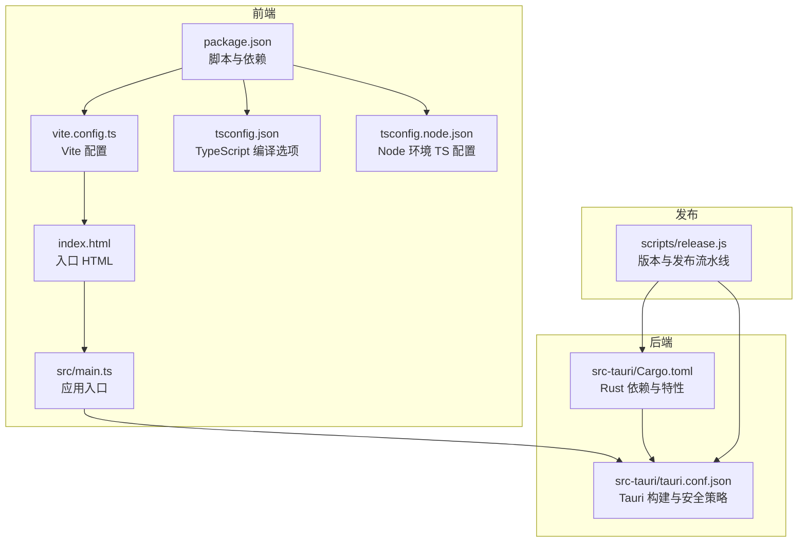
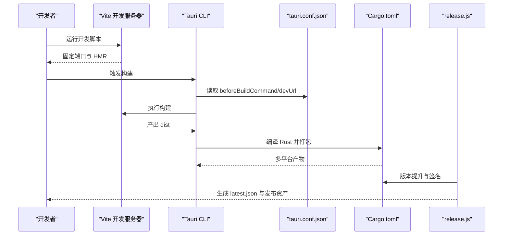
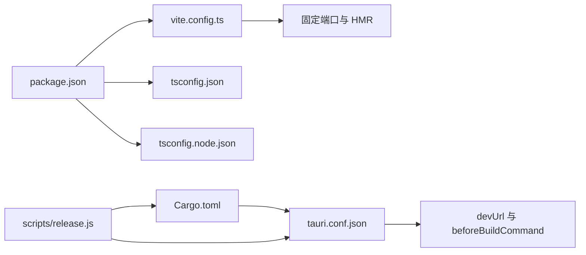

# 构建配置

<cite>
**本文引用的文件**
- [vite.config.ts](file://vite.config.ts)
- [package.json](file://package.json)
- [tsconfig.json](file://tsconfig.json)
- [tsconfig.node.json](file://tsconfig.node.json)
- [src-tauri/Cargo.toml](file://src-tauri/Cargo.toml)
- [src-tauri/tauri.conf.json](file://src-tauri/tauri.conf.json)
- [index.html](file://index.html)
- [src/main.ts](file://src/main.ts)
- [scripts/release.js](file://scripts/release.js)
- [README.md](file://README.md)
</cite>

## 目录
1. [简介](#简介)
2. [项目结构](#项目结构)
3. [核心组件](#核心组件)
4. [架构总览](#架构总览)
5. [详细组件分析](#详细组件分析)
6. [依赖分析](#依赖分析)
7. [性能考虑](#性能考虑)
8. [故障排查指南](#故障排查指南)
9. [结论](#结论)
10. [附录](#附录)

## 简介
本文件系统性梳理 Skills Manager 的构建配置与流程，覆盖前端 Vite 构建配置、TypeScript 编译选项以及 Rust Cargo 配置；对比开发与生产环境差异（端口、热重载、主机绑定等）；总结构建优化策略（代码分割、资源压缩、打包目标）；并提供构建脚本使用方法与常见问题解决方案及性能调优建议。

## 项目结构
该工程采用“前端 Vue + TypeScript + Vite + Tauri 2”技术栈，后端 Rust 通过 Tauri 暴露能力。前端构建产物由 Tauri 在构建阶段打包分发，同时支持独立预览与开发模式。

图表来源
- [package.json:1-30](file://package.json#L1-L30)
- [vite.config.ts:1-33](file://vite.config.ts#L1-L33)
- [tsconfig.json:1-26](file://tsconfig.json#L1-L26)
- [tsconfig.node.json:1-11](file://tsconfig.node.json#L1-L11)
- [index.html:1-15](file://index.html#L1-L15)
- [src/main.ts:1-7](file://src/main.ts#L1-L7)
- [src-tauri/Cargo.toml:1-36](file://src-tauri/Cargo.toml#L1-L36)
- [src-tauri/tauri.conf.json:1-45](file://src-tauri/tauri.conf.json#L1-L45)
- [scripts/release.js:1-300](file://scripts/release.js#L1-L300)

章节来源
- [package.json:1-30](file://package.json#L1-L30)
- [vite.config.ts:1-33](file://vite.config.ts#L1-L33)
- [tsconfig.json:1-26](file://tsconfig.json#L1-L26)
- [tsconfig.node.json:1-11](file://tsconfig.node.json#L1-L11)
- [index.html:1-15](file://index.html#L1-L15)
- [src/main.ts:1-7](file://src/main.ts#L1-L7)
- [src-tauri/Cargo.toml:1-36](file://src-tauri/Cargo.toml#L1-L36)
- [src-tauri/tauri.conf.json:1-45](file://src-tauri/tauri.conf.json#L1-L45)
- [scripts/release.js:1-300](file://scripts/release.js#L1-L300)

## 核心组件
- 前端构建与开发服务器：Vite 配置集中于 vite.config.ts，启用 Vue 插件，固定开发端口与严格端口策略，并按需开启 HMR。
- 类型系统：tsconfig.json 与 tsconfig.node.json 分别面向浏览器端与 Node 环境，采用 bundler 模式解析模块，严格类型检查。
- 应用入口：index.html 引入挂载点与入口脚本；src/main.ts 初始化 Vue 应用并挂载。
- 后端打包：src-tauri/Cargo.toml 定义 Rust 依赖与 crate 类型；tauri.conf.json 配置构建命令、开发 URL、安全策略与打包目标。
- 发布流水：scripts/release.js 自动提升版本、生成更新清单、可选上传资产与打标签。

章节来源
- [vite.config.ts:1-33](file://vite.config.ts#L1-L33)
- [tsconfig.json:1-26](file://tsconfig.json#L1-L26)
- [tsconfig.node.json:1-11](file://tsconfig.node.json#L1-L11)
- [index.html:1-15](file://index.html#L1-L15)
- [src/main.ts:1-7](file://src/main.ts#L1-L7)
- [src-tauri/Cargo.toml:1-36](file://src-tauri/Cargo.toml#L1-L36)
- [src-tauri/tauri.conf.json:1-45](file://src-tauri/tauri.conf.json#L1-L45)
- [scripts/release.js:1-300](file://scripts/release.js#L1-L300)

## 架构总览
下图展示从开发到生产的整体流程：Vite 提供开发服务器与构建，Tauri 将前端产物打包为多平台安装包，发布脚本负责版本管理与更新清单生成。

图表来源
- [package.json:6-12](file://package.json#L6-L12)
- [vite.config.ts:16-31](file://vite.config.ts#L16-L31)
- [src-tauri/tauri.conf.json:6-11](file://src-tauri/tauri.conf.json#L6-L11)
- [src-tauri/Cargo.toml:1-36](file://src-tauri/Cargo.toml#L1-L36)
- [scripts/release.js:43-64](file://scripts/release.js#L43-L64)
- [scripts/release.js:199-232](file://scripts/release.js#L199-L232)

## 详细组件分析

### Vite 构建配置
- 插件与入口
  - 使用 Vue 插件进行单文件组件编译与 HMR 支持。
- 开发服务器
  - 固定端口与严格端口策略：确保 Tauri dev 模式稳定联调。
  - 主机绑定：可通过环境变量控制是否允许远程访问。
  - HMR：在指定主机时启用 WebSocket HMR，端口与协议可定制。
  - 监视忽略：排除 src-tauri 目录，避免不必要的文件监听开销。
- 清屏策略：关闭清屏以保留 Rust 错误输出，便于调试。

章节来源
- [vite.config.ts:8-32](file://vite.config.ts#L8-L32)

### TypeScript 编译选项
- 浏览器端（tsconfig.json）
  - 目标与模块：ES2020 与 ESNext，配合 bundler 解析。
  - 严格模式：启用严格检查、未使用变量/参数、switch 穷举校验。
  - 禁止输出 JS：仅做类型检查，构建由 Vite 与 vue-tsc 协作完成。
  - JSX 保留：保持 Vue JSX 兼容性。
- Node 环境（tsconfig.node.json）
  - 仅包含 Vite 配置文件，采用 ESNext 与 bundler 解析，允许默认导入。

章节来源
- [tsconfig.json:1-26](file://tsconfig.json#L1-L26)
- [tsconfig.node.json:1-11](file://tsconfig.node.json#L1-L11)

### Rust Cargo 配置
- 包元数据：名称、版本、作者、时间线。
- 库类型：静态库、动态库与 rlib 组合，满足跨语言调用与链接需求。
- 依赖：Tauri 核心、对话框、打开器、进程、序列化、网络请求、文件系统工具集等。
- 平台条件依赖：非移动端启用更新与单实例插件。
- 构建依赖：tauri-build 用于生成能力与 schema。

章节来源
- [src-tauri/Cargo.toml:1-36](file://src-tauri/Cargo.toml#L1-L36)

### Tauri 构建与安全配置
- 构建命令与入口
  - beforeDevCommand：启动前端开发服务器。
  - devUrl：前端开发服务器地址，与 Vite 固定端口一致。
  - beforeBuildCommand：构建前端产物。
  - frontendDist：前端产物目录。
- 应用窗口与安全
  - 窗口尺寸与标题。
  - 内嵌 CSP：限制连接源、脚本与样式策略，保障运行期安全。
- 插件与打包
  - 更新器插件：配置更新源与公钥。
  - 打包：启用打包与更新产物生成，目标为全平台。

章节来源
- [src-tauri/tauri.conf.json:6-11](file://src-tauri/tauri.conf.json#L6-L11)
- [src-tauri/tauri.conf.json:20-22](file://src-tauri/tauri.conf.json#L20-L22)
- [src-tauri/tauri.conf.json:24-31](file://src-tauri/tauri.conf.json#L24-L31)
- [src-tauri/tauri.conf.json:32-43](file://src-tauri/tauri.conf.json#L32-L43)

### 构建脚本与发布流程
- 版本提升：同步更新 package.json、tauri.conf.json、Cargo.toml 与 Cargo.lock 中的版本号。
- 构建与签名：要求设置签名私钥环境变量，执行 tauri build 生成带签名产物。
- 更新清单：扫描打包目录，生成 latest.json，包含各平台签名与下载地址。
- 发布与推送：可选上传资产至 GitHub Releases，打标签并推送分支。

章节来源
- [scripts/release.js:43-64](file://scripts/release.js#L43-L64)
- [scripts/release.js:273-276](file://scripts/release.js#L273-L276)
- [scripts/release.js:199-232](file://scripts/release.js#L199-L232)
- [scripts/release.js:248-268](file://scripts/release.js#L248-L268)
- [scripts/release.js:289-299](file://scripts/release.js#L289-L299)

## 依赖分析
- 前端依赖
  - Vue 3、i18n、Tauri API 及相关插件，支撑桌面端 UI 与系统能力调用。
  - Vite、Vue 插件、TypeScript、vue-tsc，构成开发与构建链路。
- 后端依赖
  - Tauri 核心与插件生态，结合 Rust 工具库实现文件、网络、进程等系统操作。
- 关键耦合点
  - Vite 固定端口与 Tauri devUrl 必须一致，否则无法联调。
  - Tauri 构建前会触发前端构建脚本，产物目录需与 tauri.conf.json 配置一致。

图表来源
- [vite.config.ts:16-31](file://vite.config.ts#L16-L31)
- [package.json:6-12](file://package.json#L6-L12)
- [tsconfig.json:1-26](file://tsconfig.json#L1-L26)
- [tsconfig.node.json:1-11](file://tsconfig.node.json#L1-L11)
- [src-tauri/tauri.conf.json:6-11](file://src-tauri/tauri.conf.json#L6-L11)
- [src-tauri/Cargo.toml:1-36](file://src-tauri/Cargo.toml#L1-L36)
- [scripts/release.js:43-64](file://scripts/release.js#L43-L64)

章节来源
- [package.json:13-28](file://package.json#L13-L28)
- [src-tauri/Cargo.toml:20-36](file://src-tauri/Cargo.toml#L20-L36)
- [src-tauri/tauri.conf.json:6-11](file://src-tauri/tauri.conf.json#L6-L11)

## 性能考虑
- 代码分割与懒加载
  - 利用 Vite 的动态导入实现路由级或组件级懒加载，减少首屏体积。
- 资源压缩与产物优化
  - 生产构建默认启用压缩；如需进一步优化，可在 Vite 配置中引入压缩插件或调整最小化策略。
- 依赖拆分
  - 将不常变更的第三方库单独提取，提升缓存命中率。
- 构建缓存
  - 使用 Vite 的构建缓存与增量编译，缩短二次构建时间。
- 平台打包目标
  - 根据需要选择特定平台与架构，减少打包体积与时间。

## 故障排查指南
- 端口占用导致开发失败
  - 现象：启动开发服务器报端口冲突。
  - 处理：确认固定端口未被占用，或在 Tauri 配置中调整端口（需同步修改 devUrl）。
- HMR 不生效
  - 现象：修改代码后页面未刷新。
  - 处理：若启用远程主机绑定，确认 HMR 协议与端口配置正确；检查防火墙与网络策略。
- Rust 错误被清屏掩盖
  - 现象：终端输出被清屏导致错误丢失。
  - 处理：保持清屏关闭以便查看完整日志。
- 构建失败或产物缺失
  - 现象：Tauri 构建找不到前端产物。
  - 处理：确认 beforeBuildCommand 正确执行且输出目录与 frontendDist 一致。
- 发布脚本异常
  - 现象：版本提升后签名或发布失败。
  - 处理：确保签名私钥环境变量已设置；检查 GitHub CLI 与仓库 slug；必要时手动生成最新清单。

章节来源
- [vite.config.ts:14](file://vite.config.ts#L14)
- [vite.config.ts:16-31](file://vite.config.ts#L16-L31)
- [src-tauri/tauri.conf.json:6-11](file://src-tauri/tauri.conf.json#L6-L11)
- [scripts/release.js:66-70](file://scripts/release.js#L66-L70)
- [scripts/release.js:234-246](file://scripts/release.js#L234-L246)

## 结论
本项目的构建体系围绕“Vite + TypeScript + Tauri + Rust”协同工作：Vite 提供高效开发体验与产物，TypeScript 保证类型安全，Tauri 将前端与系统能力整合为跨平台应用，Rust 提供底层能力与安全性。通过严格的端口与 HMR 配置、清晰的构建脚本与发布流程，能够稳定地支持本地开发与生产发布。

## 附录

### 开发与生产环境差异
- 开发环境
  - 固定端口与严格端口策略，确保 Tauri dev 稳定联调。
  - HMR 可按主机变量启用，支持远程联调。
  - 清屏关闭，便于查看 Rust 错误。
- 生产环境
  - 通过 Tauri 构建命令统一触发前端构建与打包。
  - 打包目标为全平台，可按需裁剪。

章节来源
- [vite.config.ts:14-31](file://vite.config.ts#L14-L31)
- [src-tauri/tauri.conf.json:6-11](file://src-tauri/tauri.conf.json#L6-L11)

### 构建脚本使用方法
- 基础命令
  - 开发：运行前端开发服务器。
  - 构建：先类型检查再构建。
  - 预览：本地预览构建产物。
  - Tauri：调用 Tauri CLI。
- 发布流程
  - 使用发布脚本提升版本、构建并生成更新清单，可选上传资产与推送标签。

章节来源
- [package.json:6-12](file://package.json#L6-L12)
- [scripts/release.js:270-287](file://scripts/release.js#L270-L287)

### 自定义配置选项
- Vite
  - 修改固定端口与 HMR 参数，需同步更新 Tauri devUrl。
  - 调整监视忽略路径，减少无关文件监听。
- TypeScript
  - 根据团队规范调整严格级别与检查项。
- Tauri
  - 调整窗口尺寸、CSP 策略与打包目标。
- Cargo
  - 按需增删依赖与平台条件依赖，控制产物大小与功能范围。

章节来源
- [vite.config.ts:16-31](file://vite.config.ts#L16-L31)
- [tsconfig.json:17-22](file://tsconfig.json#L17-L22)
- [src-tauri/tauri.conf.json:13-19](file://src-tauri/tauri.conf.json#L13-L19)
- [src-tauri/tauri.conf.json:20-22](file://src-tauri/tauri.conf.json#L20-L22)
- [src-tauri/tauri.conf.json:32-43](file://src-tauri/tauri.conf.json#L32-L43)
- [src-tauri/Cargo.toml:20-36](file://src-tauri/Cargo.toml#L20-L36)