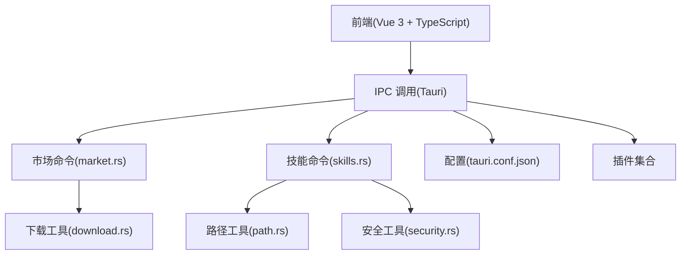
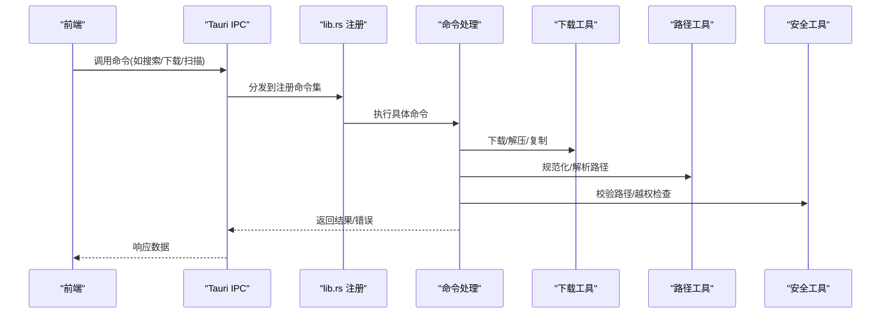
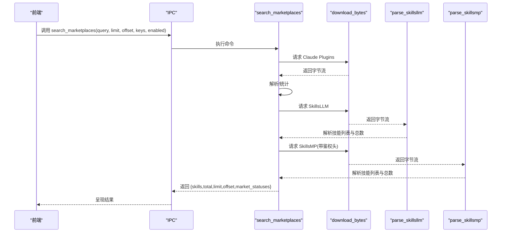
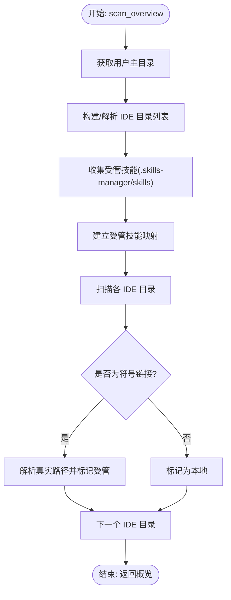
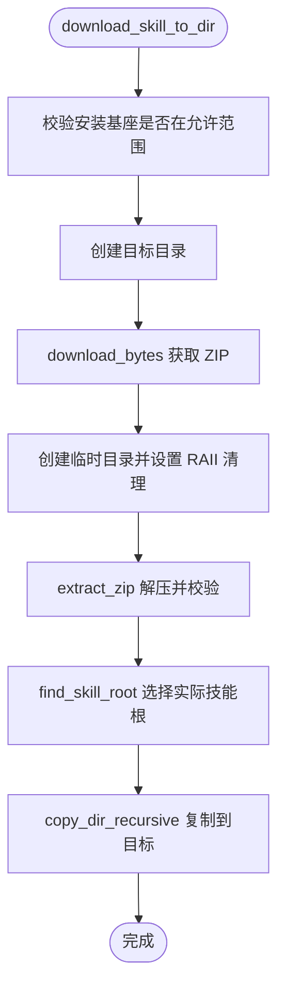
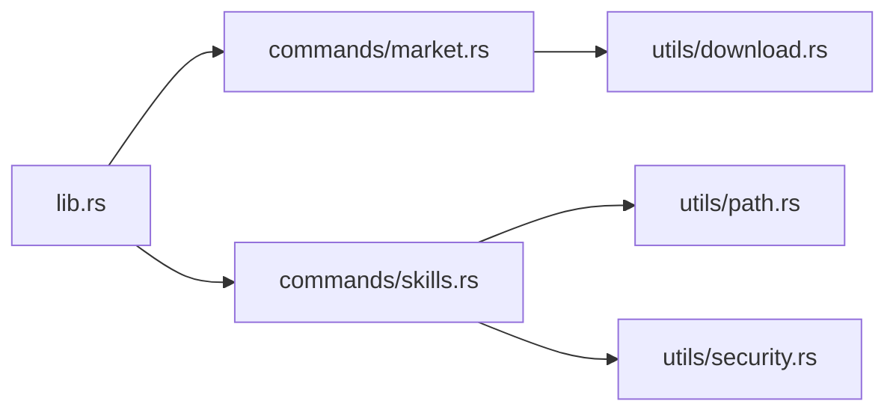

# 监控维护

<cite>
**本文引用的文件**
- [src-tauri/src/main.rs](file://src-tauri/src/main.rs)
- [src-tauri/src/lib.rs](file://src-tauri/src/lib.rs)
- [src-tauri/Cargo.toml](file://src-tauri/Cargo.toml)
- [src-tauri/tauri.conf.json](file://src-tauri/tauri.conf.json)
- [package.json](file://package.json)
- [src-tauri/src/commands/market.rs](file://src-tauri/src/commands/market.rs)
- [src-tauri/src/commands/skills.rs](file://src-tauri/src/commands/skills.rs)
- [src-tauri/src/utils/download.rs](file://src-tauri/src/utils/download.rs)
- [src-tauri/src/utils/security.rs](file://src-tauri/src/utils/security.rs)
- [src-tauri/src/utils/path.rs](file://src-tauri/src/utils/path.rs)
- [README.md](file://README.md)
</cite>

## 目录
1. [简介](#简介)
2. [项目结构](#项目结构)
3. [核心组件](#核心组件)
4. [架构总览](#架构总览)
5. [详细组件分析](#详细组件分析)
6. [依赖关系分析](#依赖关系分析)
7. [性能考量](#性能考量)
8. [故障排查指南](#故障排查指南)
9. [结论](#结论)
10. [附录](#附录)

## 简介
本指南面向 Skills Manager 的运维与开发团队，提供一套可落地的监控与维护策略，覆盖应用运行时监控、日志管理、性能指标采集、错误追踪与异常处理（前后端）、系统资源与磁盘空间监控、网络连接状态检测、定期维护与清理策略、备份与灾难恢复方案，以及安全监控与威胁检测最佳实践。文档以仓库现有实现为基础，结合 Tauri 应用的特性，给出可操作的建议与流程图示。

## 项目结构
Skills Manager 采用 Tauri 2 + Vue 3 + TypeScript 前后端分离架构：前端通过 Vite 构建，后端 Rust 命令在 Tauri 容器中执行，二者通过 IPC 调用交互；同时使用插件完成进程、对话框、打开外部资源、更新器等能力。

**图表来源**
- [src-tauri/src/lib.rs:20-53](file://src-tauri/src/lib.rs#L20-L53)
- [src-tauri/src/commands/market.rs:173-392](file://src-tauri/src/commands/market.rs#L173-L392)
- [src-tauri/src/commands/skills.rs:355-725](file://src-tauri/src/commands/skills.rs#L355-L725)
- [src-tauri/src/utils/download.rs:27-116](file://src-tauri/src/utils/download.rs#L27-L116)
- [src-tauri/src/utils/path.rs:21-90](file://src-tauri/src/utils/path.rs#L21-L90)
- [src-tauri/src/utils/security.rs:3-92](file://src-tauri/src/utils/security.rs#L3-L92)
- [src-tauri/tauri.conf.json:1-45](file://src-tauri/tauri.conf.json#L1-L45)

**章节来源**
- [src-tauri/src/main.rs:1-7](file://src-tauri/src/main.rs#L1-L7)
- [src-tauri/src/lib.rs:20-53](file://src-tauri/src/lib.rs#L20-L53)
- [src-tauri/Cargo.toml:1-36](file://src-tauri/Cargo.toml#L1-L36)
- [src-tauri/tauri.conf.json:1-45](file://src-tauri/tauri.conf.json#L1-L45)
- [package.json:1-30](file://package.json#L1-L30)

## 核心组件
- 启动入口与应用生命周期
  - 入口函数负责启动 GUI 并初始化插件与命令处理器。
- 命令层
  - 市场命令：聚合多源市场搜索、下载与更新。
  - 技能命令：本地扫描、安装/卸载、导入导出、链接管理。
- 工具层
  - 下载工具：HTTP 下载、ZIP 解压、防 Zip Slip、大小限制。
  - 路径工具：规范化、安全校验、Windows 前缀处理。
  - 安全工具：路径合法性、WSL 路径识别、目录越权检查。
- 插件与配置
  - 进程、对话框、打开器、更新器、单实例等插件集成。
  - CSP、更新器公钥、构建与打包配置。

**章节来源**
- [src-tauri/src/main.rs:4-6](file://src-tauri/src/main.rs#L4-L6)
- [src-tauri/src/lib.rs:20-53](file://src-tauri/src/lib.rs#L20-L53)
- [src-tauri/src/commands/market.rs:173-442](file://src-tauri/src/commands/market.rs#L173-L442)
- [src-tauri/src/commands/skills.rs:355-847](file://src-tauri/src/commands/skills.rs#L355-L847)
- [src-tauri/src/utils/download.rs:27-273](file://src-tauri/src/utils/download.rs#L27-L273)
- [src-tauri/src/utils/path.rs:21-90](file://src-tauri/src/utils/path.rs#L21-L90)
- [src-tauri/src/utils/security.rs:3-92](file://src-tauri/src/utils/security.rs#L3-L92)
- [src-tauri/Cargo.toml:20-36](file://src-tauri/Cargo.toml#L20-L36)
- [src-tauri/tauri.conf.json:20-43](file://src-tauri/tauri.conf.json#L20-L43)

## 架构总览
下图展示应用启动、IPC 调用与命令处理的整体流程，以及关键安全与工具模块的协作关系。

**图表来源**
- [src-tauri/src/lib.rs:27-39](file://src-tauri/src/lib.rs#L27-L39)
- [src-tauri/src/commands/market.rs:173-392](file://src-tauri/src/commands/market.rs#L173-L392)
- [src-tauri/src/commands/skills.rs:355-725](file://src-tauri/src/commands/skills.rs#L355-L725)
- [src-tauri/src/utils/download.rs:27-116](file://src-tauri/src/utils/download.rs#L27-L116)
- [src-tauri/src/utils/path.rs:21-90](file://src-tauri/src/utils/path.rs#L21-L90)
- [src-tauri/src/utils/security.rs:3-92](file://src-tauri/src/utils/security.rs#L3-L92)

## 详细组件分析

### 市场命令与网络监控
- 功能要点
  - 多源聚合搜索：Claude Plugins、SkillsLLM、SkillsMP。
  - 在线状态上报：对每个启用的市场返回在线/错误/需要密钥状态。
  - 下载与更新：统一走下载工具链，支持超时、重定向、大小限制。
- 日志与错误
  - 对各市场的请求失败会记录错误信息，并在响应中标注错误状态。
- 性能与可靠性
  - 限制单次下载最大字节数，避免内存压力。
  - 为第三方 API 设置 User-Agent 与 Accept 头，便于服务端识别。
- 维护建议
  - 定期检查各市场可用性与限流阈值。
  - 对 SkillsMP 的密钥缺失场景进行告警。

**图表来源**
- [src-tauri/src/commands/market.rs:173-392](file://src-tauri/src/commands/market.rs#L173-L392)
- [src-tauri/src/utils/download.rs:27-48](file://src-tauri/src/utils/download.rs#L27-L48)

**章节来源**
- [src-tauri/src/commands/market.rs:173-442](file://src-tauri/src/commands/market.rs#L173-L442)
- [src-tauri/src/utils/download.rs:27-48](file://src-tauri/src/utils/download.rs#L27-L48)

### 技能命令与系统资源监控
- 功能要点
  - 扫描：遍历本地与 IDE 目录，识别受管/链接/本地技能。
  - 安装/卸载：创建/删除符号链接或目录，支持 Windows 跨平台兼容。
  - 导入/导出：安全校验、压缩导出、防越权写入。
- 错误与安全
  - 路径合法性校验、WSL 路径识别、禁止危险绝对路径。
  - ZIP 解压时进行目录越权检查与单文件大小限制。
- 维护建议
  - 定期扫描并修复断链、重复链接与越权目录。
  - 对导出路径进行白名单校验，避免写入受管目录。

**图表来源**
- [src-tauri/src/commands/skills.rs:451-535](file://src-tauri/src/commands/skills.rs#L451-L535)
- [src-tauri/src/utils/path.rs:21-90](file://src-tauri/src/utils/path.rs#L21-L90)
- [src-tauri/src/utils/security.rs:3-92](file://src-tauri/src/utils/security.rs#L3-L92)

**章节来源**
- [src-tauri/src/commands/skills.rs:355-847](file://src-tauri/src/commands/skills.rs#L355-L847)
- [src-tauri/src/utils/path.rs:21-90](file://src-tauri/src/utils/path.rs#L21-L90)
- [src-tauri/src/utils/security.rs:3-92](file://src-tauri/src/utils/security.rs#L3-L92)

### 下载与解压工具的安全与性能
- 安全
  - 目录越权检查：解压时校验输出路径是否位于目标目录内。
  - 单文件大小限制：防止 Zip Bomb。
  - 临时目录 RAII 清理：确保异常退出也能回收资源。
- 性能
  - 下载超时与重定向控制，限制最大下载体积。
  - ZIP 提取按需读取，避免一次性加载大文件。
- 维护建议
  - 对异常下载与解压失败进行审计与告警。
  - 定期清理临时目录残留。

**图表来源**
- [src-tauri/src/utils/download.rs:50-116](file://src-tauri/src/utils/download.rs#L50-L116)
- [src-tauri/src/utils/download.rs:143-183](file://src-tauri/src/utils/download.rs#L143-L183)
- [src-tauri/src/utils/download.rs:185-210](file://src-tauri/src/utils/download.rs#L185-L210)
- [src-tauri/src/utils/download.rs:212-273](file://src-tauri/src/utils/download.rs#L212-L273)

**章节来源**
- [src-tauri/src/utils/download.rs:27-273](file://src-tauri/src/utils/download.rs#L27-L273)

### 插件与配置
- 插件
  - 进程、对话框、打开器、更新器、单实例等插件按需启用。
- 配置
  - CSP 严格限制连接源与脚本来源，提升前端安全。
  - 更新器 endpoint 与公钥配置，保障二进制更新可信。

**章节来源**
- [src-tauri/Cargo.toml:20-36](file://src-tauri/Cargo.toml#L20-L36)
- [src-tauri/tauri.conf.json:20-43](file://src-tauri/tauri.conf.json#L20-L43)

## 依赖关系分析
- 组件耦合
  - 命令层依赖工具层（下载/路径/安全），工具层彼此独立但共同服务于命令。
  - lib.rs 作为统一入口，集中注册命令与插件，降低调用方复杂度。
- 外部依赖
  - HTTP 客户端、ZIP 解压、路径遍历、跨平台符号链接/连接。
- 循环依赖
  - 当前结构未见循环依赖，模块职责清晰。

**图表来源**
- [src-tauri/src/lib.rs:20-53](file://src-tauri/src/lib.rs#L20-L53)
- [src-tauri/src/commands/market.rs:1-8](file://src-tauri/src/commands/market.rs#L1-L8)
- [src-tauri/src/commands/skills.rs:1-16](file://src-tauri/src/commands/skills.rs#L1-L16)
- [src-tauri/src/utils/download.rs:1-9](file://src-tauri/src/utils/download.rs#L1-L9)
- [src-tauri/src/utils/path.rs:1-3](file://src-tauri/src/utils/path.rs#L1-L3)
- [src-tauri/src/utils/security.rs:1-4](file://src-tauri/src/utils/security.rs#L1-L4)

**章节来源**
- [src-tauri/src/lib.rs:20-53](file://src-tauri/src/lib.rs#L20-L53)

## 性能考量
- I/O 与 CPU
  - 扫描与复制大量文件时，注意批处理与并发控制，避免阻塞 UI。
- 网络
  - 为远端 API 设置合理超时与重试，限制单次下载体积，防止 OOM。
- 存储
  - 定期清理临时目录与过期缓存，监控用户主目录下 .skills-manager/skills 的增长趋势。
- 内存
  - 控制 ZIP 解压与读取的缓冲区大小，避免峰值过高。

[本节为通用指导，无需列出章节来源]

## 故障排查指南
- 常见问题定位
  - 市场搜索失败：检查网络连通、User-Agent 与 Accept 头、第三方 API 变更。
  - 下载失败：确认 URL 正确、代理/防火墙影响、临时目录权限。
  - 卸载/链接失败：检查路径合法性、符号链接类型差异（Unix/Junction）。
- 日志与错误
  - 市场命令对各源的错误会记录并返回，前端据此提示“需要密钥/错误”。
  - 下载工具对 Zip Slip 与越权写入会直接报错。
- 建议流程
  - 记录失败时间、URL、错误码与堆栈摘要。
  - 对外网请求增加重试与降级策略。
  - 对本地操作增加回滚点（如导出前备份）。

**章节来源**
- [src-tauri/src/commands/market.rs:234-243](file://src-tauri/src/commands/market.rs#L234-L243)
- [src-tauri/src/commands/market.rs:293-301](file://src-tauri/src/commands/market.rs#L293-L301)
- [src-tauri/src/commands/market.rs:355-372](file://src-tauri/src/commands/market.rs#L355-L372)
- [src-tauri/src/utils/download.rs:158-164](file://src-tauri/src/utils/download.rs#L158-L164)

## 结论
本指南基于仓库现有实现，给出了 Skills Manager 的监控与维护实践框架。通过在命令层与工具层埋点、完善错误上报、强化路径与安全校验、规范日志与告警，可显著提升系统的可观测性与稳定性。建议结合 CI/CD 与运维平台，将上述策略自动化落地。

[本节为总结性内容，无需列出章节来源]

## 附录

### 监控策略与指标清单
- 运行时监控
  - 应用存活、窗口焦点、单实例行为。
  - 市场可用性与错误率、平均响应时间。
- 日志管理
  - 前端：UI 行为、错误弹窗、网络请求摘要。
  - 后端：命令执行耗时、路径校验结果、下载/解压事件。
- 性能指标
  - 下载速率、解压耗时、扫描目录数量、符号链接创建/删除次数。
- 资源监控
  - CPU、内存、磁盘占用；.skills-manager/skills 目录大小与增长曲线。
- 网络状态
  - DNS 解析成功率、HTTPS 握手耗时、第三方 API 响应码分布。

[本节为通用指导，无需列出章节来源]

### 日志记录与错误追踪
- 前端
  - 使用浏览器控制台与系统通知记录关键错误与用户操作轨迹。
- 后端
  - 命令层返回字符串错误，前端统一转译为用户可读提示。
  - 对网络与文件系统异常进行结构化日志记录（字段：时间戳、命令名、参数摘要、错误码、堆栈片段）。

**章节来源**
- [src-tauri/src/commands/market.rs:234-243](file://src-tauri/src/commands/market.rs#L234-L243)
- [src-tauri/src/commands/skills.rs:538-609](file://src-tauri/src/commands/skills.rs#L538-L609)

### 系统资源与磁盘空间管理
- 磁盘空间
  - 定期扫描 ~/.skills-manager/skills，生成容量报告与增长趋势。
  - 对超过阈值的目录触发清理建议（删除未使用技能、导出备份）。
- 资源监控
  - 使用系统工具（如 top/htop、iostat、iotop）观察 I/O 与 CPU 占用高峰。
  - 对大规模扫描/复制操作进行限速与队列化。

[本节为通用指导，无需列出章节来源]

### 网络连接状态检测
- 健康检查
  - 定时探测 https://claude-plugins.dev、https://skillsllm.com、https://skillsmp.com。
  - 记录延迟、状态码、解析耗时。
- 降级策略
  - 当某市场不可用时，优先返回其他市场结果并提示用户。

**章节来源**
- [src-tauri/src/commands/market.rs:195-251](file://src-tauri/src/commands/market.rs#L195-L251)
- [src-tauri/src/commands/market.rs:253-309](file://src-tauri/src/commands/market.rs#L253-L309)
- [src-tauri/src/commands/market.rs:311-380](file://src-tauri/src/commands/market.rs#L311-L380)

### 定期维护与清理策略
- 自动化脚本建议
  - 清理临时目录：删除 /tmp 或系统临时目录下以特定前缀命名的目录。
  - 清理过期导出包：保留最近 N 份导出包，其余删除。
  - 清理未使用技能：基于最近访问时间与使用统计，删除长期未用技能。
- 清理策略
  - 删除前先导出备份，失败则回滚。
  - 对受管技能与 IDE 链接分别处理，避免误删。

[本节为通用指导，无需列出章节来源]

### 备份与灾难恢复
- 备份
  - 定期导出所有受管技能（压缩包），保存至安全位置。
  - 备份用户配置与 IDE 链接状态快照。
- 恢复
  - 从导出包重建 .skills-manager/skills，重新创建符号链接。
  - 若数据库/索引损坏，可重建索引并重新扫描。

[本节为通用指导，无需列出章节来源]

### 安全监控与威胁检测
- 路径安全
  - 严格校验相对/绝对路径，禁止危险绝对路径与父目录穿越。
  - 对 WSL UNC 路径进行识别与放行。
- 下载安全
  - 限制下载体积与单文件大小，检测 Zip Slip 攻击。
  - 对第三方 API 使用受限 UA 与必要头，避免滥用。
- 配置安全
  - CSP 严格限制来源，更新器公钥校验，仅允许可信更新。

**章节来源**
- [src-tauri/src/utils/security.rs:3-92](file://src-tauri/src/utils/security.rs#L3-L92)
- [src-tauri/src/utils/download.rs:158-180](file://src-tauri/src/utils/download.rs#L158-L180)
- [src-tauri/tauri.conf.json:20-22](file://src-tauri/tauri.conf.json#L20-L22)
- [src-tauri/tauri.conf.json:25-30](file://src-tauri/tauri.conf.json#L25-L30)