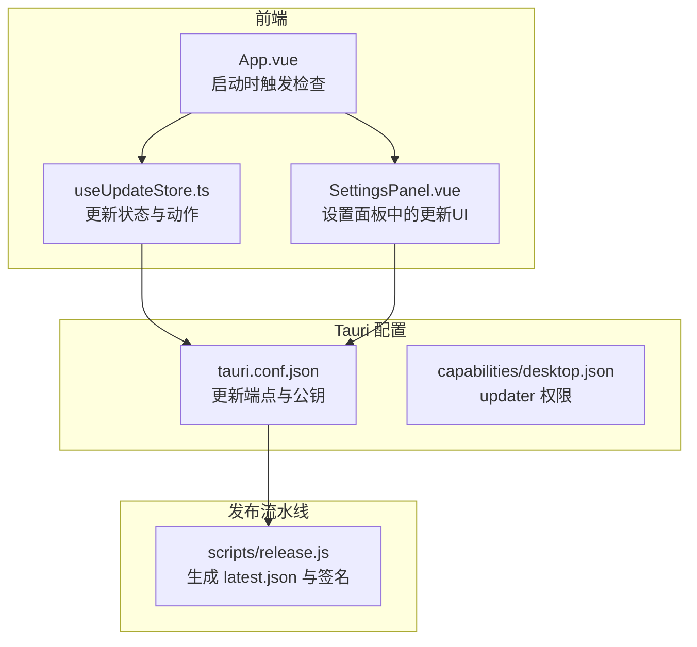
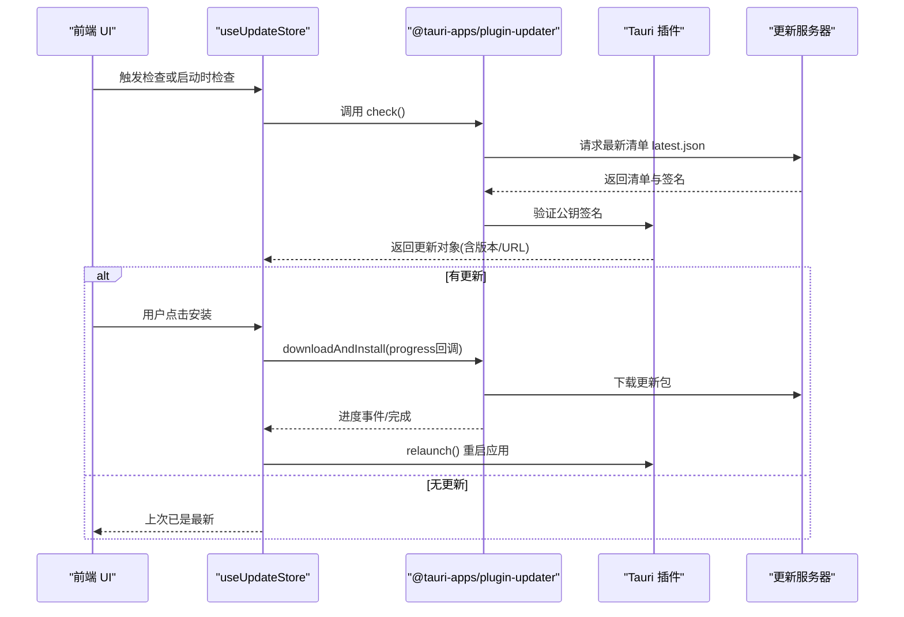
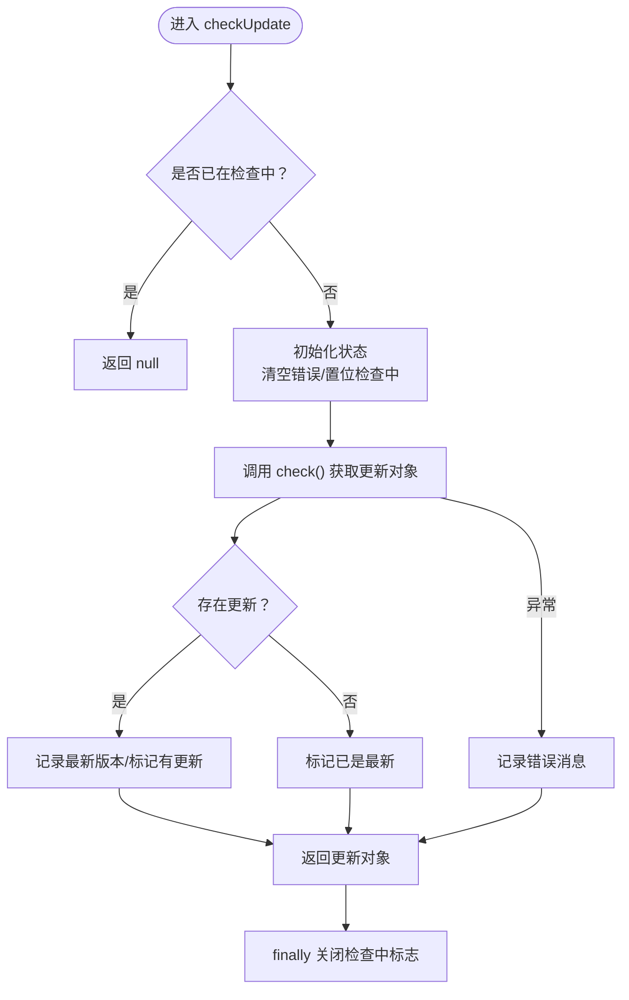
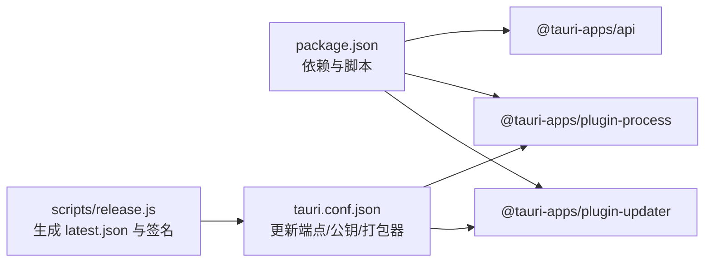

# 自动更新机制

<cite>
**本文引用的文件**
- [src/composables/useUpdateStore.ts](file://src/composables/useUpdateStore.ts)
- [src/App.vue](file://src/App.vue)
- [src/components/SettingsPanel.vue](file://src/components/SettingsPanel.vue)
- [src-tauri/tauri.conf.json](file://src-tauri/tauri.conf.json)
- [src-tauri/capabilities/desktop.json](file://src-tauri/capabilities/desktop.json)
- [scripts/release.js](file://scripts/release.js)
- [package.json](file://package.json)
- [src-tauri/src/utils/security.rs](file://src-tauri/src/utils/security.rs)
</cite>

## 更新摘要
**所做更改**
- 移除了 UpdateChecker 组件相关的内容，因为该组件已被删除
- 更新了自动更新机制的实现方式，现在通过 SettingsPanel.vue 中的 UI 组件实现
- 保留了 useUpdateStore 组合式状态管理的核心功能描述
- 更新了架构图和流程说明以反映新的实现方式

## 目录
1. [简介](#简介)
2. [项目结构](#项目结构)
3. [核心组件](#核心组件)
4. [架构总览](#架构总览)
5. [详细组件分析](#详细组件分析)
6. [依赖关系分析](#依赖关系分析)
7. [性能与可靠性考量](#性能与可靠性考量)
8. [故障排查指南](#故障排查指南)
9. [结论](#结论)
10. [附录](#附录)

## 简介
本文件系统性阐述 Skills Manager 的自动更新机制，覆盖更新检查流程、版本管理、更新推送、useUpdateStore 组合式实现与使用方式、更新服务器配置、发布渠道与回滚策略、更新包生成与签名分发流程、失败处理与用户通知策略，以及安全验证最佳实践。目标是帮助开发者与运维人员快速理解并维护该机制。

## 项目结构
自动更新相关的关键位置与职责如下：
- 前端组合式状态与逻辑：src/composables/useUpdateStore.ts
- 设置面板中的更新 UI：src/components/SettingsPanel.vue
- 应用入口触发启动检查：src/App.vue
- Tauri 更新插件配置：src-tauri/tauri.conf.json
- 权限声明（桌面端）：src-tauri/capabilities/desktop.json
- 发布脚本（生成最新清单与签名）：scripts/release.js
- 依赖与插件版本：package.json
- 安全工具（路径校验等）：src-tauri/src/utils/security.rs

**图表来源**
- [src/App.vue:50-61](file://src/App.vue#L50-L61)
- [src/composables/useUpdateStore.ts:26-83](file://src/composables/useUpdateStore.ts#L26-L83)
- [src/components/SettingsPanel.vue:19-60](file://src/components/SettingsPanel.vue#L19-L60)
- [src-tauri/tauri.conf.json:24-31](file://src-tauri/tauri.conf.json#L24-L31)
- [src-tauri/capabilities/desktop.json:11-13](file://src-tauri/capabilities/desktop.json#L11-L13)
- [scripts/release.js:200-232](file://scripts/release.js#L200-L232)

**章节来源**
- [src/App.vue:50-61](file://src/App.vue#L50-L61)
- [src/composables/useUpdateStore.ts:26-83](file://src/composables/useUpdateStore.ts#L26-L83)
- [src-tauri/tauri.conf.json:24-31](file://src-tauri/tauri.conf.json#L24-L31)
- [src-tauri/capabilities/desktop.json:11-13](file://src-tauri/capabilities/desktop.json#L11-L13)
- [scripts/release.js:200-232](file://scripts/release.js#L200-L232)

## 核心组件
- useUpdateStore 组合式：封装更新状态、检查、下载、安装与重启等动作，并提供计算属性用于 UI 判断。
- SettingsPanel.vue：在设置面板中提供完整的更新检查、下载和安装界面，包括进度显示和状态管理。
- App.vue：应用启动时调用"启动时静默检查"，并在设置页标签显示更新徽章。
- tauri.conf.json：定义更新端点与公钥，启用打包器生成更新产物。
- capabilities/desktop.json：授予 updater 权限集，允许前端执行检查、下载、安装与重启。
- scripts/release.js：生成最新清单 latest.json 并附带签名，供更新端点消费。

**章节来源**
- [src/composables/useUpdateStore.ts:26-157](file://src/composables/useUpdateStore.ts#L26-L157)
- [src/components/SettingsPanel.vue:19-60](file://src/components/SettingsPanel.vue#L19-L60)
- [src/App.vue:126-127](file://src/App.vue#L126-L127)
- [src-tauri/tauri.conf.json:24-31](file://src-tauri/tauri.conf.json#L24-L31)
- [src-tauri/capabilities/desktop.json:11-13](file://src-tauri/capabilities/desktop.json#L11-L13)
- [scripts/release.js:200-232](file://scripts/release.js#L200-L232)

## 架构总览
自动更新的整体流程由"检查—下载—安装—重启"构成，前端通过 @tauri-apps/plugin-updater 与后端 Tauri 插件交互，Tauri 配置指定更新源与公钥，发布脚本生成签名后的清单与二进制资产。

**图表来源**
- [src/composables/useUpdateStore.ts:39-125](file://src/composables/useUpdateStore.ts#L39-L125)
- [src-tauri/tauri.conf.json:24-31](file://src-tauri/tauri.conf.json#L24-L31)
- [scripts/release.js:200-232](file://scripts/release.js#L200-L232)

## 详细组件分析

### useUpdateStore 组合式实现与使用
- 状态管理
  - 检查中、是否有更新、最新版本、下载中、进度、是否已下载、是否已是最新、错误信息、应用名称与当前版本等。
- 动作函数
  - loadAppInfo：读取应用名与当前版本，失败时回退默认值。
  - checkUpdate：重入保护，发起检查，成功则记录最新版本并标记"有更新"，否则标记"已是最新"，异常时设置错误信息。
  - checkOnStartup：应用启动时静默检查一次，仅在发现更新时置位，避免频繁打扰。
  - downloadUpdate：基于 update 对象进行下载与安装，进度事件驱动 UI，完成后标记已下载。
  - installAndRestart：调用 relaunch 实现重启。
  - resetState：重置"已是最新"与错误状态。
- 计算属性
  - hasUpdate：当"有更新且未下载完成"时为真，便于 UI 控制按钮显隐与禁用。

**图表来源**
- [src/composables/useUpdateStore.ts:39-64](file://src/composables/useUpdateStore.ts#L39-L64)

**章节来源**
- [src/composables/useUpdateStore.ts:26-157](file://src/composables/useUpdateStore.ts#L26-L157)

### SettingsPanel.vue 中的更新 UI 实现
- 提供完整的更新检查界面，包括应用信息显示、更新状态检测、下载进度显示和安装重启功能。
- 包含三个主要状态区域：更新可用时显示版本信息和下载按钮；下载过程中显示进度条和百分比；下载完成后显示安装重启按钮。
- 支持手动检查更新、下载更新包和重启应用的完整流程。
- 错误处理：检查失败时显示错误信息，下载失败时禁用相关按钮。

**章节来源**
- [src/components/SettingsPanel.vue:19-60](file://src/components/SettingsPanel.vue#L19-L60)
- [src/components/SettingsPanel.vue:143-181](file://src/components/SettingsPanel.vue#L143-L181)
- [src/components/SettingsPanel.vue:182-196](file://src/components/SettingsPanel.vue#L182-L196)

### App.vue 中的集成
- 启动时调用 checkOnStartup，静默检查更新；设置页标签上显示更新徽章以提醒用户。
- 通过 updateAvailable 计算属性控制徽章的显示状态。

**章节来源**
- [src/App.vue:50-61](file://src/App.vue#L50-L61)
- [src/App.vue:126-127](file://src/App.vue#L126-L127)

### 更新服务器与清单
- 更新端点与公钥在 tauri.conf.json 中配置，确保客户端能从指定地址拉取最新清单并用公钥验证签名。
- 发布脚本会生成 latest.json，其中包含各平台的签名与下载链接。

**章节来源**
- [src-tauri/tauri.conf.json:24-31](file://src-tauri/tauri.conf.json#L24-L31)
- [scripts/release.js:200-232](file://scripts/release.js#L200-L232)

### 权限与能力
- capabilities/desktop.json 明确授予 updater:default 权限集合，允许前端执行检查、下载、安装与下载并安装。

**章节来源**
- [src-tauri/capabilities/desktop.json:11-13](file://src-tauri/capabilities/desktop.json#L11-L13)

### 安全与路径校验
- 安全工具模块提供相对/绝对路径的安全性判断，虽非直接用于更新，但体现了对路径安全的重视，有助于整体安全基线。

**章节来源**
- [src-tauri/src/utils/security.rs:3-65](file://src-tauri/src/utils/security.rs#L3-L65)

## 依赖关系分析
- 前端依赖
  - @tauri-apps/plugin-updater：负责检查更新、下载与安装。
  - @tauri-apps/plugin-process：负责重启应用。
  - @tauri-apps/api：读取应用名与版本。
- 版本与脚本
  - package.json 中声明了插件版本与 release 脚本命令。
- Tauri 配置
  - tauri.conf.json 指定更新端点与公钥，开启打包器生成更新产物。

**图表来源**
- [package.json:13-28](file://package.json#L13-L28)
- [src-tauri/tauri.conf.json:24-31](file://src-tauri/tauri.conf.json#L24-L31)
- [scripts/release.js:200-232](file://scripts/release.js#L200-L232)

**章节来源**
- [package.json:13-28](file://package.json#L13-L28)
- [src-tauri/tauri.conf.json:24-31](file://src-tauri/tauri.conf.json#L24-L31)
- [scripts/release.js:200-232](file://scripts/release.js#L200-L232)

## 性能与可靠性考量
- 启动时静默检查：避免在前台频繁打扰用户，仅在发现更新时才提示。
- 进度反馈：下载阶段采用"进度事件 + 渐进式进度"的方式，提升用户体验。
- 错误隔离：检查与下载阶段分别捕获异常，避免相互影响。
- 公钥验证：通过配置公钥对更新清单进行签名验证，保证来源可信。
- 平台产物优先级：发布脚本根据产物类型与平台选择最优资产，减少下载体积与时间。

**章节来源**
- [src/composables/useUpdateStore.ts:67-83](file://src/composables/useUpdateStore.ts#L67-L83)
- [src/composables/useUpdateStore.ts:85-115](file://src/composables/useUpdateStore.ts#L85-L115)
- [src-tauri/tauri.conf.json:24-31](file://src-tauri/tauri.conf.json#L24-L31)
- [scripts/release.js:127-138](file://scripts/release.js#L127-L138)

## 故障排查指南
- 检查失败
  - 现象：控制台输出"Update check failed"，错误信息被写入 store.error。
  - 排查：确认网络可达、更新端点可访问、公钥配置正确。
- 下载失败
  - 现象：downloadAndInstall 抛错，UI 展示错误并禁用安装按钮。
  - 排查：检查磁盘空间、权限、代理与防火墙；确认签名与清单未被篡改。
- 重启失败
  - 现象：relaunch 抛错，应用未能自动重启。
  - 排查：查看进程权限与沙箱限制；确认 capabilities/desktop.json 已授予相应权限。
- 启动时静默检查未提示
  - 现象：应用启动后无更新提示。
  - 排查：确认 checkOnStartup 已调用且仅在发现更新时置位；检查日志中"Startup update check failed"相关输出。

**章节来源**
- [src/composables/useUpdateStore.ts:57-63](file://src/composables/useUpdateStore.ts#L57-L63)
- [src/composables/useUpdateStore.ts:110-125](file://src/composables/useUpdateStore.ts#L110-L125)
- [src-tauri/capabilities/desktop.json:11-13](file://src-tauri/capabilities/desktop.json#L11-L13)
- [src/App.vue:56-57](file://src/App.vue#L56-L57)

## 结论
本项目采用 Tauri 插件化更新方案，结合前端组合式状态与设置面板 UI 组件，实现了从检查到安装再到重启的完整闭环。通过配置公钥与发布脚本生成签名清单，确保更新链路的安全性与可靠性。建议在生产环境中持续关注网络稳定性、权限配置与签名有效性，并在 CI 中严格校验更新清单与签名。

## 附录

### 更新检查流程（步骤化）
- 启动时静默检查：应用启动后仅在发现更新时提示。
- 手动检查：用户在设置面板点击"检查更新"。
- 解析清单：从更新端点获取最新清单，验证签名。
- 有更新：在设置面板显示版本信息与下载按钮；下载并安装。
- 无更新：在设置面板显示"已是最新"提示。
- 安装完成：自动重启应用。

**章节来源**
- [src/App.vue:56-57](file://src/App.vue#L56-L57)
- [src/components/SettingsPanel.vue:19-60](file://src/components/SettingsPanel.vue#L19-L60)
- [src/composables/useUpdateStore.ts:39-64](file://src/composables/useUpdateStore.ts#L39-L64)

### 版本管理与发布渠道
- 版本来源：package.json 与 tauri.conf.json 中的 version 字段。
- 发布渠道：通过 GitHub Releases 上传签名后的更新包与 latest.json。
- 回滚策略：若新版本不稳定，可通过降低版本号或在发布脚本中调整版本号回退。

**章节来源**
- [package.json:4](file://package.json#L4)
- [src-tauri/tauri.conf.json:4](file://src-tauri/tauri.conf.json#L4)
- [scripts/release.js:48-64](file://scripts/release.js#L48-L64)

### 更新包生成、签名与分发
- 生成清单：scripts/release.js 收集打包产物，生成 latest.json 并写入签名与下载链接。
- 端点与公钥：tauri.conf.json 指定更新端点与公钥，确保客户端可验证签名。

**章节来源**
- [scripts/release.js:200-232](file://scripts/release.js#L200-L232)
- [src-tauri/tauri.conf.json:24-31](file://src-tauri/tauri.conf.json#L24-L31)

### 安全考虑与最佳实践
- 使用公钥验证更新清单，防止中间人攻击与篡改。
- 仅在受信渠道发布更新包，避免第三方篡改。
- 保持插件与 CLI 版本一致，避免兼容性问题。
- 在 CI 中强制校验签名与清单完整性。
- 对下载路径与安装目录进行安全校验，避免危险路径写入。

**章节来源**
- [src-tauri/tauri.conf.json:24-31](file://src-tauri/tauri.conf.json#L24-L31)
- [package.json:13-28](file://package.json#L13-L28)
- [src-tauri/src/utils/security.rs:3-65](file://src-tauri/src/utils/security.rs#L3-L65)