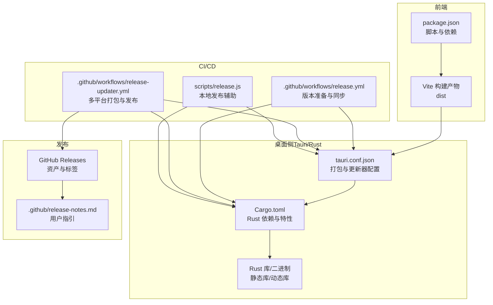
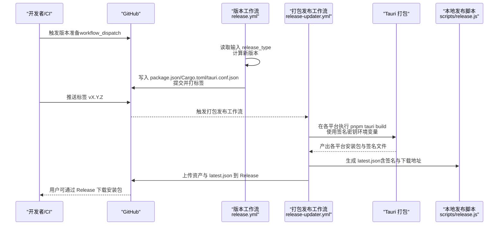
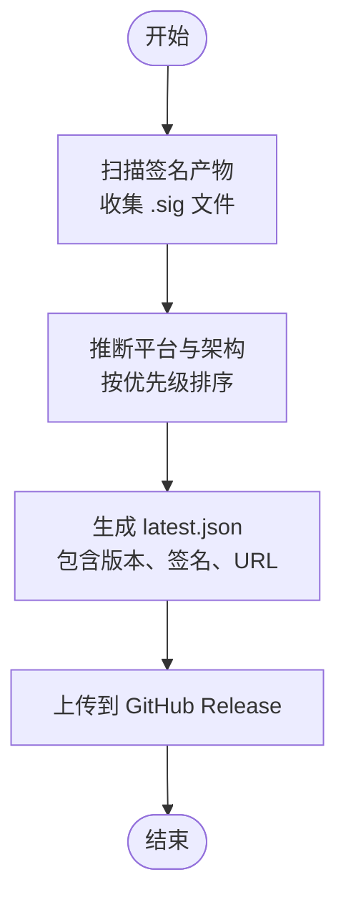
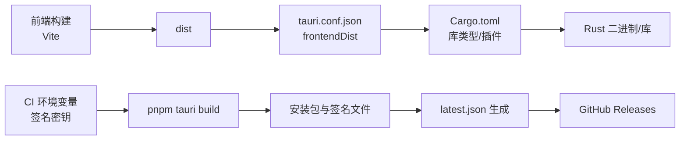

# 跨平台打包

<cite>
**本文引用的文件**
- [tauri.conf.json](file://src-tauri/tauri.conf.json)
- [Cargo.toml](file://src-tauri/Cargo.toml)
- [package.json](file://package.json)
- [README.md](file://README.md)
- [.github/workflows/release.yml](file://.github/workflows/release.yml)
- [.github/workflows/release-updater.yml](file://.github/workflows/release-updater.yml)
- [scripts/release.js](file://scripts/release.js)
- [.github/release-notes.md](file://.github/release-notes.md)
</cite>

## 目录
1. [简介](#简介)
2. [项目结构](#项目结构)
3. [核心组件](#核心组件)
4. [架构总览](#架构总览)
5. [详细组件分析](#详细组件分析)
6. [依赖关系分析](#依赖关系分析)
7. [性能考虑](#性能考虑)
8. [故障排除指南](#故障排除指南)
9. [结论](#结论)
10. [附录](#附录)

## 简介
本指南面向 Skills Manager 的维护者与贡献者，提供基于 Tauri 2 的跨平台打包与发布最佳实践。内容覆盖 Windows、macOS、Linux 的构建配置要点、tauri.conf.json 关键字段说明、CI/CD 流水线（GitHub Actions）与自动化发布流程、签名与公证建议、以及平台特定注意事项与排障方法。目标是帮助你在本地与 CI 中稳定产出可分发的安装包，并通过内置更新器完成安全分发。

## 项目结构
本项目采用前端（Vue 3 + Vite）+ 后端（Rust + Tauri）的混合架构，打包与发布相关的关键位置如下：
- 前端与脚本：package.json 定义开发与构建脚本，根目录 scripts/release.js 提供本地发布辅助工具
- 桌面侧（Tauri）：src-tauri/tauri.conf.json 为打包与更新器的核心配置；src-tauri/Cargo.toml 管理 Rust 依赖与条件编译
- CI/CD：.github/workflows 下包含版本准备与打包发布的流水线
- 发布说明：.github/release-notes.md 用于在 GitHub Release 中展示用户指引

图表来源
- [package.json:1-30](file://package.json#L1-L30)
- [tauri.conf.json:1-45](file://src-tauri/tauri.conf.json#L1-L45)
- [Cargo.toml:1-36](file://src-tauri/Cargo.toml#L1-L36)
- [.github/workflows/release.yml:1-73](file://.github/workflows/release.yml#L1-L73)
- [.github/workflows/release-updater.yml:1-144](file://.github/workflows/release-updater.yml#L1-L144)
- [scripts/release.js:1-300](file://scripts/release.js#L1-L300)
- [.github/release-notes.md:1-30](file://.github/release-notes.md#L1-L30)

章节来源
- [package.json:1-30](file://package.json#L1-L30)
- [tauri.conf.json:1-45](file://src-tauri/tauri.conf.json#L1-L45)
- [Cargo.toml:1-36](file://src-tauri/Cargo.toml#L1-L36)
- [.github/workflows/release.yml:1-73](file://.github/workflows/release.yml#L1-L73)
- [.github/workflows/release-updater.yml:1-144](file://.github/workflows/release-updater.yml#L1-L144)
- [scripts/release.js:1-300](file://scripts/release.js#L1-L300)
- [.github/release-notes.md:1-30](file://.github/release-notes.md#L1-L30)

## 核心组件
- 打包配置（tauri.conf.json）
  - 产品名称、版本、标识符、开发/构建入口、窗口尺寸、CSP、插件（如更新器）、打包目标与图标清单等
- Rust 依赖（Cargo.toml）
  - 包含 Tauri 2 及其插件、条件依赖（非 Android/iOS 平台启用更新器与单实例插件）、库类型（静态库/动态库/rlib）
- 前端脚本（package.json）
  - 开发、构建、预览、Tauri CLI、发布脚本等
- CI/CD 工作流
  - 版本准备与同步（release.yml），多平台打包与发布（release-updater.yml）
- 本地发布脚本（scripts/release.js）
  - 自动化版本写入、收集签名产物、生成 latest.json、调用 GitHub CLI 发布

章节来源
- [tauri.conf.json:1-45](file://src-tauri/tauri.conf.json#L1-L45)
- [Cargo.toml:1-36](file://src-tauri/Cargo.toml#L1-L36)
- [package.json:1-30](file://package.json#L1-L30)
- [.github/workflows/release.yml:1-73](file://.github/workflows/release.yml#L1-L73)
- [.github/workflows/release-updater.yml:1-144](file://.github/workflows/release-updater.yml#L1-L144)
- [scripts/release.js:1-300](file://scripts/release.js#L1-L300)

## 架构总览
下图展示了从版本准备到多平台打包、签名、生成更新清单与发布到 GitHub Releases 的整体流程。

图表来源
- [.github/workflows/release.yml:1-73](file://.github/workflows/release.yml#L1-L73)
- [.github/workflows/release-updater.yml:1-144](file://.github/workflows/release-updater.yml#L1-L144)
- [scripts/release.js:199-232](file://scripts/release.js#L199-L232)

章节来源
- [.github/workflows/release.yml:1-73](file://.github/workflows/release.yml#L1-L73)
- [.github/workflows/release-updater.yml:1-144](file://.github/workflows/release-updater.yml#L1-L144)
- [scripts/release.js:199-232](file://scripts/release.js#L199-L232)

## 详细组件分析

### tauri.conf.json 配置详解
- schema 与基础元信息
  - 使用 Tauri 2 的 schema；定义产品名称、版本、标识符，确保与前端 package.json 与 Cargo.toml 版本保持一致
- 构建入口
  - beforeDevCommand、devUrl、beforeBuildCommand、frontendDist，确保开发与构建阶段前端资源正确注入
- 应用窗口与安全
  - windows 数组定义窗口标题与尺寸；security.csp 控制脚本、样式、图片、连接源的安全策略
- 插件：更新器
  - endpoints 指向 GitHub Releases 的最新清单；pubkey 用于验证签名
- 打包：目标与图标
  - targets 设置为 all，自动对所有平台打包；icon 列表包含 PNG 与平台原生图标（icns、ico）

章节来源
- [tauri.conf.json:1-45](file://src-tauri/tauri.conf.json#L1-L45)

### Cargo.toml 与平台特性
- 库类型
  - crate-type 包含 staticlib、cdylib、rlib，满足不同链接与分发场景需求
- 依赖与特性
  - tauri 2、tauri-plugin-dialog、tauri-plugin-opener、tauri-plugin-process、ureq、serde、walkdir、zip、dirs 等
- 条件依赖
  - 非 Android/iOS 平台启用 tauri-plugin-updater 与 tauri-plugin-single-instance，保证桌面端功能可用

章节来源
- [Cargo.toml:1-36](file://src-tauri/Cargo.toml#L1-L36)

### package.json 脚本与依赖
- 脚本
  - dev、build、preview、tauri、release（调用 scripts/release.js）
- 依赖
  - @tauri-apps/* 生态插件与 Vue 3、TypeScript、Vite 等

章节来源
- [package.json:1-30](file://package.json#L1-L30)

### CI/CD 工作流：版本准备与同步
- release.yml
  - 支持 workflow_dispatch 输入 release_type（patch/minor/major）
  - 使用 standard-version 计算版本，同步至 package.json、src-tauri/tauri.conf.json、src-tauri/Cargo.toml、src-tauri/Cargo.lock
  - 提交并推送标签，触发后续打包发布流程

章节来源
- [.github/workflows/release.yml:1-73](file://.github/workflows/release.yml#L1-L73)

### CI/CD 工作流：多平台打包与发布
- release-updater.yml
  - 多矩阵构建：macOS（aarch64/x86_64）、Linux（x86_64）、Windows（x86_64）
  - 各平台安装依赖：Node.js、Rust 工具链、Linux GTK/WebKit/AppIndicator 等依赖
  - 使用 pnpm tauri build，传入 TAURI_SIGNING_PRIVATE_KEY 与 TAURI_SIGNING_PRIVATE_KEY_PASSWORD 环境变量进行签名
  - 通过 stage-release-assets.js 将产物归档到 release-assets/<target>，上传为工作流制品
  - 在 publish-release 步骤中生成 latest.json，确保包含各平台签名与下载地址，随后上传到对应 Release 标签

章节来源
- [.github/workflows/release-updater.yml:1-144](file://.github/workflows/release-updater.yml#L1-L144)

### 本地发布脚本：scripts/release.js
- 版本同步
  - 读取命令行参数版本号，同步写入 package.json、tauri.conf.json、Cargo.toml、Cargo.lock
- 产物收集与排序
  - 遍历 src-tauri/target/release/bundle 下的签名文件（.sig），推断平台与优先级，生成候选集
- 生成 latest.json
  - 基于仓库 slug、标签、签名与下载地址生成各平台条目
- 发布到 GitHub Releases
  - 使用 GitHub CLI 创建或更新 Release，上传资产与 latest.json，并同步发布说明

章节来源
- [scripts/release.js:1-300](file://scripts/release.js#L1-L300)

### 更新器清单生成流程

图表来源
- [scripts/release.js:140-176](file://scripts/release.js#L140-L176)
- [scripts/release.js:199-232](file://scripts/release.js#L199-L232)
- [.github/workflows/release-updater.yml:111-135](file://.github/workflows/release-updater.yml#L111-L135)

## 依赖关系分析
- 前端构建依赖于 Vite，输出 dist；Tauri 打包时通过 frontendDist 引入
- Tauri 配置依赖 Cargo.toml 的库类型与插件；更新器依赖 tauri-plugin-updater（非移动端）
- CI/CD 通过环境变量注入签名密钥，确保产物可被更新器验证

图表来源
- [package.json:6-12](file://package.json#L6-L12)
- [tauri.conf.json:6-11](file://src-tauri/tauri.conf.json#L6-L11)
- [Cargo.toml:10-36](file://src-tauri/Cargo.toml#L10-L36)
- [.github/workflows/release-updater.yml:67-70](file://.github/workflows/release-updater.yml#L67-L70)
- [scripts/release.js:199-232](file://scripts/release.js#L199-L232)

章节来源
- [package.json:6-12](file://package.json#L6-L12)
- [tauri.conf.json:6-11](file://src-tauri/tauri.conf.json#L6-L11)
- [Cargo.toml:10-36](file://src-tauri/Cargo.toml#L10-L36)
- [.github/workflows/release-updater.yml:67-70](file://.github/workflows/release-updater.yml#L67-L70)
- [scripts/release.js:199-232](file://scripts/release.js#L199-L232)

## 性能考虑
- 构建缓存
  - 使用 pnpm 缓存与 Node.js 缓存策略，减少重复安装时间
- 并行矩阵
  - release-updater.yml 通过矩阵并行构建多平台产物，缩短整体耗时
- 产物精简
  - 仅上传必要的安装包与签名文件，避免冗余资产
- 签名与公证
  - 建议在 CI 中统一注入签名密钥，避免本地手工签名导致的一致性问题

## 故障排除指南
- macOS 安全警告与隔离属性
  - 首次打开可能提示“应用已损坏”或“来自身份不明的开发者”，可通过终端清除隔离属性的方式绕过
- Windows 安装提示
  - 首次运行可能提示“此应用未通过验证”，点击“更多选项”后选择“仍要运行”
- 更新器无法验证
  - 确保 TAURI_SIGNING_PRIVATE_KEY 与 TAURI_SIGNING_PRIVATE_KEY_PASSWORD 环境变量正确配置，且与 tauri.conf.json 中 pubkey 对应
- 版本不一致
  - release.yml 会同步版本到 package.json、tauri.conf.json、Cargo.toml、Cargo.lock；若出现不一致，检查同步步骤是否成功执行
- Linux 依赖缺失
  - 在 Ubuntu 上构建需安装 GTK/WebKit/AppIndicator 等依赖，否则打包失败

章节来源
- [README.md:43-49](file://README.md#L43-L49)
- [.github/release-notes.md:1-30](file://.github/release-notes.md#L1-L30)
- [.github/workflows/release.yml:54-64](file://.github/workflows/release.yml#L54-L64)
- [.github/workflows/release-updater.yml:57-61](file://.github/workflows/release-updater.yml#L57-L61)

## 结论
通过本指南，你可以：
- 明确 tauri.conf.json 的关键配置项及其作用
- 在本地与 CI 中稳定地构建 Windows、macOS、Linux 的安装包
- 使用 scripts/release.js 或 CI 工作流自动生成更新器清单并发布到 GitHub Releases
- 遵循签名与公证建议，降低用户侧安全警告的影响
- 快速定位常见问题并进行排障

## 附录

### Windows 打包与签名要点
- 使用 x86_64-pc-windows-msvc 目标进行构建
- 在 CI 中设置 TAURI_SIGNING_PRIVATE_KEY 与 TAURI_SIGNING_PRIVATE_KEY_PASSWORD
- 产物通常包含 NSIS 安装包与 MSI 压缩包，按优先级生成 latest.json

章节来源
- [.github/workflows/release-updater.yml:24-25](file://.github/workflows/release-updater.yml#L24-L25)
- [.github/workflows/release-updater.yml:67-70](file://.github/workflows/release-updater.yml#L67-L70)

### macOS 打包与公证要点
- 支持 aarch64-apple-darwin 与 x86_64-apple-darwin 两种目标
- 首次打开可能触发安全警告，提供终端命令清除隔离属性
- 建议在 CI 中完成签名，便于后续公证与分发

章节来源
- [.github/workflows/release-updater.yml:18-21](file://.github/workflows/release-updater.yml#L18-L21)
- [README.md:43-49](file://README.md#L43-L49)

### Linux 打包与依赖要点
- Ubuntu 22.04 上需安装 GTK、WebKit、AppIndicator、SVG、patchelf 等依赖
- 产物通常包含 AppImage、deb、rpm，按优先级生成 latest.json

章节来源
- [.github/workflows/release-updater.yml:57-61](file://.github/workflows/release-updater.yml#L57-L61)