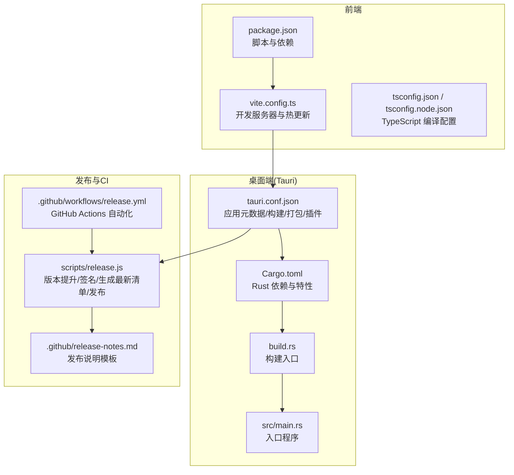
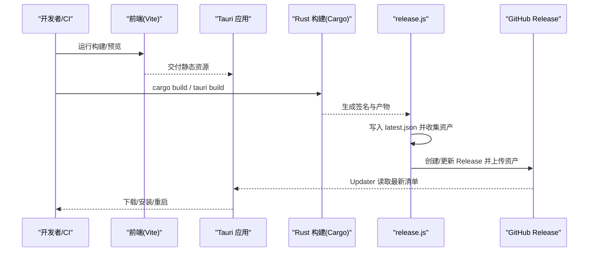
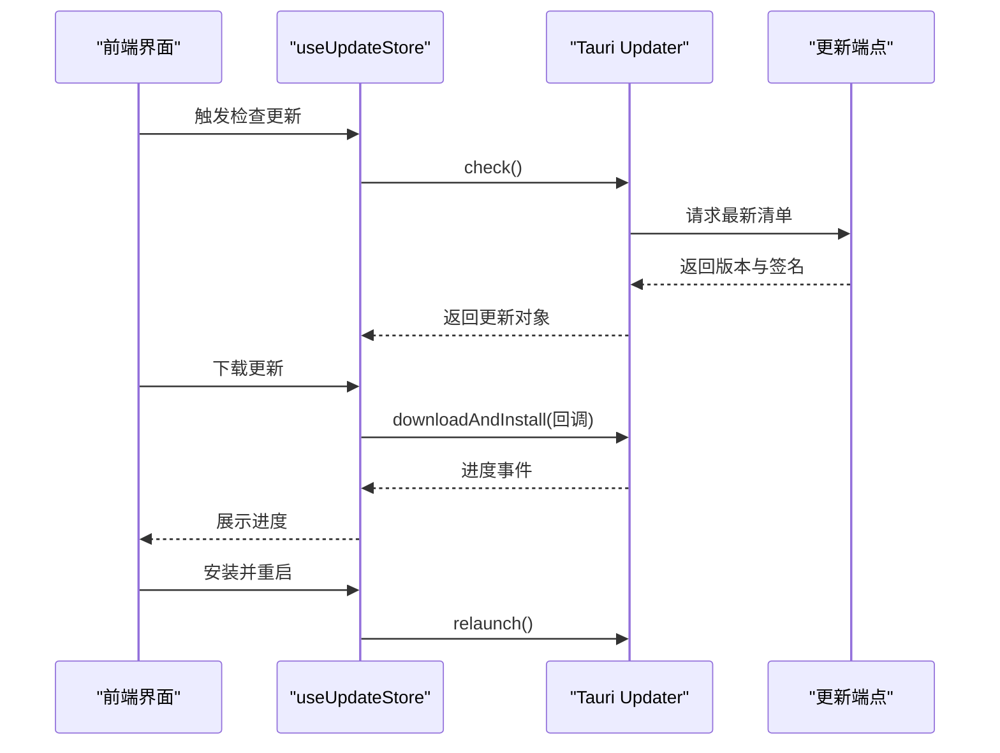
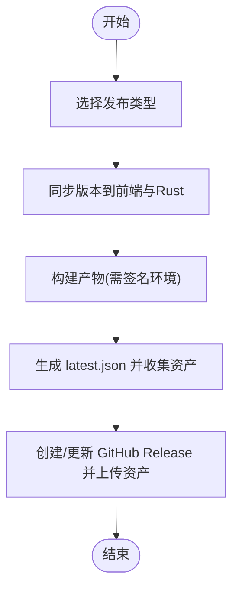
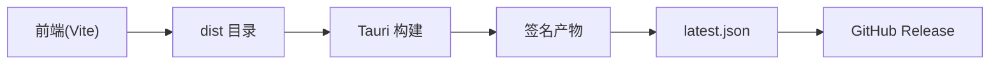

# 部署运维

<cite>
**本文引用的文件**
- [package.json](file://package.json)
- [vite.config.ts](file://vite.config.ts)
- [tauri.conf.json](file://src-tauri/tauri.conf.json)
- [Cargo.toml](file://src-tauri/Cargo.toml)
- [build.rs](file://src-tauri/build.rs)
- [release.js](file://scripts/release.js)
- [release.yml](file://.github/workflows/release.yml)
- [release-notes.md](file://.github/release-notes.md)
- [useUpdateStore.ts](file://src/composables/useUpdateStore.ts)
- [main.rs](file://src-tauri/src/main.rs)
- [tsconfig.json](file://tsconfig.json)
- [tsconfig.node.json](file://tsconfig.node.json)
</cite>

## 目录
1. [简介](#简介)
2. [项目结构](#项目结构)
3. [核心组件](#核心组件)
4. [架构总览](#架构总览)
5. [详细组件分析](#详细组件分析)
6. [依赖关系分析](#依赖关系分析)
7. [性能考虑](#性能考虑)
8. [故障排查指南](#故障排查指南)
9. [结论](#结论)
10. [附录](#附录)

## 简介
本指南面向运维与开发团队，提供 Skills Manager 的部署与运维全栈方案。内容覆盖构建配置、跨平台打包、自动更新机制、发布策略、开发/生产环境差异、性能优化、监控方案、Docker 部署思路、CI/CD 流水线配置与自动化测试设置，以及日志管理、错误追踪与系统维护最佳实践。

## 项目结构
项目采用前端（Vue + Vite）与后端（Tauri/Rust）混合架构，前端负责 UI 与交互，Tauri 负责桌面端窗口、系统集成与自动更新；发布侧通过脚本与 GitHub Actions 完成版本同步、签名、产物生成与 GitHub Release 发布。

图表来源
- [package.json:1-30](file://package.json#L1-L30)
- [vite.config.ts:1-33](file://vite.config.ts#L1-L33)
- [tauri.conf.json:1-45](file://src-tauri/tauri.conf.json#L1-L45)
- [Cargo.toml:1-36](file://src-tauri/Cargo.toml#L1-L36)
- [build.rs:1-4](file://src-tauri/build.rs#L1-L4)
- [main.rs:1-7](file://src-tauri/src/main.rs#L1-L7)
- [release.js:1-300](file://scripts/release.js#L1-L300)
- [release.yml:1-73](file://.github/workflows/release.yml#L1-L73)
- [release-notes.md:1-30](file://.github/release-notes.md#L1-L30)

章节来源
- [package.json:1-30](file://package.json#L1-L30)
- [vite.config.ts:1-33](file://vite.config.ts#L1-L33)
- [tauri.conf.json:1-45](file://src-tauri/tauri.conf.json#L1-L45)
- [Cargo.toml:1-36](file://src-tauri/Cargo.toml#L1-L36)
- [build.rs:1-4](file://src-tauri/build.rs#L1-L4)
- [main.rs:1-7](file://src-tauri/src/main.rs#L1-L7)
- [release.js:1-300](file://scripts/release.js#L1-L300)
- [release.yml:1-73](file://.github/workflows/release.yml#L1-L73)
- [release-notes.md:1-30](file://.github/release-notes.md#L1-L30)

## 核心组件
- 前端构建与开发服务器
  - 使用 Vite 提供开发服务器与热更新，固定端口与 HMR 配置适配 Tauri 开发模式。
  - TypeScript 编译配置启用 bundler 模式与严格模式，保证类型安全与模块解析一致性。
- 桌面端配置与打包
  - Tauri 配置定义产品名称、版本、窗口尺寸、CSP、插件（含自动更新）、打包目标与图标等。
  - Rust 依赖包含 Tauri 核心、对话框、打开器、进程控制、网络请求、压缩与路径工具等。
- 自动更新机制
  - 前端通过 Tauri Updater 插件检查更新、下载并安装，支持进度事件与重启。
  - 后端通过签名密钥生成更新签名，配合 release.js 生成最新清单并上传到 GitHub Release。
- 发布流水线
  - 手动触发的 GitHub Actions 工作流用于版本号同步与打标签推送。
  - release.js 支持本地或 CI 中执行版本提升、构建、生成签名与发布资产。

章节来源
- [vite.config.ts:1-33](file://vite.config.ts#L1-L33)
- [tsconfig.json:1-26](file://tsconfig.json#L1-L26)
- [tsconfig.node.json:1-11](file://tsconfig.node.json#L1-L11)
- [tauri.conf.json:1-45](file://src-tauri/tauri.conf.json#L1-L45)
- [Cargo.toml:1-36](file://src-tauri/Cargo.toml#L1-L36)
- [useUpdateStore.ts:1-158](file://src/composables/useUpdateStore.ts#L1-L158)
- [release.js:1-300](file://scripts/release.js#L1-L300)
- [release.yml:1-73](file://.github/workflows/release.yml#L1-L73)

## 架构总览
下图展示从开发到发布的整体流程，包括版本同步、构建、签名、生成最新清单与发布到 GitHub Release。

图表来源
- [vite.config.ts:1-33](file://vite.config.ts#L1-L33)
- [tauri.conf.json:1-45](file://src-tauri/tauri.conf.json#L1-L45)
- [Cargo.toml:1-36](file://src-tauri/Cargo.toml#L1-L36)
- [release.js:1-300](file://scripts/release.js#L1-L300)
- [release.yml:1-73](file://.github/workflows/release.yml#L1-L73)

## 详细组件分析

### 构建配置与开发环境
- 前端
  - 固定开发端口与严格端口策略，支持远程 HMR（通过环境变量注入主机地址），忽略对 src-tauri 的监听以避免不必要的重编译。
  - TypeScript 采用 bundler 模式与严格选项，确保模块解析与类型检查一致。
- 桌面端
  - Tauri 配置指定开发前命令与前端构建目录，确保开发时前后端联动。
  - CSP 限制连接源、脚本与图片来源，保障运行时安全。
- 版本与标识
  - package.json、tauri.conf.json、Cargo.toml 与 Cargo.lock 的版本保持一致，便于发布与溯源。

章节来源
- [vite.config.ts:1-33](file://vite.config.ts#L1-L33)
- [tsconfig.json:1-26](file://tsconfig.json#L1-L26)
- [tsconfig.node.json:1-11](file://tsconfig.node.json#L1-L11)
- [tauri.conf.json:1-45](file://src-tauri/tauri.conf.json#L1-L45)
- [package.json:1-30](file://package.json#L1-L30)
- [Cargo.toml:1-36](file://src-tauri/Cargo.toml#L1-L36)

### 跨平台打包流程
- 目标与图标
  - 打包目标设为 all，生成多平台产物；图标包含多分辨率与平台格式。
- 平台识别与产物优先级
  - release.js 通过文件路径推断平台与架构，并按优先级选择需要上传的产物。
- 签名与发布
  - 需要设置私钥环境变量以生成签名；生成 latest.json 并上传至 GitHub Release。

章节来源
- [tauri.conf.json:32-43](file://src-tauri/tauri.conf.json#L32-L43)
- [release.js:109-176](file://scripts/release.js#L109-L176)
- [release.js:199-232](file://scripts/release.js#L199-L232)
- [release.js:234-246](file://scripts/release.js#L234-L246)

### 自动更新机制
- 前端状态与行为
  - 使用组合式函数封装检查、下载、安装与重启逻辑，支持进度事件与错误处理。
  - 支持启动时静默检查，避免阻塞用户。
- 后端与签名
  - Tauri Updater 插件配置了更新端点与公钥，确保更新包可验证性。
- 更新流程
  - 前端调用检查接口获取更新对象，下载完成后触发安装并重启应用。

图表来源
- [useUpdateStore.ts:1-158](file://src/composables/useUpdateStore.ts#L1-L158)
- [tauri.conf.json:24-31](file://src-tauri/tauri.conf.json#L24-L31)

章节来源
- [useUpdateStore.ts:1-158](file://src/composables/useUpdateStore.ts#L1-L158)
- [tauri.conf.json:24-31](file://src-tauri/tauri.conf.json#L24-L31)

### 发布策略与 CI/CD
- 手动触发工作流
  - 在 GitHub 上手动选择补丁/小改/大改，自动生成版本号但不提交与打标签，随后同步到前端与 Rust 侧版本。
- 自动化发布脚本
  - 支持本地或 CI 中执行版本提升、构建、生成签名与发布资产；若未找到签名环境变量则报错。
  - 生成 latest.json 并使用 GitHub CLI 上传资产，支持编辑 Release 标题与说明。
- 发布说明
  - 提供中英文发布说明模板，包含首次启动与安装注意事项。

图表来源
- [release.yml:1-73](file://.github/workflows/release.yml#L1-L73)
- [release.js:1-300](file://scripts/release.js#L1-L300)
- [release-notes.md:1-30](file://.github/release-notes.md#L1-L30)

章节来源
- [release.yml:1-73](file://.github/workflows/release.yml#L1-L73)
- [release.js:1-300](file://scripts/release.js#L1-L300)
- [release-notes.md:1-30](file://.github/release-notes.md#L1-L30)

### Docker 部署（思路）
- 建议在容器内运行 Linux 桌面应用时，结合 X11 或 Wayland 显示栈与桌面环境（如 xvfb/headless 方案）。
- 将打包后的应用二进制与依赖镜像化，暴露必要端口与卷挂载（如配置目录）。
- 使用健康检查探测应用窗口或进程状态，结合日志采集与告警。

[本节为概念性指导，无需图表来源]

### 性能优化建议
- 前端
  - 启用严格的 TypeScript 检查与模块解析，减少运行时错误与包体积。
  - 避免监听 src-tauri 目录，降低开发时的文件系统压力。
- 桌面端
  - 合理使用插件与网络请求，避免阻塞主线程。
  - 对下载进度进行节流与 UI 动画优化，提升用户体验。
- 发布
  - 仅上传最优产物，减少 Release 资产体积与下载时间。

章节来源
- [tsconfig.json:1-26](file://tsconfig.json#L1-L26)
- [vite.config.ts:27-31](file://vite.config.ts#L27-L31)
- [useUpdateStore.ts:86-115](file://src/composables/useUpdateStore.ts#L86-L115)

### 监控方案
- 日志
  - 前端错误统一记录到控制台，便于定位更新失败与下载异常。
  - 桌面端可通过系统日志与应用日志目录收集运行时信息。
- 健康检查
  - 通过进程存活与窗口状态判断应用可用性。
- 告警
  - 结合 CI/CD 成功/失败与更新失败事件，触发通知。

章节来源
- [useUpdateStore.ts:57-63](file://src/composables/useUpdateStore.ts#L57-L63)
- [useUpdateStore.ts:110-115](file://src/composables/useUpdateStore.ts#L110-L115)

### 日志管理、错误追踪与系统维护
- 错误追踪
  - 更新检查与下载阶段均捕获异常并记录错误消息，便于快速定位问题。
- 系统维护
  - 定期清理旧 Release 资产与标签，保持仓库整洁。
  - 维护签名密钥轮换与公钥更新，确保更新通道安全。

章节来源
- [useUpdateStore.ts:57-63](file://src/composables/useUpdateStore.ts#L57-L63)
- [useUpdateStore.ts:110-115](file://src/composables/useUpdateStore.ts#L110-L115)
- [tauri.conf.json:24-31](file://src-tauri/tauri.conf.json#L24-L31)

## 依赖关系分析
- 前端到桌面端
  - 前端构建产物由 Tauri 在构建前准备，开发时通过 devUrl 指向本地 Vite。
- 桌面端到发布
  - Tauri 配置中的打包与签名参数直接影响 release.js 的产物收集与发布。
- 发布到外部
  - release.js 依赖 GitHub CLI 与发布说明模板，最终写入最新清单并上传到 GitHub Release。

图表来源
- [tauri.conf.json:6-11](file://src-tauri/tauri.conf.json#L6-L11)
- [release.js:199-232](file://scripts/release.js#L199-L232)
- [release.js:248-268](file://scripts/release.js#L248-L268)

章节来源
- [tauri.conf.json:6-11](file://src-tauri/tauri.conf.json#L6-L11)
- [release.js:199-232](file://scripts/release.js#L199-L232)
- [release.js:248-268](file://scripts/release.js#L248-L268)

## 性能考虑
- 构建阶段
  - 使用严格端口与固定端口策略，避免端口冲突导致的反复重试。
  - 忽略 src-tauri 监听，减少不必要的重新编译。
- 运行阶段
  - 更新下载进度事件仅提供块长度，采用递增动画模拟进度，避免 UI 卡顿。
- 发布阶段
  - 仅上传最优产物，缩短下载时间并降低带宽占用。

章节来源
- [vite.config.ts:14-31](file://vite.config.ts#L14-L31)
- [useUpdateStore.ts:93-109](file://src/composables/useUpdateStore.ts#L93-L109)

## 故障排查指南
- 开发环境
  - 若 HMR 不生效，检查是否设置了正确的开发主机地址与端口。
  - 若监听 src-tauri 导致频繁重编译，确认忽略规则是否正确。
- 发布流程
  - 缺少签名环境变量会导致构建失败，需设置私钥环境变量。
  - 缺少 GitHub CLI 会阻止资产上传，需安装并登录。
  - 无法推断仓库 slug 时，需显式设置 GITHUB_REPOSITORY。
- 更新机制
  - 更新检查失败会在控制台输出错误信息，检查网络与端点可达性。
  - 下载失败时查看进度事件与错误消息，确认签名与 URL 正确性。

章节来源
- [vite.config.ts:5-31](file://vite.config.ts#L5-L31)
- [release.js:66-70](file://scripts/release.js#L66-L70)
- [release.js:234-246](file://scripts/release.js#L234-L246)
- [useUpdateStore.ts:57-63](file://src/composables/useUpdateStore.ts#L57-L63)
- [useUpdateStore.ts:110-115](file://src/composables/useUpdateStore.ts#L110-L115)

## 结论
本指南提供了 Skills Manager 从开发到发布的完整运维方案。通过明确的构建配置、跨平台打包流程、自动更新机制与发布策略，结合 CI/CD 与发布说明模板，可实现稳定高效的桌面应用交付与维护。建议在生产环境中强化签名与公钥管理、完善监控与告警，并持续优化构建与更新体验。

## 附录
- 关键配置要点
  - 前端：固定端口、严格端口、HMR 主机、忽略监听目录。
  - 桌面端：开发前命令、前端构建目录、CSP、插件与打包配置。
  - 发布：版本同步、签名环境变量、GitHub CLI、latest.json 生成与上传。
- 最佳实践
  - 保持版本一致性与标签规范，定期清理旧资产。
  - 在 CI 中分步执行版本提升、构建、签名与发布，确保可追溯性。
  - 对更新失败与下载异常进行集中记录与告警。