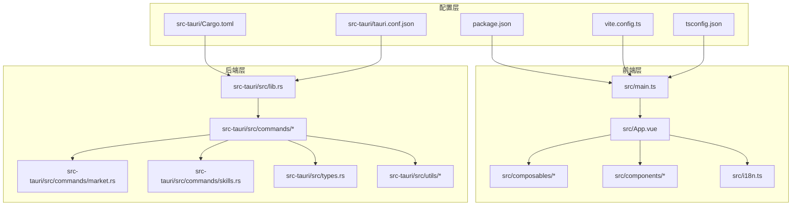
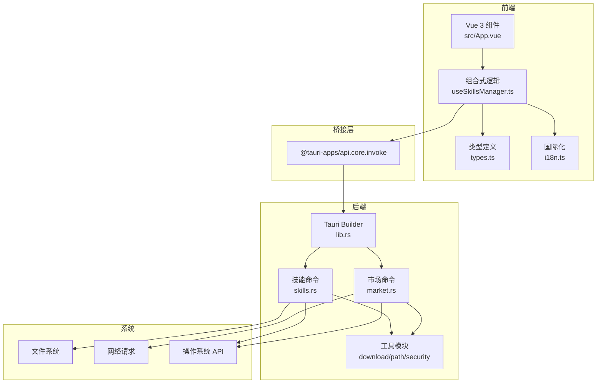
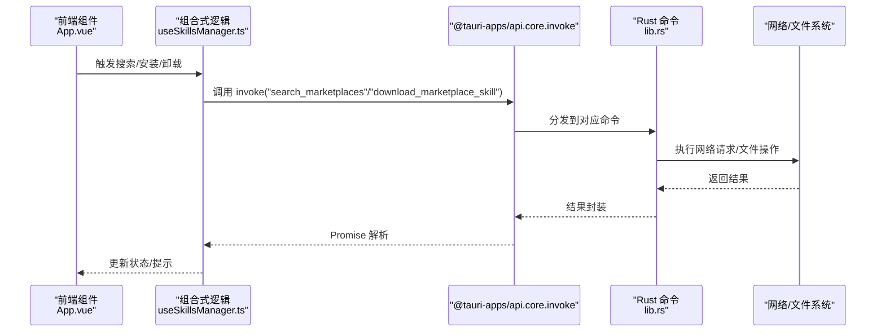
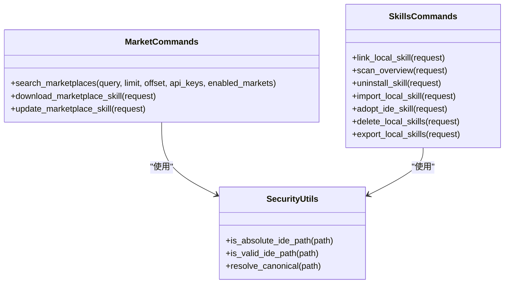
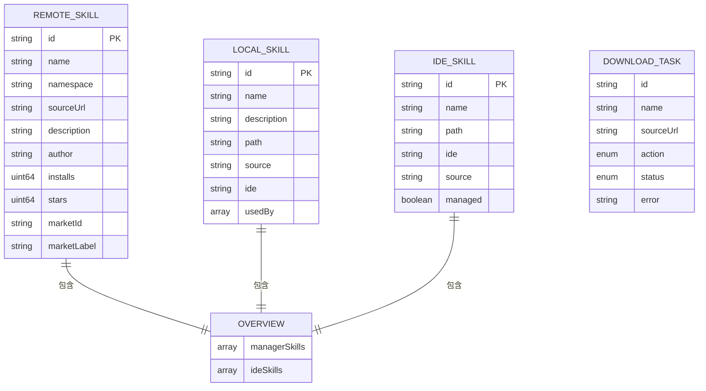
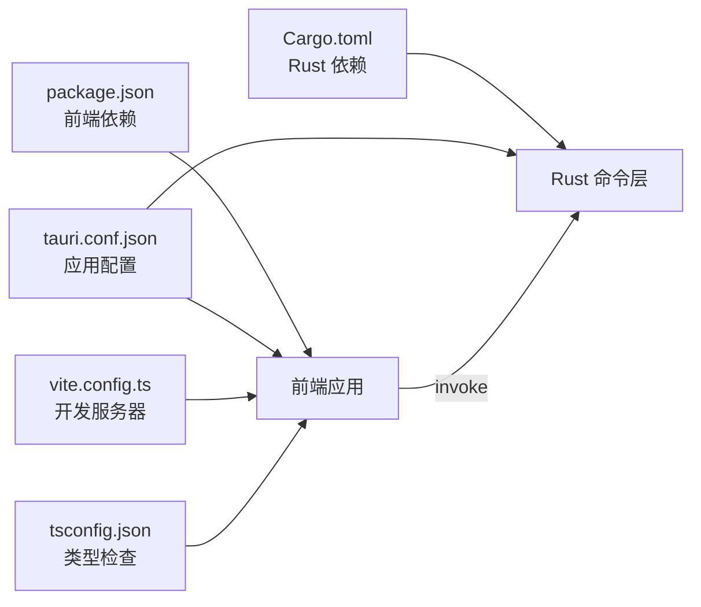

# 技术架构概览

<cite>
**本文档引用的文件**
- [package.json](file://package.json)
- [Cargo.toml](file://src-tauri/Cargo.toml)
- [tauri.conf.json](file://src-tauri/tauri.conf.json)
- [vite.config.ts](file://vite.config.ts)
- [tsconfig.json](file://tsconfig.json)
- [src/main.ts](file://src/main.ts)
- [src/App.vue](file://src/App.vue)
- [src/composables/useSkillsManager.ts](file://src/composables/useSkillsManager.ts)
- [src/composables/types.ts](file://src/composables/types.ts)
- [src/i18n.ts](file://src/i18n.ts)
- [src-tauri/src/lib.rs](file://src-tauri/src/lib.rs)
- [src-tauri/src/commands/mod.rs](file://src-tauri/src/commands/mod.rs)
- [src-tauri/src/commands/market.rs](file://src-tauri/src/commands/market.rs)
- [src-tauri/src/commands/skills.rs](file://src-tauri/src/commands/skills.rs)
- [README.md](file://README.md)
</cite>

## 目录
1. [简介](#简介)
2. [项目结构](#项目结构)
3. [核心组件](#核心组件)
4. [架构总览](#架构总览)
5. [详细组件分析](#详细组件分析)
6. [依赖关系分析](#依赖关系分析)
7. [性能考虑](#性能考虑)
8. [故障排除指南](#故障排除指南)
9. [结论](#结论)

## 简介
本项目采用 Tauri 2 + Vue 3 + TypeScript + Rust 的混合桌面应用架构，旨在为多 IDE 平台提供统一的 AI Skills 管理能力。该架构通过前端 Vue 3 + TypeScript 提供现代化用户界面与类型安全保障，通过 Rust 命令层处理系统级操作（文件管理、链接创建、网络请求等），并通过 Tauri 桌面运行时实现跨平台部署与原生功能集成。

技术选型优势：
- Tauri 2：轻量级桌面运行时，相比 Electron 更加高效，支持多平台打包与原生插件生态。
- Vue 3 + TypeScript：组件化开发与强类型约束，提升开发效率与可维护性。
- Rust：高性能、内存安全的系统级语言，适合处理文件系统、网络与安全校验等底层逻辑。
- Vite：快速构建工具链，提供热重载与模块联邦能力。

## 项目结构
项目采用前后端分离的模块化组织方式：
- 前端层：src 目录包含 Vue 3 应用、国际化配置、组合式函数与组件。
- 后端层：src-tauri 目录包含 Rust 命令模块、类型定义与工具函数。
- 配置层：package.json、Cargo.toml、tauri.conf.json、vite.config.ts 等统一管理依赖与构建配置。

**图表来源**
- [src/main.ts:1-7](file://src/main.ts#L1-L7)
- [src/App.vue:1-20](file://src/App.vue#L1-L20)
- [src-tauri/src/lib.rs:1-54](file://src-tauri/src/lib.rs#L1-L54)
- [src-tauri/src/commands/mod.rs:1-3](file://src-tauri/src/commands/mod.rs#L1-L3)
- [package.json:1-30](file://package.json#L1-L30)
- [Cargo.toml:1-36](file://src-tauri/Cargo.toml#L1-L36)
- [tauri.conf.json:1-45](file://src-tauri/tauri.conf.json#L1-L45)
- [vite.config.ts:1-33](file://vite.config.ts#L1-L33)
- [tsconfig.json:1-26](file://tsconfig.json#L1-L26)

**章节来源**
- [package.json:1-30](file://package.json#L1-L30)
- [Cargo.toml:1-36](file://src-tauri/Cargo.toml#L1-L36)
- [tauri.conf.json:1-45](file://src-tauri/tauri.conf.json#L1-L45)
- [vite.config.ts:1-33](file://vite.config.ts#L1-L33)
- [tsconfig.json:1-26](file://tsconfig.json#L1-L26)
- [src/main.ts:1-7](file://src/main.ts#L1-L7)
- [src/App.vue:1-20](file://src/App.vue#L1-L20)

## 核心组件
- 前端应用入口与路由：src/main.ts 负责创建 Vue 应用并挂载根组件；src/App.vue 提供主界面与标签页导航。
- 组合式逻辑：src/composables/useSkillsManager.ts 封装市场搜索、下载队列、本地扫描、IDE 安装等业务逻辑，并通过 @tauri-apps/api 与 Rust 命令交互。
- 类型系统：src/composables/types.ts 定义远程技能、本地技能、IDE 技能、概述、下载任务等核心数据模型。
- 国际化：src/i18n.ts 使用 vue-i18n 提供中英文切换。
- 后端命令：src-tauri/src/lib.rs 注册所有命令；src-tauri/src/commands/market.rs 处理市场搜索与下载；src-tauri/src/commands/skills.rs 处理本地技能管理与 IDE 链接。

**章节来源**
- [src/main.ts:1-7](file://src/main.ts#L1-L7)
- [src/App.vue:1-20](file://src/App.vue#L1-L20)
- [src/composables/useSkillsManager.ts:1-20](file://src/composables/useSkillsManager.ts#L1-L20)
- [src/composables/types.ts:1-119](file://src/composables/types.ts#L1-L119)
- [src/i18n.ts:1-17](file://src/i18n.ts#L1-L17)
- [src-tauri/src/lib.rs:1-54](file://src-tauri/src/lib.rs#L1-L54)
- [src-tauri/src/commands/mod.rs:1-3](file://src-tauri/src/commands/mod.rs#L1-L3)

## 架构总览
整体架构采用“前端 UI + 类型安全 + 命令层 + 桌面运行时”的分层设计。前端通过 @tauri-apps/api 的 invoke 调用 Rust 命令，Rust 命令在独立线程池中执行耗时或系统级操作，完成后返回结果给前端。

**图表来源**
- [src/App.vue:1-20](file://src/App.vue#L1-L20)
- [src/composables/useSkillsManager.ts:1-20](file://src/composables/useSkillsManager.ts#L1-L20)
- [src/composables/types.ts:1-119](file://src/composables/types.ts#L1-L119)
- [src/i18n.ts:1-17](file://src/i18n.ts#L1-L17)
- [src-tauri/src/lib.rs:1-54](file://src-tauri/src/lib.rs#L1-L54)
- [src-tauri/src/commands/market.rs:1-20](file://src-tauri/src/commands/market.rs#L1-L20)
- [src-tauri/src/commands/skills.rs:1-20](file://src-tauri/src/commands/skills.rs#L1-L20)

## 详细组件分析

### 前端组件与数据流
- 主界面与状态管理：src/App.vue 通过响应式引用与计算属性管理主题、语言、标签页与全局状态；调用 useSkillsManager.ts 中的方法进行市场搜索、本地扫描与安装流程。
- 下载队列与并发控制：useSkillsManager.ts 实现了下载队列的入队、出队与错误重试机制，避免并发冲突并提供用户反馈。
- 类型安全的数据模型：types.ts 定义了 RemoteSkill、LocalSkill、IdeSkill、Overview、DownloadTask 等类型，确保前后端契约一致。

**图表来源**
- [src/App.vue:73-124](file://src/App.vue#L73-L124)
- [src/composables/useSkillsManager.ts:190-248](file://src/composables/useSkillsManager.ts#L190-L248)
- [src-tauri/src/lib.rs:27-39](file://src-tauri/src/lib.rs#L27-L39)
- [src-tauri/src/commands/market.rs:173-392](file://src-tauri/src/commands/market.rs#L173-L392)

**章节来源**
- [src/App.vue:73-124](file://src/App.vue#L73-L124)
- [src/composables/useSkillsManager.ts:190-352](file://src/composables/useSkillsManager.ts#L190-L352)
- [src/composables/types.ts:1-119](file://src/composables/types.ts#L1-L119)

### Rust 命令层与安全策略
- 命令注册与生命周期：src-tauri/src/lib.rs 在应用启动时注册所有命令，并根据平台启用单实例与更新插件。
- 市场命令：src-tauri/src/commands/market.rs 实现多市场聚合搜索、下载与更新，包含市场状态上报与错误处理。
- 技能命令：src-tauri/src/commands/skills.rs 实现本地技能导入、导出、删除、链接与卸载，严格的安全路径校验与跨平台符号链接/连接处理。

**图表来源**
- [src-tauri/src/commands/market.rs:173-442](file://src-tauri/src/commands/market.rs#L173-L442)
- [src-tauri/src/commands/skills.rs:355-800](file://src-tauri/src/commands/skills.rs#L355-L800)

**章节来源**
- [src-tauri/src/lib.rs:20-53](file://src-tauri/src/lib.rs#L20-L53)
- [src-tauri/src/commands/market.rs:173-442](file://src-tauri/src/commands/market.rs#L173-L442)
- [src-tauri/src/commands/skills.rs:355-800](file://src-tauri/src/commands/skills.rs#L355-L800)

### 数据模型与类型系统
- 远程技能：包含标识、名称、命名空间、源地址、描述、作者、安装量、星数与市场信息。
- 本地技能：包含标识、名称、描述、路径、来源与被哪些 IDE 使用。
- IDE 技能：包含标识、名称、路径、IDE 标签、来源与是否受管理。
- 概述：统一返回本地管理技能与 IDE 技能列表。
- 下载任务：用于队列管理的状态跟踪。

**图表来源**
- [src/composables/types.ts:4-119](file://src/composables/types.ts#L4-L119)

**章节来源**
- [src/composables/types.ts:1-119](file://src/composables/types.ts#L1-L119)

### 跨平台兼容性与性能优化
- 跨平台：Rust 命令层通过条件编译与平台特定 API（如 Windows 的 mklink）适配不同操作系统；前端通过 Tauri 插件访问原生能力。
- 性能：使用 spawn_blocking 将阻塞操作移至后台线程，避免阻塞主线程；前端实现搜索缓存与下载队列并发控制；Vite 提供快速热重载与按需加载。
- 安全：严格的路径解析与规范化、符号链接/连接的安全检查、仅允许受控目录内的文件操作。

**章节来源**
- [src-tauri/src/commands/skills.rs:311-353](file://src-tauri/src/commands/skills.rs#L311-L353)
- [src/composables/useSkillsManager.ts:23-27](file://src/composables/useSkillsManager.ts#L23-L27)
- [vite.config.ts:16-31](file://vite.config.ts#L16-L31)

## 依赖关系分析
- 前端依赖：Vue 3、TypeScript、@tauri-apps/api、vue-i18n 等；通过 package.json 管理版本与脚本。
- 后端依赖：Tauri 2、serde、ureq、zip、walkdir、dirs 等；通过 Cargo.toml 管理构建与插件。
- 构建配置：Vite 提供开发服务器与 HMR；Tauri 配置指定前端构建输出与 CSP 策略；TypeScript 配置启用严格模式与模块解析。

**图表来源**
- [package.json:13-28](file://package.json#L13-L28)
- [Cargo.toml:20-36](file://src-tauri/Cargo.toml#L20-L36)
- [tauri.conf.json:6-11](file://src-tauri/tauri.conf.json#L6-L11)
- [vite.config.ts:8-32](file://vite.config.ts#L8-L32)
- [tsconfig.json:2-22](file://tsconfig.json#L2-L22)

**章节来源**
- [package.json:1-30](file://package.json#L1-L30)
- [Cargo.toml:1-36](file://src-tauri/Cargo.toml#L1-L36)
- [tauri.conf.json:1-45](file://src-tauri/tauri.conf.json#L1-L45)
- [vite.config.ts:1-33](file://vite.config.ts#L1-L33)
- [tsconfig.json:1-26](file://tsconfig.json#L1-L26)

## 性能考虑
- 异步与并发：市场搜索与下载通过 spawn_blocking 与 Promise 链式调用，避免 UI 卡顿。
- 缓存策略：前端对市场搜索结果进行时间窗口缓存，减少重复请求。
- 资源隔离：Vite 开发服务器固定端口与 HMR 配置，保证调试体验与资源加载稳定性。
- 文件操作优化：批量导出使用 ZIP 流式写入，避免大文件内存占用。

[本节为通用性能建议，无需具体文件分析]

## 故障排除指南
- 市场状态异常：market.rs 返回 MarketStatus，包含 online/error/needs_key 三态与错误详情，前端据此展示提示。
- 路径安全错误：skills.rs 对绝对/相对路径、符号链接目标与允许根目录进行严格校验，出现错误时返回明确信息。
- 下载失败：download_marketplace_skill/update_marketplace_skill 返回错误字符串，前端统一转为用户提示。
- 卸载与删除：uninstall_skill/delete_local_skills 限制在受控目录内，防止误删系统关键文件。

**章节来源**
- [src-tauri/src/commands/market.rs:219-251](file://src-tauri/src/commands/market.rs#L219-L251)
- [src-tauri/src/commands/skills.rs:538-609](file://src-tauri/src/commands/skills.rs#L538-L609)

## 结论
本项目通过 Tauri 2 + Vue 3 + TypeScript + Rust 的组合，实现了高性能、跨平台且类型安全的 Skills 管理器。前端负责用户体验与业务编排，后端负责系统级操作与安全校验，两者通过 Tauri 的命令机制紧密协作。该架构既满足了现代桌面应用的易用性要求，又具备良好的扩展性与安全性，适合长期演进与多平台发布。