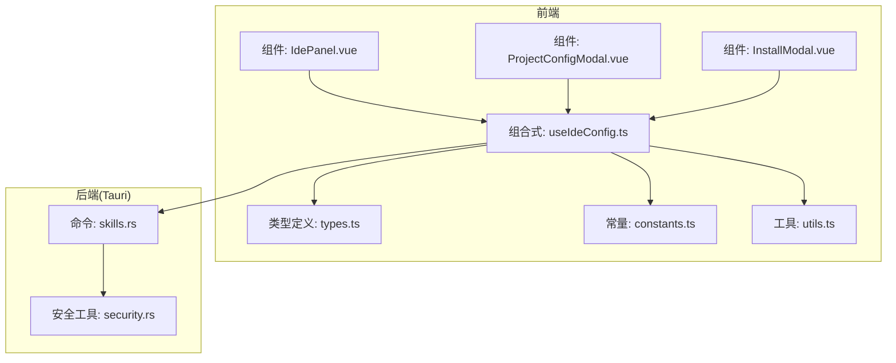
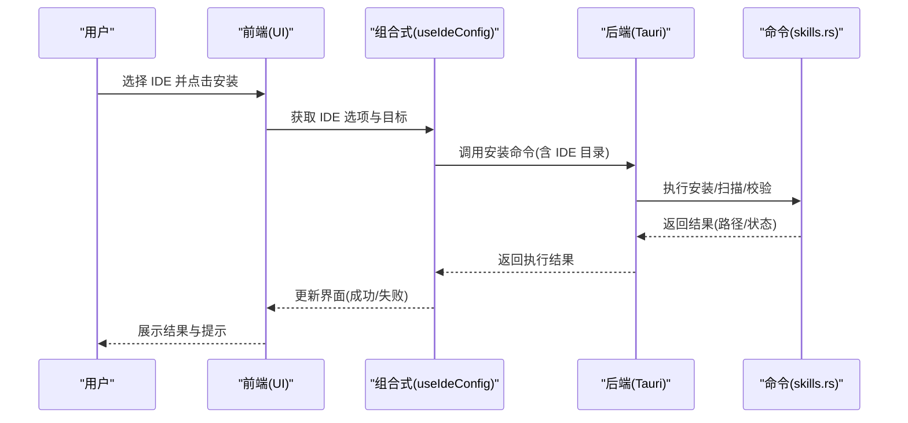
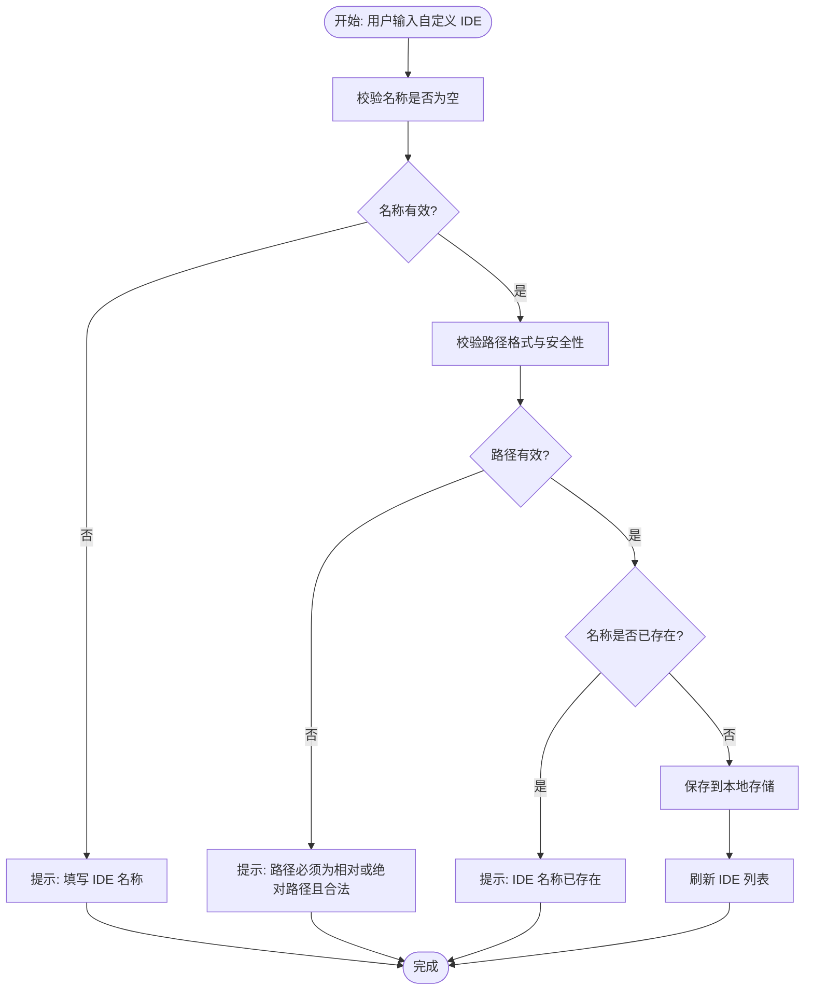
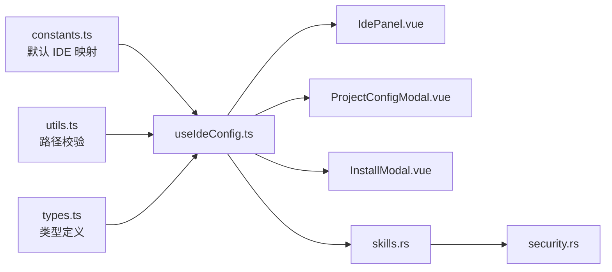

# 支持的 IDE 类型

<cite>
**本文引用的文件**
- [README.md](file://README.md)
- [src/composables/constants.ts](file://src/composables/constants.ts)
- [src/composables/types.ts](file://src/composables/types.ts)
- [src/composables/utils.ts](file://src/composables/utils.ts)
- [src/composables/useIdeConfig.ts](file://src/composables/useIdeConfig.ts)
- [src-tauri/src/commands/skills.rs](file://src-tauri/src/commands/skills.rs)
- [src-tauri/src/utils/security.rs](file://src-tauri/src/utils/security.rs)
- [src/components/IdePanel.vue](file://src/components/IdePanel.vue)
- [src/components/ProjectConfigModal.vue](file://src/components/ProjectConfigModal.vue)
- [src/components/InstallModal.vue](file://src/components/InstallModal.vue)
- [src/locales/en-US.ts](file://src/locales/en-US.ts)
- [src/locales/zh-CN.ts](file://src/locales/zh-CN.ts)
</cite>

## 目录
1. [简介](#简介)
2. [项目结构](#项目结构)
3. [核心组件](#核心组件)
4. [架构总览](#架构总览)
5. [详细组件分析](#详细组件分析)
6. [依赖关系分析](#依赖关系分析)
7. [性能考量](#性能考量)
8. [故障排查指南](#故障排查指南)
9. [结论](#结论)
10. [附录](#附录)

## 简介
本文件面向 Skills Manager 的使用者与维护者，系统性介绍已原生支持的 IDE 列表、各 IDE 的技能目录结构与配置方式；同时提供“自定义 IDE 添加机制”的完整规范（目录结构、配置参数、注册流程），并给出最佳实践与常见问题解决方案。文档中的截图与配置示例均以仓库内现有资源为准。

## 项目结构
- 前端层（Vue 3 + TypeScript + Vite）负责用户界面与交互逻辑，IDE 配置与安装目标选择等均由前端组件与组合式函数实现。
- 后端层（Rust + Tauri）负责系统级操作（如扫描 IDE 目录、安全路径校验、安装/卸载等），并与前端通过命令通道通信。
- 国际化与本地化：英文与中文文案在前端 i18n 文件中集中维护，IDE 相关提示与错误信息均通过键值映射呈现。

图表来源
- [src/components/IdePanel.vue](file://src/components/IdePanel.vue)
- [src/components/ProjectConfigModal.vue](file://src/components/ProjectConfigModal.vue)
- [src/components/InstallModal.vue](file://src/components/InstallModal.vue)
- [src/composables/useIdeConfig.ts](file://src/composables/useIdeConfig.ts)
- [src/composables/constants.ts](file://src/composables/constants.ts)
- [src/composables/types.ts](file://src/composables/types.ts)
- [src/composables/utils.ts](file://src/composables/utils.ts)
- [src-tauri/src/commands/skills.rs](file://src-tauri/src/commands/skills.rs)
- [src-tauri/src/utils/security.rs](file://src-tauri/src/utils/security.rs)

章节来源
- [README.md:21-34](file://README.md#L21-L34)
- [src/composables/constants.ts:6-19](file://src/composables/constants.ts#L6-L19)
- [src/composables/constants.ts:58-71](file://src/composables/constants.ts#L58-L71)

## 核心组件
- IDE 选项与默认映射：前端通过常量定义默认 IDE 列表及其技能目录相对路径，并在本地存储中持久化用户自定义 IDE。
- 路径校验与安全策略：前端与后端共同保证自定义 IDE 目录的安全性（相对路径、绝对路径、WSL UNC、危险路径拦截等）。
- 安装目标选择：安装弹窗支持“全局 IDE”和“项目”两种目标，项目模式下可按 IDE 过滤与选择。
- IDE 扫描与项目检测：后端扫描用户主目录下的默认 IDE 目录，同时支持在项目根目录扫描各 IDE 的技能目录。

章节来源
- [src/composables/constants.ts:6-19](file://src/composables/constants.ts#L6-L19)
- [src/composables/constants.ts:58-71](file://src/composables/constants.ts#L58-L71)
- [src/composables/utils.ts:34-99](file://src/composables/utils.ts#L34-L99)
- [src-tauri/src/commands/skills.rs:458-492](file://src-tauri/src/commands/skills.rs#L458-L492)
- [src-tauri/src/commands/skills.rs:807-846](file://src-tauri/src/commands/skills.rs#L807-L846)

## 架构总览
下图展示 IDE 配置与安装流程的关键交互：前端收集 IDE 选项与目标，调用后端命令进行路径校验与安装，最终在对应 IDE 的技能目录中生成符号链接或复制内容。

图表来源
- [src/components/InstallModal.vue:75-101](file://src/components/InstallModal.vue#L75-L101)
- [src/composables/useIdeConfig.ts:59-130](file://src/composables/useIdeConfig.ts#L59-L130)
- [src-tauri/src/commands/skills.rs:458-492](file://src-tauri/src/commands/skills.rs#L458-L492)

## 详细组件分析

### 已原生支持的 IDE 列表与技能目录结构
以下 IDE 为默认内置支持，安装时直接使用其对应的相对路径作为技能目录。这些映射在前端常量与后端扫描逻辑中均有体现。

- Antigravity：`.gemini/antigravity/skills`
- Claude Code：`.claude/skills`
- CodeBuddy：`.codebuddy/skills`
- Codex：`.codex/skills`
- Cursor：`.cursor/skills`
- Kiro：`.kiro/skills`
- OpenClaw：`.openclaw/skills`
- OpenCode：`.config/opencode/skills`
- Qoder：`.qoder/skills`
- Trae：`.trae/skills`
- VSCode：`.github/skills`
- Windsurf：`.windsurf/skills`

章节来源
- [README.md:21-34](file://README.md#L21-L34)
- [src/composables/constants.ts:6-19](file://src/composables/constants.ts#L6-L19)
- [src/composables/constants.ts:58-71](file://src/composables/constants.ts#L58-L71)
- [src-tauri/src/commands/skills.rs:814-827](file://src-tauri/src/commands/skills.rs#L814-L827)

### 各 IDE 的技能目录结构与配置方式
- 目录结构：每个 IDE 的技能目录位于用户主目录下，采用统一的相对路径约定。安装时，Skills Manager 将本地技能以符号链接或复制的方式部署到该目录。
- 配置方式：
  - 全局安装：在“安装到 IDE”弹窗中勾选目标 IDE，即可将技能安装到其全局目录。
  - 项目安装：在“项目配置”中为项目指定 IDE 目标，安装时选择“项目”，技能将被链接到项目内的对应 IDE 目录。
  - 自定义 IDE：通过 IDE 浏览面板添加自定义 IDE，填写 IDE 名称与技能目录路径，系统将对其进行安全校验并持久化。

章节来源
- [src/components/InstallModal.vue:75-101](file://src/components/InstallModal.vue#L75-L101)
- [src/components/ProjectConfigModal.vue:67-90](file://src/components/ProjectConfigModal.vue#L67-L90)
- [src/components/IdePanel.vue:110-131](file://src/components/IdePanel.vue#L110-L131)

### 自定义 IDE 添加机制
- 目录结构规范
  - 相对路径：以用户主目录为根，形如 `.myide/skills`。
  - 绝对路径：以系统根为起点，形如 `/home/user/.myide/skills` 或 `C:\Users\user\.myide\skills`。
  - WSL UNC 路径：支持 `\\wsl$\<distro>\<path>` 与 `\\wsl.localhost\<distro>\<path>` 形式。
- 配置参数
  - IDE 名称：用于 UI 显示与过滤。
  - 技能目录：IDE 的技能根目录，Skills Manager 将在此目录下管理技能。
- 注册流程
  1) 在 IDE 浏览面板输入 IDE 名称与目录，点击“添加 IDE”。
  2) 前端进行格式与安全校验（相对/绝对路径、非法字符、保留名、危险路径等）。
  3) 若通过校验，将自定义 IDE 写入本地存储；否则返回相应错误提示。
  4) 刷新 IDE 列表，可在安装与浏览中使用该自定义 IDE。

图表来源
- [src/composables/useIdeConfig.ts:76-104](file://src/composables/useIdeConfig.ts#L76-L104)
- [src/composables/utils.ts:34-99](file://src/composables/utils.ts#L34-L99)
- [src/locales/en-US.ts:170-187](file://src/locales/en-US.ts#L170-L187)
- [src/locales/zh-CN.ts:170-187](file://src/locales/zh-CN.ts#L170-L187)

章节来源
- [src/composables/useIdeConfig.ts:59-130](file://src/composables/useIdeConfig.ts#L59-L130)
- [src/composables/utils.ts:34-99](file://src/composables/utils.ts#L34-L99)
- [src/locales/en-US.ts:170-187](file://src/locales/en-US.ts#L170-L187)
- [src/locales/zh-CN.ts:170-187](file://src/locales/zh-CN.ts#L170-L187)

### IDE 集成最佳实践
- 使用相对路径：优先使用以用户主目录为根的相对路径，便于跨平台迁移与分享。
- 避免危险路径：不要指向系统关键目录（如 `/etc`、`/sys`、`/proc`、`/dev`、`/root` 等），系统会自动拦截。
- 跨平台兼容：Windows 使用驱动器盘符或 WSL UNC；Unix 使用绝对路径前缀 `/`。
- 项目隔离：为不同项目配置不同的 IDE 目标，避免技能相互干扰。
- 安全校验：自定义 IDE 目录应确保可读写权限，避免符号链接环路或越权访问。

章节来源
- [src/composables/utils.ts:70-92](file://src/composables/utils.ts#L70-L92)
- [src-tauri/src/utils/security.rs:43-65](file://src-tauri/src/utils/security.rs#L43-L65)

### 常见问题与解决方案
- 无法打开目录或提示找不到文件：系统会尝试回退到父目录打开，若仍失败则提示错误。请检查路径是否存在、权限是否足够。
- 自定义 IDE 添加失败：检查名称是否重复、路径是否为空、是否为合法路径格式。
- 项目未配置 IDE 目标：在项目配置中先选择 IDE 目标再进行安装。
- 安装/卸载失败：检查磁盘空间、权限与路径合法性；必要时更换为相对路径或绝对路径。

章节来源
- [src/composables/useSkillsManager.ts:723-739](file://src/composables/useSkillsManager.ts#L723-L739)
- [src/locales/en-US.ts:170-187](file://src/locales/en-US.ts#L170-L187)
- [src/locales/zh-CN.ts:170-187](file://src/locales/zh-CN.ts#L170-L187)

## 依赖关系分析
- 前端依赖
  - useIdeConfig.ts 依赖 constants.ts（默认 IDE 列表）、utils.ts（路径校验）、types.ts（类型定义）。
  - 组件层（IdePanel.vue、ProjectConfigModal.vue、InstallModal.vue）依赖 useIdeConfig.ts 提供的状态与动作。
- 后端依赖
  - skills.rs 依赖 security.rs 进行路径合法性与安全性校验，并根据请求解析 IDE 目录（相对路径拼接主目录，绝对路径直接使用）。
- 数据流
  - 用户在前端选择 IDE 与目标，前端调用后端命令，后端执行扫描/安装/校验，返回结果并更新前端 UI。

图表来源
- [src/composables/constants.ts](file://src/composables/constants.ts)
- [src/composables/utils.ts](file://src/composables/utils.ts)
- [src/composables/types.ts](file://src/composables/types.ts)
- [src/composables/useIdeConfig.ts](file://src/composables/useIdeConfig.ts)
- [src/components/IdePanel.vue](file://src/components/IdePanel.vue)
- [src/components/ProjectConfigModal.vue](file://src/components/ProjectConfigModal.vue)
- [src/components/InstallModal.vue](file://src/components/InstallModal.vue)
- [src-tauri/src/commands/skills.rs](file://src-tauri/src/commands/skills.rs)
- [src-tauri/src/utils/security.rs](file://src-tauri/src/utils/security.rs)

章节来源
- [src/composables/constants.ts:6-19](file://src/composables/constants.ts#L6-L19)
- [src/composables/useIdeConfig.ts:59-130](file://src/composables/useIdeConfig.ts#L59-L130)
- [src-tauri/src/commands/skills.rs:458-492](file://src-tauri/src/commands/skills.rs#L458-L492)

## 性能考量
- 路径校验前置：在前端尽早进行路径格式与安全校验，减少无效请求与后端开销。
- 批量操作：安装/卸载支持多选批量处理，降低 UI 交互次数与系统调用频率。
- 缓存与重用：安装目标与 IDE 选项持久化于本地存储，避免每次启动重新计算。
- 目录扫描：项目扫描仅针对已知模式进行，避免全盘扫描带来的性能损耗。

## 故障排查指南
- 打开目录失败
  - 现象：点击“打开目录”提示失败。
  - 排查：确认路径存在且有读取权限；若为不存在的文件，系统会尝试打开其父目录；仍失败则检查路径拼写与权限。
- 自定义 IDE 添加失败
  - 现象：添加按钮无响应或报错。
  - 排查：检查名称是否为空或重复；路径是否为相对或绝对路径且不包含非法字符；Windows 保留名检查。
- 项目安装无目标
  - 现象：项目安装时提示“项目未配置 IDE 目标”。
  - 排查：在项目配置中先为项目选择 IDE 目标，再进行安装。
- 卸载/安装失败
  - 现象：卸载或安装后 IDE 中无变化。
  - 排查：检查磁盘空间、权限；确认 IDE 目录为合法路径；必要时更换为相对路径或绝对路径。

章节来源
- [src/composables/useSkillsManager.ts:723-739](file://src/composables/useSkillsManager.ts#L723-L739)
- [src/composables/useIdeConfig.ts:76-104](file://src/composables/useIdeConfig.ts#L76-L104)
- [src/composables/utils.ts:34-99](file://src/composables/utils.ts#L34-L99)
- [src/locales/en-US.ts:170-187](file://src/locales/en-US.ts#L170-L187)
- [src/locales/zh-CN.ts:170-187](file://src/locales/zh-CN.ts#L170-L187)

## 结论
Skills Manager 对主流 IDE 提供了完善的原生支持与统一的技能目录结构，配合自定义 IDE 添加机制，能够满足跨平台、多项目的技能管理需求。通过严格的路径校验与安全策略，系统在易用性与安全性之间取得良好平衡。建议在实际使用中遵循相对路径优先、项目隔离与权限最小化等最佳实践，以获得更稳定高效的体验。

## 附录
- 截图演示
  - 本地、市场、IDE、项目等界面截图位于 docs/screenshots 目录，可参考仓库内现有资源进行演示。
- 配置示例
  - 全局 IDE：在安装弹窗中勾选目标 IDE，安装到其全局目录。
  - 项目 IDE：在项目配置中选择 IDE 目标，安装到项目内的对应 IDE 目录。
  - 自定义 IDE：在 IDE 浏览面板输入名称与目录，点击“添加 IDE”。

章节来源
- [README.md:8-11](file://README.md#L8-L11)
- [src/components/InstallModal.vue:75-101](file://src/components/InstallModal.vue#L75-L101)
- [src/components/ProjectConfigModal.vue:67-90](file://src/components/ProjectConfigModal.vue#L67-L90)
- [src/components/IdePanel.vue:110-131](file://src/components/IdePanel.vue#L110-L131)