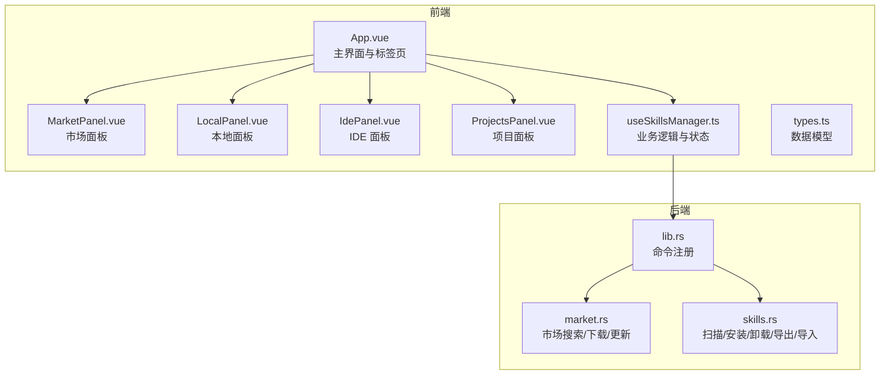
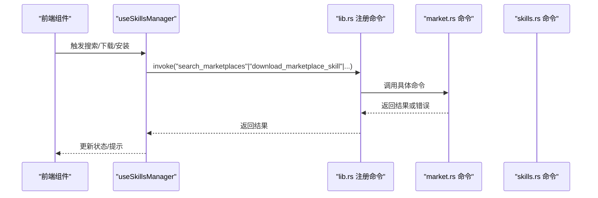
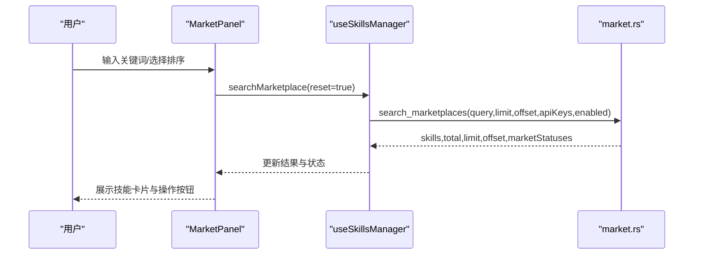
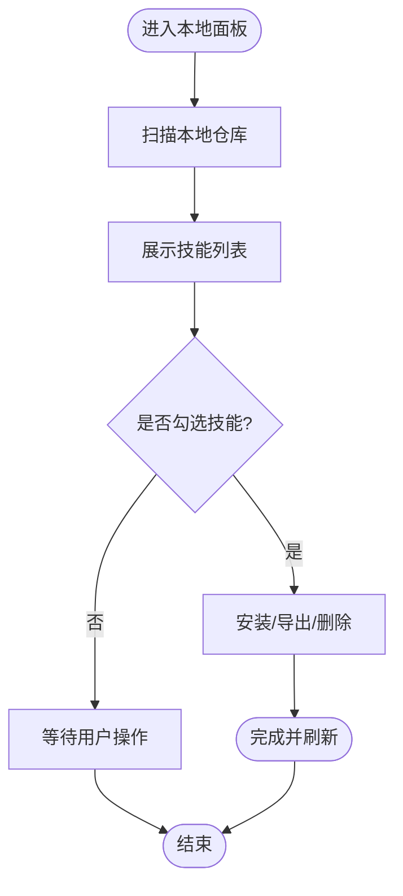
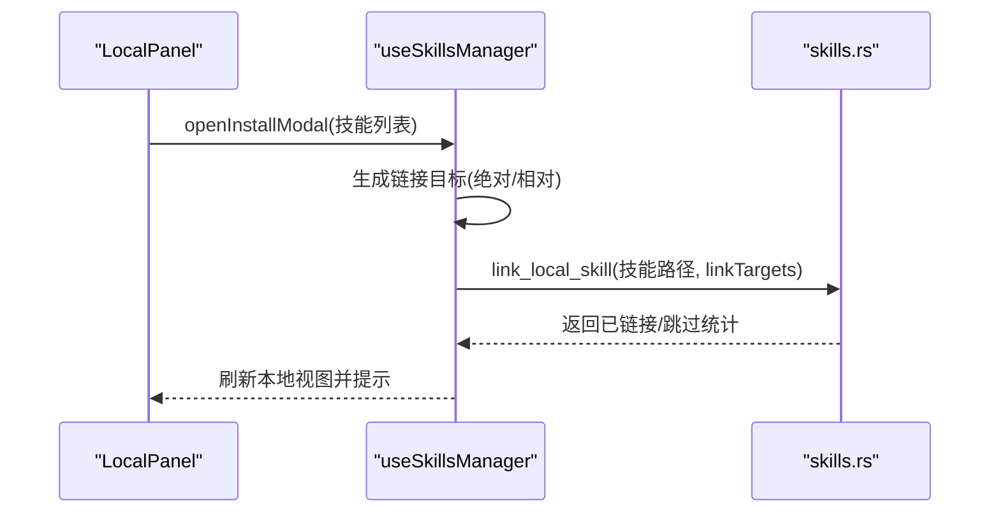
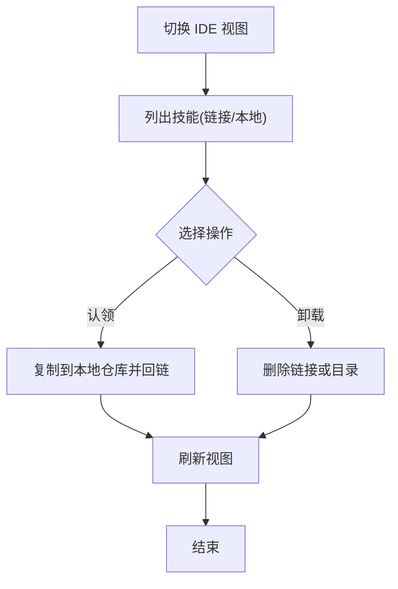
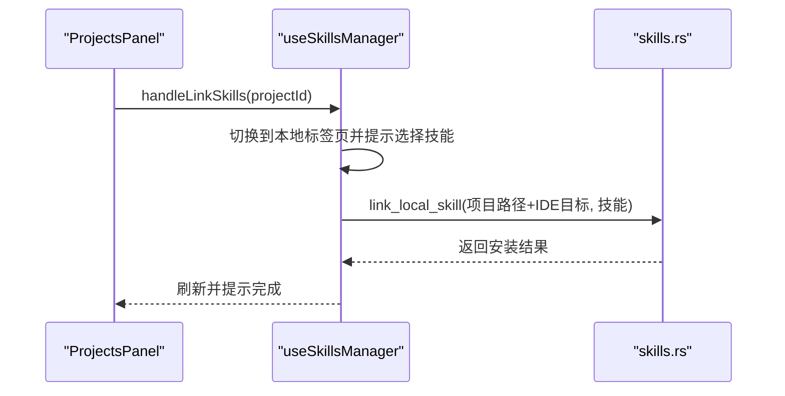
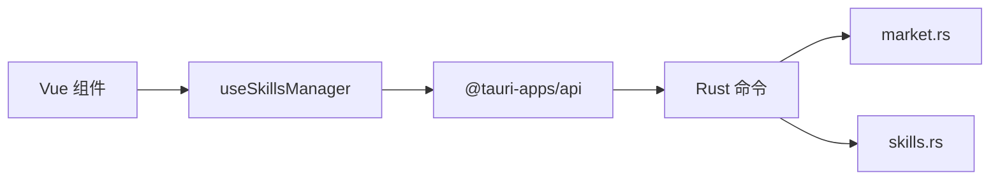

# 核心功能介绍

<cite>
**本文引用的文件**
- [README.md](file://README.md)
- [src/main.ts](file://src/main.ts)
- [src/App.vue](file://src/App.vue)
- [src/composables/useSkillsManager.ts](file://src/composables/useSkillsManager.ts)
- [src-tauri/src/lib.rs](file://src-tauri/src/lib.rs)
- [src-tauri/src/commands/market.rs](file://src-tauri/src/commands/market.rs)
- [src-tauri/src/commands/skills.rs](file://src-tauri/src/commands/skills.rs)
- [src/components/MarketPanel.vue](file://src/components/MarketPanel.vue)
- [src/components/LocalPanel.vue](file://src/components/LocalPanel.vue)
- [src/components/IdePanel.vue](file://src/components/IdePanel.vue)
- [src/components/ProjectsPanel.vue](file://src/components/ProjectsPanel.vue)
- [src/composables/types.ts](file://src/composables/types.ts)
- [src/composables/useIdeConfig.ts](file://src/composables/useIdeConfig.ts)
- [src/composables/useMarketConfig.ts](file://src/composables/useMarketConfig.ts)
- [src/composables/utils.ts](file://src/composables/utils.ts)
- [package.json](file://package.json)
</cite>

## 目录
1. [简介](#简介)
2. [项目结构](#项目结构)
3. [核心组件](#核心组件)
4. [架构总览](#架构总览)
5. [详细组件分析](#详细组件分析)
6. [依赖关系分析](#依赖关系分析)
7. [性能考量](#性能考量)
8. [故障排查指南](#故障排查指南)
9. [结论](#结论)
10. [附录](#附录)

## 简介
Skills Manager 是一款跨平台 AI 技能管理工具，提供五大核心能力：
- 聚合市场搜索：从多个公开技能市场统一检索与下载
- 统一本地仓库：集中管理已下载技能（位于 ~/.skills-manager/skills）
- 一键安装：通过符号链接将本地技能快速部署到目标 IDE
- 多维度管理：按 IDE 浏览、安全卸载、自定义 IDE 支持
- 项目管理：为不同项目挂载专属技能集，按 IDE 配置隔离

其技术栈采用 Tauri 2 + Vue 3 + TypeScript + Vite，后端命令由 Rust 实现，确保安全性与跨平台一致性。

## 项目结构
应用采用前端组件化 + 后端命令模块化的分层设计：
- 前端（Vue 3）：页面组件、组合式函数（composables）、类型定义、国际化
- 后端（Rust）：命令注册与执行（市场搜索、技能下载/更新、本地扫描、安装/卸载、导出导入等）
- 构建与运行：Vite 打包、Tauri 运行时

图示来源
- [src/App.vue:204-400](file://src/App.vue#L204-L400)
- [src/components/MarketPanel.vue:1-192](file://src/components/MarketPanel.vue#L1-L192)
- [src/components/LocalPanel.vue:1-310](file://src/components/LocalPanel.vue#L1-L310)
- [src/components/IdePanel.vue:1-270](file://src/components/IdePanel.vue#L1-L270)
- [src/components/ProjectsPanel.vue:1-253](file://src/components/ProjectsPanel.vue#L1-L253)
- [src/composables/useSkillsManager.ts:1-800](file://src/composables/useSkillsManager.ts#L1-L800)
- [src-tauri/src/lib.rs:20-53](file://src-tauri/src/lib.rs#L20-L53)
- [src-tauri/src/commands/market.rs:173-442](file://src-tauri/src/commands/market.rs#L173-L442)
- [src-tauri/src/commands/skills.rs:355-847](file://src-tauri/src/commands/skills.rs#L355-L847)

章节来源
- [src/main.ts:1-7](file://src/main.ts#L1-L7)
- [package.json:1-30](file://package.json#L1-L30)

## 核心组件
- 市场面板（MarketPanel）：支持关键词搜索、排序、批量下载/更新、市场配置与状态展示
- 本地面板（LocalPanel）：本地技能列表、筛选、批量操作（安装/导出/删除）、下载队列
- IDE 面板（IdePanel）：按 IDE 切换视图、自定义 IDE 目录、未托管技能“认领”、批量卸载
- 项目面板（ProjectsPanel）：项目增删改查、IDE 目标配置、一键为所选项目挂载技能
- 业务组合式函数（useSkillsManager）：统一调度市场搜索、下载队列、本地扫描、安装/卸载、导入/导出、错误提示与加载态

章节来源
- [src/components/MarketPanel.vue:1-192](file://src/components/MarketPanel.vue#L1-L192)
- [src/components/LocalPanel.vue:1-310](file://src/components/LocalPanel.vue#L1-L310)
- [src/components/IdePanel.vue:1-270](file://src/components/IdePanel.vue#L1-L270)
- [src/components/ProjectsPanel.vue:1-253](file://src/components/ProjectsPanel.vue#L1-L253)
- [src/composables/useSkillsManager.ts:1-800](file://src/composables/useSkillsManager.ts#L1-L800)

## 架构总览
前端通过 Tauri 桥接调用后端命令，后端以线程池异步处理网络请求与文件系统操作，保证 UI 流畅与安全。

图示来源
- [src/composables/useSkillsManager.ts:190-248](file://src/composables/useSkillsManager.ts#L190-L248)
- [src-tauri/src/lib.rs:27-39](file://src-tauri/src/lib.rs#L27-L39)
- [src-tauri/src/commands/market.rs:173-392](file://src-tauri/src/commands/market.rs#L173-L392)
- [src-tauri/src/commands/skills.rs:355-535](file://src-tauri/src/commands/skills.rs#L355-L535)

## 详细组件分析

### 聚合市场搜索（MarketPanel + useSkillsManager + market.rs）
- 工作原理
  - 前端输入关键词与排序模式，触发搜索（带缓存与去重）
  - 后端并发访问多个市场（Claude Plugins、SkillsLLM、SkillsMP），解析响应并汇总
  - 结果按排序模式（默认/星数/安装量）排序，并在 UI 中展示“下载/更新”按钮状态
- 用户交互流程
  1) 输入关键词并点击“搜索”
  2) 加载完成后，点击“下载”加入下载队列
  3) 下载完成后自动刷新本地仓库
- 使用场景
  - 快速发现高质量技能
  - 批量比较不同市场的同名技能差异
- 最佳实践
  - 使用“星数/安装量”排序筛选高口碑技能
  - 对于需要 API Key 的市场（如 SkillsMP），先在设置中配置再启用

图示来源
- [src/components/MarketPanel.vue:53-144](file://src/components/MarketPanel.vue#L53-L144)
- [src/composables/useSkillsManager.ts:190-248](file://src/composables/useSkillsManager.ts#L190-L248)
- [src-tauri/src/commands/market.rs:173-392](file://src-tauri/src/commands/market.rs#L173-L392)

章节来源
- [src/components/MarketPanel.vue:1-192](file://src/components/MarketPanel.vue#L1-L192)
- [src/composables/useSkillsManager.ts:72-100](file://src/composables/useSkillsManager.ts#L72-L100)
- [src-tauri/src/commands/market.rs:173-392](file://src-tauri/src/commands/market.rs#L173-L392)

### 统一本地仓库（LocalPanel + useSkillsManager + skills.rs）
- 工作原理
  - 通过扫描统一本地仓库目录，收集所有符合规范的技能元数据
  - 支持搜索过滤、批量勾选、导出 ZIP、删除本地技能
- 用户交互流程
  1) 在“本地”标签页查看已下载技能
  2) 勾选技能并点击“安装”，打开安装模态框选择 IDE
  3) 导出/删除可批量进行
- 使用场景
  - 集中式管理所有技能，避免重复下载
  - 通过导出备份技能集合
- 最佳实践
  - 定期清理无用技能，保持仓库整洁
  - 使用搜索关键词或规范化名称匹配（支持大小写与特殊字符归一）

图示来源
- [src/components/LocalPanel.vue:103-219](file://src/components/LocalPanel.vue#L103-L219)
- [src/composables/useSkillsManager.ts:353-374](file://src/composables/useSkillsManager.ts#L353-L374)
- [src-tauri/src/commands/skills.rs:451-535](file://src-tauri/src/commands/skills.rs#L451-L535)

章节来源
- [src/components/LocalPanel.vue:1-310](file://src/components/LocalPanel.vue#L1-L310)
- [src/composables/useSkillsManager.ts:353-374](file://src/composables/useSkillsManager.ts#L353-L374)
- [src-tauri/src/commands/skills.rs:451-535](file://src-tauri/src/commands/skills.rs#L451-L535)

### 一键安装（InstallModal + useSkillsManager + skills.rs）
- 工作原理
  - 将本地技能通过符号链接安装到目标 IDE 目录；若为相对路径则基于用户家目录拼接
  - 支持单个/批量安装，安装结果统计“已链接/跳过”
- 用户交互流程
  1) 在本地面板选择技能，点击“安装”
  2) 在弹窗中选择 IDE（可记忆上次选择）
  3) 点击确认后后台执行安装，完成后刷新本地视图
- 使用场景
  - 快速在多个 IDE 间同步同一技能
  - 项目级安装：选择项目后为所选 IDE 目标批量安装
- 最佳实践
  - 若 IDE 目录为相对路径，建议统一使用“自定义 IDE”添加绝对路径以避免歧义
  - 安装前确保目标 IDE 目录存在且有写权限

图示来源
- [src/components/LocalPanel.vue:191-202](file://src/components/LocalPanel.vue#L191-L202)
- [src/composables/useSkillsManager.ts:400-499](file://src/composables/useSkillsManager.ts#L400-L499)
- [src-tauri/src/commands/skills.rs:355-449](file://src-tauri/src/commands/skills.rs#L355-L449)

章节来源
- [src/composables/useSkillsManager.ts:400-499](file://src/composables/useSkillsManager.ts#L400-L499)
- [src-tauri/src/commands/skills.rs:355-449](file://src-tauri/src/commands/skills.rs#L355-L449)

### 多维度管理（IdePanel + useSkillsManager + skills.rs）
- 工作原理
  - 按 IDE 切换视图，展示各 IDE 下的技能（含链接/本地两种来源）
  - 支持“认领”未托管技能（复制到本地仓库并回链），批量卸载（安全删除链接或物理目录）
  - 支持自定义 IDE 目录（相对/绝对路径均受安全校验）
- 用户交互流程
  1) 在 IDE 面板切换 IDE
  2) 选择未托管技能点击“认领”，或选择已托管技能点击“卸载”
  3) 可添加自定义 IDE 并移除
- 使用场景
  - 管理多 IDE 的技能差异
  - 将散落在各 IDE 的技能统一纳入本地仓库
- 最佳实践
  - 自定义 IDE 目录优先使用绝对路径，避免跨用户/跨环境差异
  - 卸载前确认是否为符号链接，避免误删本地副本

图示来源
- [src/components/IdePanel.vue:83-197](file://src/components/IdePanel.vue#L83-L197)
- [src/composables/useSkillsManager.ts:741-793](file://src/composables/useSkillsManager.ts#L741-L793)
- [src-tauri/src/commands/skills.rs:640-725](file://src-tauri/src/commands/skills.rs#L640-L725)

章节来源
- [src/components/IdePanel.vue:1-270](file://src/components/IdePanel.vue#L1-L270)
- [src/composables/useSkillsManager.ts:741-793](file://src/composables/useSkillsManager.ts#L741-L793)
- [src-tauri/src/commands/skills.rs:640-725](file://src-tauri/src/commands/skills.rs#L640-L725)

### 项目管理（ProjectsPanel + useSkillsManager + skills.rs）
- 工作原理
  - 项目配置包含项目路径、IDE 目标列表、检测到的 IDE 目录
  - 一键为所选项目挂载技能，自动计算项目内各 IDE 的技能路径并安装
- 用户交互流程
  1) 添加项目并扫描 IDE 目录
  2) 配置项目 IDE 目标
  3) 选择项目并点击“链接技能”，在本地面板选择技能后确认安装
- 使用场景
  - 不同项目使用不同技能集
  - 团队协作中按项目隔离技能配置
- 最佳实践
  - 为每个项目明确 IDE 目标，避免遗漏
  - 使用“扫描项目 IDE 目录”功能自动发现 IDE 路径

图示来源
- [src/components/ProjectsPanel.vue:40-109](file://src/components/ProjectsPanel.vue#L40-L109)
- [src/App.vue:188-201](file://src/App.vue#L188-L201)
- [src/composables/useSkillsManager.ts:414-462](file://src/composables/useSkillsManager.ts#L414-L462)
- [src-tauri/src/commands/skills.rs:501-523](file://src-tauri/src/commands/skills.rs#L501-L523)

章节来源
- [src/components/ProjectsPanel.vue:1-253](file://src/components/ProjectsPanel.vue#L1-L253)
- [src/App.vue:188-201](file://src/App.vue#L188-L201)
- [src/composables/useSkillsManager.ts:414-462](file://src/composables/useSkillsManager.ts#L414-L462)
- [src-tauri/src/commands/skills.rs:501-523](file://src-tauri/src/commands/skills.rs#L501-L523)

## 依赖关系分析
- 前端依赖
  - Vue 3 + TypeScript + Vite 提供响应式 UI 与构建
  - @tauri-apps/* 插件提供对话框、文件打开器、进程与更新器
- 后端依赖
  - Tauri 2 运行时与命令桥接
  - Rust 标准库与第三方库（如 zip、walkdir、dirs）用于文件系统与压缩
- 关键依赖关系
  - useSkillsManager.ts 通过 invoke 调用后端命令
  - market.rs 与 skills.rs 分别处理市场与本地技能相关操作
  - UI 组件通过组合式函数暴露事件与状态，形成清晰的单向数据流

图示来源
- [package.json:13-28](file://package.json#L13-L28)
- [src/composables/useSkillsManager.ts:3-6](file://src/composables/useSkillsManager.ts#L3-L6)
- [src-tauri/src/lib.rs:20-53](file://src-tauri/src/lib.rs#L20-L53)

章节来源
- [package.json:1-30](file://package.json#L1-L30)
- [src-tauri/src/lib.rs:20-53](file://src-tauri/src/lib.rs#L20-L53)

## 性能考量
- 搜索缓存：前端对查询结果进行缓存（默认 10 分钟），减少重复请求
- 去重策略：按来源 URL 或市场 ID+名称去重，避免重复技能多次显示
- 下载队列：串行处理下载任务，避免资源竞争与磁盘压力
- 异步执行：市场搜索与文件操作在后台线程执行，保持 UI 流畅
- 安全校验：路径合法性检查（相对/绝对、危险路径、保留名、控制字符）降低误操作风险

章节来源
- [src/composables/useSkillsManager.ts:23-27](file://src/composables/useSkillsManager.ts#L23-L27)
- [src/composables/useSkillsManager.ts:250-261](file://src/composables/useSkillsManager.ts#L250-L261)
- [src/composables/useSkillsManager.ts:278-329](file://src/composables/useSkillsManager.ts#L278-L329)
- [src/composables/utils.ts:34-99](file://src/composables/utils.ts#L34-L99)

## 故障排查指南
- 常见问题与定位
  - 搜索失败：检查网络与市场状态，查看市场面板的状态提示
  - 下载失败：检查下载队列中的错误信息，重试或移除后重新加入
  - 安装失败：确认 IDE 目录路径合法，检查是否已有同名目标或权限不足
  - 卸载失败：确认目标路径在允许范围内，区分符号链接与物理目录
  - 打开目录失败：尝试在系统文件管理器中定位，必要时修正路径
- 建议操作
  - 清理下载队列并重试
  - 使用“刷新”重新扫描本地仓库
  - 在设置中调整市场启用状态与 API Key
  - 自定义 IDE 目录时优先使用绝对路径

章节来源
- [src/composables/useSkillsManager.ts:243-247](file://src/composables/useSkillsManager.ts#L243-L247)
- [src/composables/useSkillsManager.ts:322-326](file://src/composables/useSkillsManager.ts#L322-L326)
- [src/composables/useSkillsManager.ts:568-624](file://src/composables/useSkillsManager.ts#L568-L624)
- [src/composables/utils.ts:104-112](file://src/composables/utils.ts#L104-L112)

## 结论
Skills Manager 通过“聚合市场 + 统一仓库 + 一键安装 + 多维度管理 + 项目管理”的闭环设计，显著简化了 AI 技能的发现、下载、安装与维护流程。其前后端分离、命令式后端、严格的路径安全校验与丰富的 UI 交互，使其在易用性与安全性之间取得良好平衡。结合项目级隔离与批量操作能力，可有效提升个人与团队的 AI 技能管理效率。

## 附录

### 功能对比与差异化优势
- 与传统“直接下载到 IDE”的方式相比
  - 优势：统一仓库便于管理、批量安装、导出备份、安全卸载
- 与单一市场工具相比
  - 优势：聚合多市场、统一 UI、跨 IDE 一致体验
- 与手动符号链接相比
  - 优势：自动路径解析、安全校验、错误提示、批量操作

章节来源
- [README.md:13-20](file://README.md#L13-L20)
- [README.md:88-94](file://README.md#L88-L94)