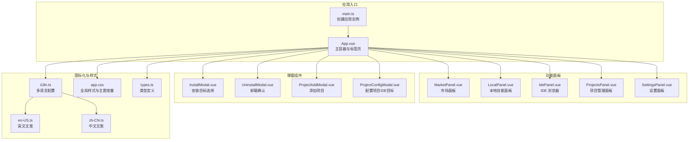
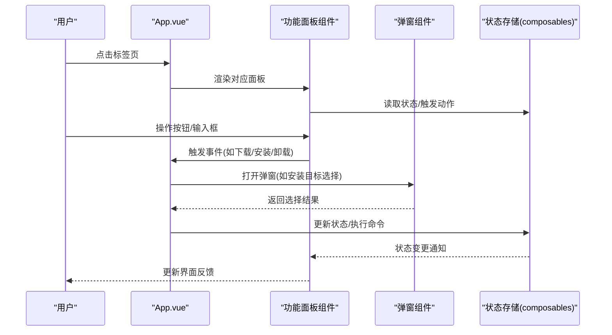
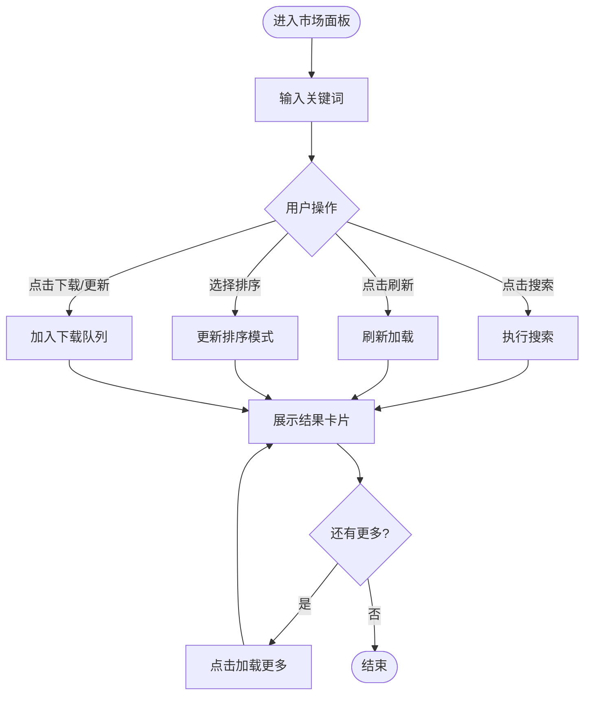
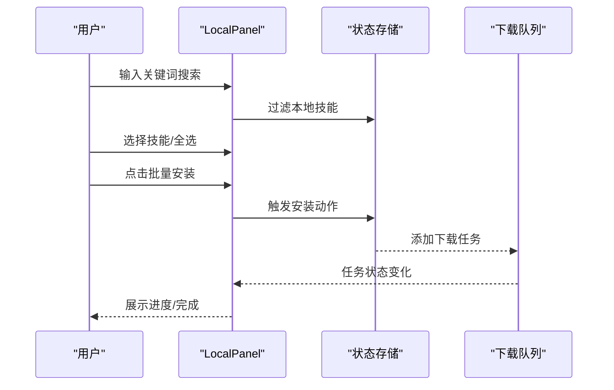
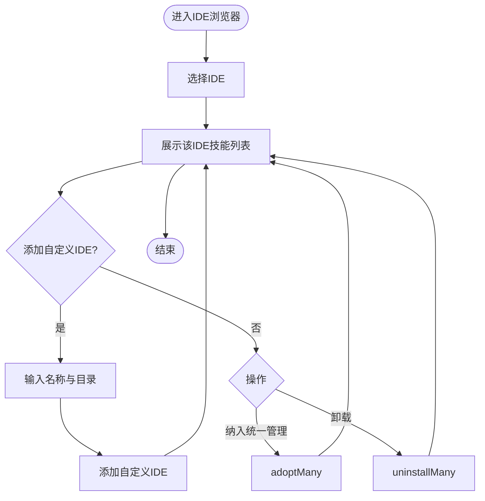
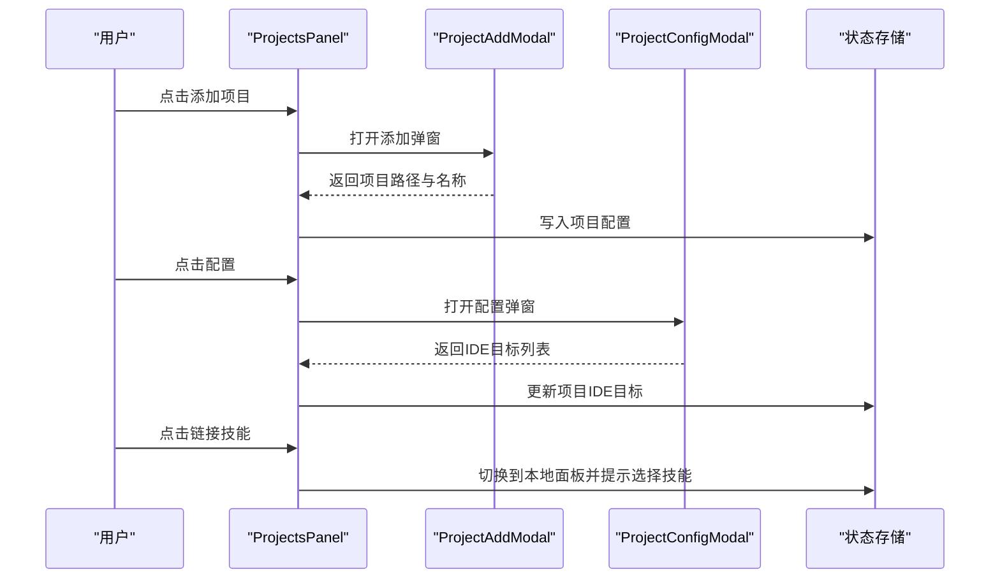
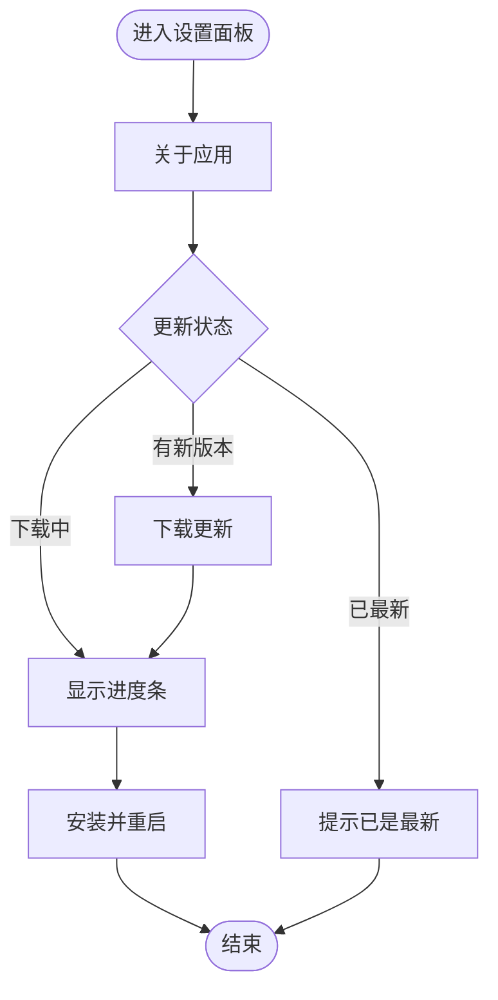
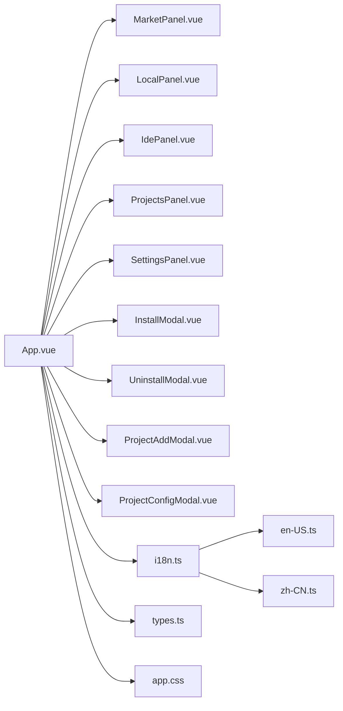

# 系统界面截图

<cite>
**本文档引用的文件**
- [README.md](file://README.md)
- [App.vue](file://src/App.vue)
- [main.ts](file://src/main.ts)
- [MarketPanel.vue](file://src/components/MarketPanel.vue)
- [LocalPanel.vue](file://src/components/LocalPanel.vue)
- [IdePanel.vue](file://src/components/IdePanel.vue)
- [ProjectsPanel.vue](file://src/components/ProjectsPanel.vue)
- [SettingsPanel.vue](file://src/components/SettingsPanel.vue)
- [InstallModal.vue](file://src/components/InstallModal.vue)
- [UninstallModal.vue](file://src/components/UninstallModal.vue)
- [ProjectAddModal.vue](file://src/components/ProjectAddModal.vue)
- [ProjectConfigModal.vue](file://src/components/ProjectConfigModal.vue)
- [types.ts](file://src/composables/types.ts)
- [i18n.ts](file://src/i18n.ts)
- [app.css](file://src/assets/app.css)
- [en-US.ts](file://src/locales/en-US.ts)
- [zh-CN.ts](file://src/locales/zh-CN.ts)
- [local.png(en-US)](file://docs/screenshots/en-US/local.png)
- [market.png(en-US)](file://docs/screenshots/en-US/market.png)
- [ide.png(en-US)](file://docs/screenshots/en-US/ide.png)
- [project.png(en-US)](file://docs/screenshots/en-US/project.png)
- [local.png(zh-CN)](file://docs/screenshots/zh-CN/local.png)
- [market.png(zh-CN)](file://docs/screenshots/zh-CN/market.png)
- [ide.png(zh-CN)](file://docs/screenshots/zh-CN/ide.png)
- [project.png(zh-CN)](file://docs/screenshots/zh-CN/project.png)
</cite>

## 目录
1. [简介](#简介)
2. [项目结构](#项目结构)
3. [核心组件](#核心组件)
4. [架构总览](#架构总览)
5. [详细组件分析](#详细组件分析)
6. [依赖关系分析](#依赖关系分析)
7. [性能考量](#性能考量)
8. [故障排查指南](#故障排查指南)
9. [结论](#结论)
10. [附录](#附录)

## 简介
本文件面向 Skills Manager 用户与支持人员，提供系统界面截图与说明文档，覆盖英文与中文双语界面。内容包括市场面板、本地技能面板、IDE 浏览器、项目管理面板以及设置面板的主要界面截图，并对各界面的功能按钮、交互流程进行标注说明。同时，结合项目源码中的界面组件与样式，解释不同操作系统下的界面差异与视觉设计特点，并提供界面操作流程图以帮助用户快速熟悉应用布局与功能分布。

## 项目结构
应用采用 Vue 3 + TypeScript + Vite 前端框架与 Tauri 2 桌面运行时，界面由主应用容器与多个功能面板组成，通过标签页切换实现模块化布局；设置面板提供外观与语言切换；弹窗组件用于安装、卸载与项目配置等关键操作。

**图表来源**
- [main.ts:1-7](file://src/main.ts#L1-L7)
- [App.vue:1-400](file://src/App.vue#L1-L400)
- [MarketPanel.vue:1-192](file://src/components/MarketPanel.vue#L1-L192)
- [LocalPanel.vue:1-310](file://src/components/LocalPanel.vue#L1-L310)
- [IdePanel.vue:1-270](file://src/components/IdePanel.vue#L1-L270)
- [ProjectsPanel.vue:1-253](file://src/components/ProjectsPanel.vue#L1-L253)
- [SettingsPanel.vue:1-570](file://src/components/SettingsPanel.vue#L1-L570)
- [InstallModal.vue:1-354](file://src/components/InstallModal.vue#L1-L354)
- [UninstallModal.vue:1-37](file://src/components/UninstallModal.vue#L1-L37)
- [ProjectAddModal.vue:1-250](file://src/components/ProjectAddModal.vue#L1-L250)
- [ProjectConfigModal.vue:1-248](file://src/components/ProjectConfigModal.vue#L1-L248)
- [i18n.ts:1-17](file://src/i18n.ts#L1-L17)
- [en-US.ts:1-241](file://src/locales/en-US.ts#L1-L241)
- [zh-CN.ts:1-241](file://src/locales/zh-CN.ts#L1-L241)
- [app.css:1-531](file://src/assets/app.css#L1-L531)
- [types.ts:1-119](file://src/composables/types.ts#L1-L119)

**章节来源**
- [README.md:1-104](file://README.md#L1-L104)
- [App.vue:1-400](file://src/App.vue#L1-L400)
- [main.ts:1-7](file://src/main.ts#L1-L7)

## 核心组件
- 主容器与标签页：在主容器中定义顶部标签页区域，包含“本地技能”“市场”“IDE 浏览”“项目管理”“设置”五个标签页，点击切换对应面板。
- 功能面板：市场面板负责检索与排序、下载与更新；本地面板负责扫描、筛选、批量安装、导入导出与删除；IDE 浏览器负责按 IDE 切换、添加自定义 IDE、卸载与纳入统一管理；项目管理面板负责项目增删改查、IDE 目标配置与技能链接；设置面板负责主题、语言与更新检查。
- 弹窗组件：安装目标选择弹窗用于选择全局 IDE 或项目进行安装；卸载确认弹窗用于确认 IDE 卸载或本地删除；项目添加与配置弹窗分别用于新增项目与配置 IDE 目标。

**章节来源**
- [App.vue:204-364](file://src/App.vue#L204-L364)
- [MarketPanel.vue:44-154](file://src/components/MarketPanel.vue#L44-L154)
- [LocalPanel.vue:103-220](file://src/components/LocalPanel.vue#L103-L220)
- [IdePanel.vue:83-197](file://src/components/IdePanel.vue#L83-L197)
- [ProjectsPanel.vue:60-138](file://src/components/ProjectsPanel.vue#L60-L138)
- [SettingsPanel.vue:132-267](file://src/components/SettingsPanel.vue#L132-L267)
- [InstallModal.vue:65-150](file://src/components/InstallModal.vue#L65-L150)
- [UninstallModal.vue:18-36](file://src/components/UninstallModal.vue#L18-L36)
- [ProjectAddModal.vue:54-108](file://src/components/ProjectAddModal.vue#L54-L108)
- [ProjectConfigModal.vue:47-99](file://src/components/ProjectConfigModal.vue#L47-L99)

## 架构总览
应用采用前端组件化架构，主容器集中管理状态与标签页切换，各功能面板通过 props 与事件与主容器通信，弹窗组件通过可见性属性控制显示与隐藏，并通过事件回调与主容器交互。国际化与样式通过 i18n 与全局 CSS 变量实现主题切换与语言切换。

**图表来源**
- [App.vue:73-124](file://src/App.vue#L73-L124)
- [MarketPanel.vue:30-39](file://src/components/MarketPanel.vue#L30-L39)
- [LocalPanel.vue:18-28](file://src/components/LocalPanel.vue#L18-L28)
- [IdePanel.vue:19-30](file://src/components/IdePanel.vue#L19-L30)
- [ProjectsPanel.vue:16-22](file://src/components/ProjectsPanel.vue#L16-L22)
- [InstallModal.vue:12-15](file://src/components/InstallModal.vue#L12-L15)
- [UninstallModal.vue:10-13](file://src/components/UninstallModal.vue#L10-L13)

## 详细组件分析

### 市场面板（MarketPanel）
- 功能概览：提供检索输入、搜索/刷新按钮、排序下拉与结果卡片展示；支持一键下载或更新，支持打开设置面板配置数据源。
- 关键交互：
  - 输入框绑定查询词，回车触发搜索，点击搜索/刷新按钮执行相应动作。
  - 排序下拉支持默认、按星数、按安装量排序。
  - 结果卡片展示技能名称、作者、星数、安装量、描述、来源与源地址；根据状态显示“下载/已下载/排队/更新/已更新/不可用”等按钮。
  - 支持“加载更多”分页加载。
- 国际化：标题、占位符、按钮文案与提示均来自英文/中文文案文件。
- 视觉设计：卡片网格布局，悬停提升与阴影效果；按钮采用主/次样式区分重要性。

**图表来源**
- [MarketPanel.vue:53-144](file://src/components/MarketPanel.vue#L53-L144)
- [en-US.ts:54-79](file://src/locales/en-US.ts#L54-L79)
- [zh-CN.ts:54-79](file://src/locales/zh-CN.ts#L54-L79)

**章节来源**
- [MarketPanel.vue:1-192](file://src/components/MarketPanel.vue#L1-L192)
- [en-US.ts:54-79](file://src/locales/en-US.ts#L54-L79)
- [zh-CN.ts:54-79](file://src/locales/zh-CN.ts#L54-L79)

### 本地技能面板（LocalPanel）
- 功能概览：扫描本地技能、搜索过滤、批量选择、安装/导出/删除；展示下载队列与任务重试/移除。
- 关键交互：
  - 全选/反选，批量安装、导出、删除。
  - 单个技能卡片包含名称、描述、路径、IDE 使用徽章（已关联/未关联）。
  - 支持打开技能目录、导入本地技能。
- 国际化：标题、提示、按钮文案与搜索提示来自英文/中文文案文件。
- 视觉设计：卡片带“已关联”边框强调状态；IDE 徽章突出显示已使用 IDE。

**图表来源**
- [LocalPanel.vue:33-101](file://src/components/LocalPanel.vue#L33-L101)
- [LocalPanel.vue:156-160](file://src/components/LocalPanel.vue#L156-L160)
- [en-US.ts:80-105](file://src/locales/en-US.ts#L80-L105)
- [zh-CN.ts:80-105](file://src/locales/zh-CN.ts#L80-L105)

**章节来源**
- [LocalPanel.vue:1-310](file://src/components/LocalPanel.vue#L1-L310)
- [en-US.ts:80-105](file://src/locales/en-US.ts#L80-L105)
- [zh-CN.ts:80-105](file://src/locales/zh-CN.ts#L80-L105)

### IDE 浏览器（IdePanel）
- 功能概览：按 IDE 切换视图、添加自定义 IDE、统一管理未托管技能、卸载已安装技能。
- 关键交互：
  - IDE 切换按钮组，点击切换当前 IDE。
  - 自定义 IDE 输入框与添加按钮，支持列出已添加的自定义 IDE 并移除。
  - 未托管技能卡片可“纳入统一管理”，已托管技能可“卸载”。
- 国际化：标题、提示、占位符、按钮文案来自英文/中文文案文件。
- 视觉设计：未托管卡片带特殊边框与阴影强调状态；按钮组突出当前选中项。

**图表来源**
- [IdePanel.vue:99-150](file://src/components/IdePanel.vue#L99-L150)
- [IdePanel.vue:154-196](file://src/components/IdePanel.vue#L154-L196)
- [en-US.ts:106-127](file://src/locales/en-US.ts#L106-L127)
- [zh-CN.ts:106-127](file://src/locales/zh-CN.ts#L106-L127)

**章节来源**
- [IdePanel.vue:1-270](file://src/components/IdePanel.vue#L1-L270)
- [en-US.ts:106-127](file://src/locales/en-US.ts#L106-L127)
- [zh-CN.ts:106-127](file://src/locales/zh-CN.ts#L106-L127)

### 项目管理面板（ProjectsPanel）
- 功能概览：项目列表展示、选择/配置/打开目录/移除项目；为项目配置 IDE 目标并链接技能。
- 关键交互：
  - 添加项目弹窗选择项目目录与命名。
  - 项目卡片支持选择/取消、配置 IDE 目标、打开目录、链接技能。
  - 配置弹窗中可勾选 IDE 目标，保存后写入项目配置。
- 国际化：标题、按钮、提示与占位符来自英文/中文文案文件。
- 视觉设计：选中项目带高亮边框与阴影；IDE 徽章显示已配置目标数量。

**图表来源**
- [ProjectsPanel.vue:60-138](file://src/components/ProjectsPanel.vue#L60-L138)
- [ProjectAddModal.vue:54-108](file://src/components/ProjectAddModal.vue#L54-L108)
- [ProjectConfigModal.vue:47-99](file://src/components/ProjectConfigModal.vue#L47-L99)
- [en-US.ts:212-239](file://src/locales/en-US.ts#L212-L239)
- [zh-CN.ts:212-239](file://src/locales/zh-CN.ts#L212-L239)

**章节来源**
- [ProjectsPanel.vue:1-253](file://src/components/ProjectsPanel.vue#L1-L253)
- [ProjectAddModal.vue:1-250](file://src/components/ProjectAddModal.vue#L1-L250)
- [ProjectConfigModal.vue:1-248](file://src/components/ProjectConfigModal.vue#L1-L248)
- [en-US.ts:212-239](file://src/locales/en-US.ts#L212-L239)
- [zh-CN.ts:212-239](file://src/locales/zh-CN.ts#L212-L239)

### 设置面板（SettingsPanel）
- 功能概览：应用信息、更新检查/下载/安装、主题与语言切换。
- 关键交互：
  - 检查更新、下载更新、安装并重启。
  - 主题支持浅色/深色/系统跟随；语言支持中文/英文。
- 国际化：标题、按钮、提示与图标文案来自英文/中文文案文件。
- 视觉设计：分区块展示“关于”与“外观”，按钮采用主/次样式区分操作优先级。

**图表来源**
- [SettingsPanel.vue:132-267](file://src/components/SettingsPanel.vue#L132-L267)
- [en-US.ts:27-53](file://src/locales/en-US.ts#L27-L53)
- [zh-CN.ts:27-53](file://src/locales/zh-CN.ts#L27-L53)

**章节来源**
- [SettingsPanel.vue:1-570](file://src/components/SettingsPanel.vue#L1-L570)
- [en-US.ts:27-53](file://src/locales/en-US.ts#L27-L53)
- [zh-CN.ts:27-53](file://src/locales/zh-CN.ts#L27-L53)

## 依赖关系分析
- 组件耦合：主容器集中管理标签页与全局状态，功能面板通过 props 接收数据并通过事件向上通信；弹窗组件通过可见性与事件回调与主容器解耦。
- 国际化依赖：各组件依赖 i18n 提供的语言包，文案来自 en-US.ts 与 zh-CN.ts。
- 类型依赖：types.ts 定义了远程技能、本地技能、IDE 技能、项目配置等核心类型，被各面板与弹窗组件引用。
- 样式依赖：全局 app.css 定义主题变量与通用样式，组件通过 CSS 变量实现明暗主题切换。

**图表来源**
- [App.vue:9-20](file://src/App.vue#L9-L20)
- [MarketPanel.vue:1-6](file://src/components/MarketPanel.vue#L1-L6)
- [LocalPanel.vue:1-6](file://src/components/LocalPanel.vue#L1-L6)
- [IdePanel.vue:1-4](file://src/components/IdePanel.vue#L1-L4)
- [ProjectsPanel.vue:1-4](file://src/components/ProjectsPanel.vue#L1-L4)
- [SettingsPanel.vue:1-7](file://src/components/SettingsPanel.vue#L1-L7)
- [InstallModal.vue:1-4](file://src/components/InstallModal.vue#L1-L4)
- [UninstallModal.vue:1-3](file://src/components/UninstallModal.vue#L1-L3)
- [ProjectAddModal.vue:1-4](file://src/components/ProjectAddModal.vue#L1-L4)
- [ProjectConfigModal.vue:1-4](file://src/components/ProjectConfigModal.vue#L1-L4)
- [i18n.ts:1-17](file://src/i18n.ts#L1-L17)
- [en-US.ts:1-241](file://src/locales/en-US.ts#L1-L241)
- [zh-CN.ts:1-241](file://src/locales/zh-CN.ts#L1-L241)
- [types.ts:1-119](file://src/composables/types.ts#L1-L119)
- [app.css:1-531](file://src/assets/app.css#L1-L531)

**章节来源**
- [App.vue:1-400](file://src/App.vue#L1-L400)
- [i18n.ts:1-17](file://src/i18n.ts#L1-L17)
- [types.ts:1-119](file://src/composables/types.ts#L1-L119)
- [app.css:1-531](file://src/assets/app.css#L1-L531)

## 性能考量
- 虚拟滚动与分页：市场面板支持“加载更多”，避免一次性渲染大量卡片导致性能下降。
- 搜索与过滤：本地面板与市场面板均提供关键词搜索与过滤，建议在输入时节流处理，减少频繁渲染。
- 图片与资源：界面截图来自 docs/screenshots 目录，建议在文档中使用缩略图与懒加载策略，避免页面加载阻塞。
- 主题切换：通过 CSS 变量实现主题切换，避免重绘与布局抖动，保证切换流畅。

[本节为通用指导，无需具体文件分析]

## 故障排查指南
- 语言与主题不生效：检查本地存储键值与系统偏好设置是否正确写入与读取。
- 更新检查失败：检查网络连接与更新服务状态，必要时重试或手动检查。
- 卸载失败：确认目标路径是否存在、权限是否足够；对于未托管技能，确认是否已纳入统一管理。
- 项目配置无效：检查项目 IDE 目标是否正确勾选，保存后确认状态已更新。

**章节来源**
- [SettingsPanel.vue:74-129](file://src/components/SettingsPanel.vue#L74-L129)
- [UninstallModal.vue:18-36](file://src/components/UninstallModal.vue#L18-L36)
- [ProjectConfigModal.vue:31-44](file://src/components/ProjectConfigModal.vue#L31-L44)

## 结论
本文件基于 Skills Manager 的源码与现有界面截图，提供了英文与中文双语界面的系统化说明，涵盖市场、本地技能、IDE 浏览、项目管理与设置五大核心面板，并对关键交互流程进行了可视化梳理。通过类型定义与国际化配置，界面在不同语言与主题下保持一致的视觉与交互体验。建议在实际使用中结合本指南的流程图与标注，快速定位功能位置并高效完成日常操作。

[本节为总结性内容，无需具体文件分析]

## 附录

### 截图与标注说明（英文版）
- 市场面板（Market）
  - 截图：[market.png(en-US)](file://docs/screenshots/en-US/market.png)
  - 标注要点：搜索框、排序下拉、结果卡片（名称/作者/星数/安装量/描述/来源/源地址）、下载/更新按钮、加载更多。
- 本地技能面板（Local）
  - 截图：[local.png(en-US)](file://docs/screenshots/en-US/local.png)
  - 标注要点：搜索框、全选/反选、批量安装/导出/删除、单个技能卡片（名称/描述/路径/IDE徽章）、打开目录、导入/删除。
- IDE 浏览器（IDE）
  - 截图：[ide.png(en-US)](file://docs/screenshots/en-US/ide.png)
  - 标注要点：IDE 切换按钮组、自定义 IDE 输入与添加、未托管技能“纳入统一管理”、已托管技能“卸载”。
- 项目管理面板（Projects）
  - 截图：[project.png(en-US)](file://docs/screenshots/en-US/project.png)
  - 标注要点：项目列表、选择/配置/打开目录/移除、配置 IDE 目标、链接技能。

**章节来源**
- [README.md:8-11](file://README.md#L8-L11)
- [market.png(en-US)](file://docs/screenshots/en-US/market.png)
- [local.png(en-US)](file://docs/screenshots/en-US/local.png)
- [ide.png(en-US)](file://docs/screenshots/en-US/ide.png)
- [project.png(en-US)](file://docs/screenshots/en-US/project.png)

### 截图与标注说明（中文版）
- 市场面板（Market）
  - 截图：[market.png(zh-CN)](file://docs/screenshots/zh-CN/market.png)
  - 标注要点：搜索框、排序下拉、结果卡片（名称/作者/星数/安装量/描述/来源/源地址）、下载/更新按钮、加载更多。
- 本地技能面板（Local）
  - 截图：[local.png(zh-CN)](file://docs/screenshots/zh-CN/local.png)
  - 标注要点：搜索框、全选/反选、批量安装/导出/删除、单个技能卡片（名称/描述/路径/IDE徽章）、打开目录、导入/删除。
- IDE 浏览器（IDE）
  - 截图：[ide.png(zh-CN)](file://docs/screenshots/zh-CN/ide.png)
  - 标注要点：IDE 切换按钮组、自定义 IDE 输入与添加、未托管技能“纳入统一管理”、已托管技能“卸载”。
- 项目管理面板（Projects）
  - 截图：[project.png(zh-CN)](file://docs/screenshots/zh-CN/project.png)
  - 标注要点：项目列表、选择/配置/打开目录/移除、配置 IDE 目标、链接技能。

**章节来源**
- [README.md:8-11](file://README.md#L8-L11)
- [market.png(zh-CN)](file://docs/screenshots/zh-CN/market.png)
- [local.png(zh-CN)](file://docs/screenshots/zh-CN/local.png)
- [ide.png(zh-CN)](file://docs/screenshots/zh-CN/ide.png)
- [project.png(zh-CN)](file://docs/screenshots/zh-CN/project.png)

### 不同操作系统下的界面差异与视觉设计特点
- 明暗主题：通过 CSS 变量与根元素 data-theme 实现明/暗主题切换，组件自动适配背景、边框与文字颜色。
- 字体与排版：全局字体族与字号在 app.css 中定义，确保跨平台一致性。
- 响应式布局：在小屏设备上，搜索框与选择控件会调整为垂直堆叠，保证可读性与可触达性。
- 滚动条与交互反馈：自定义滚动条样式与按钮悬停/激活反馈，提升交互体验。

**章节来源**
- [app.css:1-531](file://src/assets/app.css#L1-L531)
- [App.vue:402-632](file://src/App.vue#L402-L632)