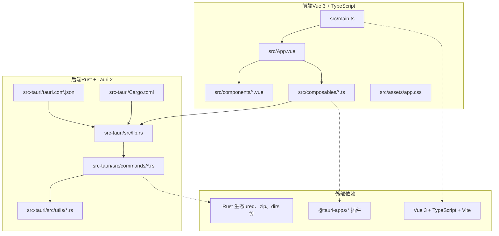
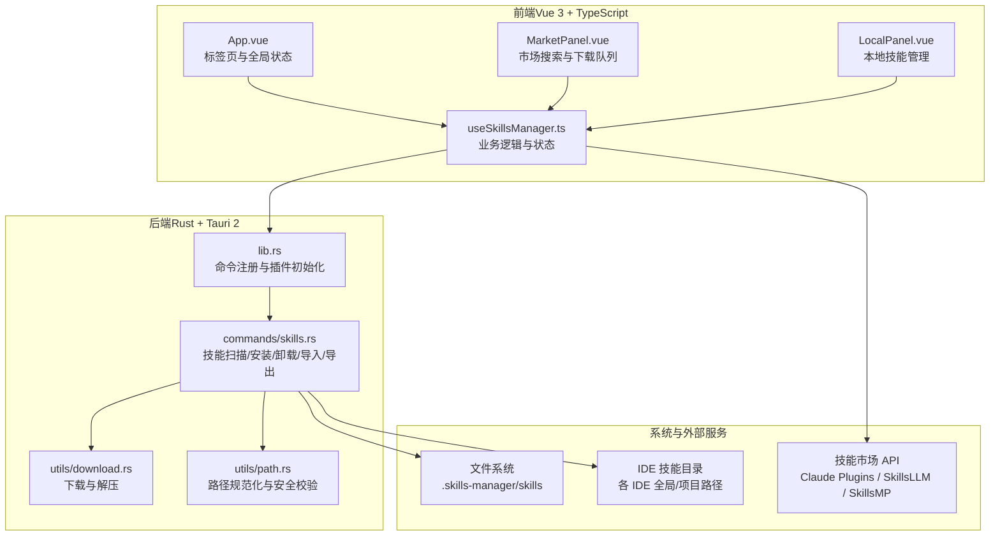
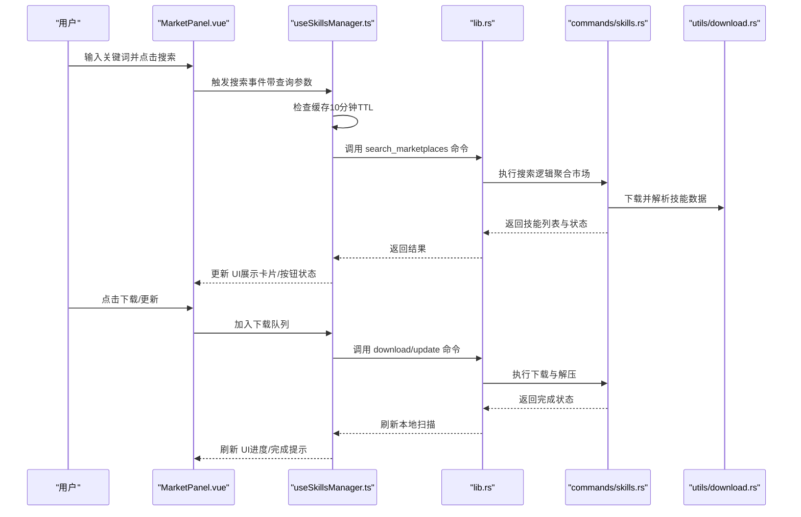
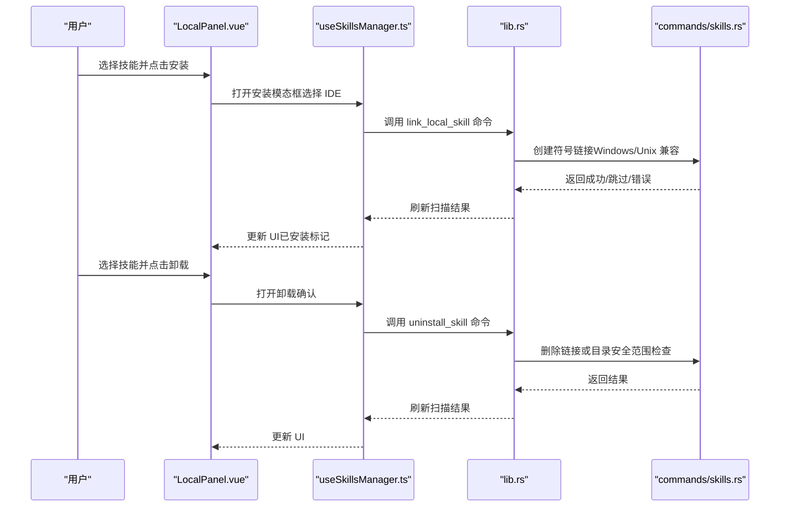
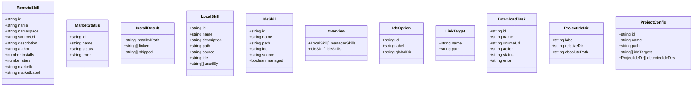
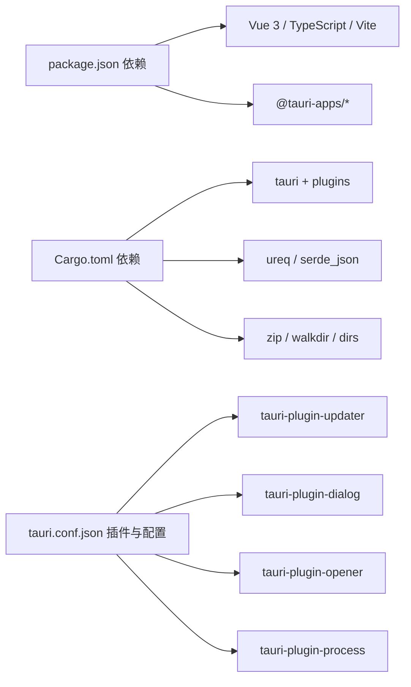

# 项目概述

<cite>
**本文档引用的文件**
- [README.md](file://README.md)
- [package.json](file://package.json)
- [src-tauri/Cargo.toml](file://src-tauri/Cargo.toml)
- [src-tauri/tauri.conf.json](file://src-tauri/tauri.conf.json)
- [src/main.ts](file://src/main.ts)
- [src/App.vue](file://src/App.vue)
- [src/composables/useSkillsManager.ts](file://src/composables/useSkillsManager.ts)
- [src-tauri/src/lib.rs](file://src-tauri/src/lib.rs)
- [src-tauri/src/commands/skills.rs](file://src-tauri/src/commands/skills.rs)
- [src-tauri/src/utils/download.rs](file://src-tauri/src/utils/download.rs)
- [src-tauri/src/utils/path.rs](file://src-tauri/src/utils/path.rs)
- [src/components/MarketPanel.vue](file://src/components/MarketPanel.vue)
- [src/components/LocalPanel.vue](file://src/components/LocalPanel.vue)
- [src/composables/types.ts](file://src/composables/types.ts)
- [src/composables/constants.ts](file://src/composables/constants.ts)
</cite>

## 目录
1. [简介](#简介)
2. [项目结构](#项目结构)
3. [核心组件](#核心组件)
4. [架构总览](#架构总览)
5. [详细组件分析](#详细组件分析)
6. [依赖关系分析](#依赖关系分析)
7. [性能考虑](#性能考虑)
8. [故障排除指南](#故障排除指南)
9. [结论](#结论)

## 简介

Skills Manager 是一个跨平台的 AI 技能管理器，旨在为开发者提供统一、安全、高效的技能（Skills）管理体验。项目通过 Tauri 2 + Vue 3 + TypeScript + Rust 的技术栈组合，构建了高性能、低资源占用的桌面应用，支持在 Windows、macOS 和 Linux 上无缝运行。

### 核心价值与目标
- **统一本地仓库**：集中管理所有已下载的技能，存储于用户主目录下的统一路径，便于备份、迁移与版本控制。
- **一键安装**：通过符号链接（symlink）将技能快速部署到任意受支持的 IDE 中，避免重复拷贝与路径冲突。
- **多维度管理**：按 IDE 分类浏览已安装技能，支持安全卸载与批量操作，保障系统整洁。
- **项目级管理**：为每个项目单独挂载技能，按项目隔离不同工作环境，提升协作效率与可移植性。
- **聚合市场搜索**：从多个公开技能市场（如 Claude Plugins、SkillsLLM、SkillsMP 等）统一检索与下载技能，支持排序与缓存优化。

### 支持的 IDE 类型（按字母顺序）
- Antigravity、Claude Code、CodeBuddy、Codex、Cursor、Kiro、OpenClaw、OpenCode、Qoder、Trae、VSCode、Windsurf

### 跨平台兼容性
- 完全兼容 Windows、macOS、Linux；针对不同平台的文件系统与权限模型进行适配，确保符号链接与路径解析的安全性与稳定性。

**章节来源**
- [README.md:13-35](file://README.md#L13-L35)
- [README.md:21-35](file://README.md#L21-L35)

## 项目结构

项目采用前后端分离的桌面应用架构，前端使用 Vue 3 + TypeScript + Vite 构建用户界面，后端使用 Rust 通过 Tauri 2 提供系统级能力（文件操作、网络请求、进程与更新插件等）。核心目录组织如下：

- 前端（src/）：包含 Vue 组件、组合式逻辑（composables）、国际化、样式与入口文件
- 后端（src-tauri/）：包含 Rust 命令模块、工具函数与 Tauri 配置
- 文档与截图（docs/screenshots/）
- 网站（website/）：项目官网与文档站点

**图表来源**
- [src/main.ts:1-7](file://src/main.ts#L1-L7)
- [src/App.vue:1-633](file://src/App.vue#L1-L633)
- [src-tauri/src/lib.rs:1-54](file://src-tauri/src/lib.rs#L1-L54)
- [src-tauri/tauri.conf.json:1-45](file://src-tauri/tauri.conf.json#L1-L45)
- [src-tauri/Cargo.toml:1-36](file://src-tauri/Cargo.toml#L1-L36)

**章节来源**
- [package.json:1-30](file://package.json#L1-L30)
- [src-tauri/Cargo.toml:1-36](file://src-tauri/Cargo.toml#L1-L36)
- [src-tauri/tauri.conf.json:1-45](file://src-tauri/tauri.conf.json#L1-L45)

## 核心组件

### 前端核心组件
- 应用入口与路由：通过 App.vue 统一管理标签页（本地、市场、IDE 浏览、项目、设置），并集成主题与语言切换、更新检查与项目管理。
- 市场面板（MarketPanel）：提供搜索框、排序控件、市场配置弹窗与技能卡片展示，支持下载队列与最近任务状态反馈。
- 本地面板（LocalPanel）：展示本地技能列表，支持筛选、批量选择、安装、导出、删除与打开目录等操作，并显示技能被哪些 IDE 使用。

### 后端核心命令
- 技能扫描与概览：扫描统一本地仓库与各 IDE 目录，识别已安装技能及其来源（本地/链接），并统计被哪些 IDE 使用。
- 技能安装与卸载：通过符号链接将本地技能安装到指定 IDE 目录；支持安全卸载，自动判断是移除链接还是删除物理目录。
- 技能导入与导出：支持将外部技能目录导入到本地仓库，或将本地技能打包导出为 ZIP 文件。
- 项目级技能管理：为项目单独扫描 IDE 目录，支持按项目挂载技能并配置 IDE 目标。

**章节来源**
- [src/App.vue:1-633](file://src/App.vue#L1-L633)
- [src/components/MarketPanel.vue:1-192](file://src/components/MarketPanel.vue#L1-L192)
- [src/components/LocalPanel.vue:1-310](file://src/components/LocalPanel.vue#L1-L310)
- [src/composables/useSkillsManager.ts:1-800](file://src/composables/useSkillsManager.ts#L1-L800)
- [src-tauri/src/commands/skills.rs:1-847](file://src-tauri/src/commands/skills.rs#L1-L847)

## 架构总览

系统采用“前端 UI + 后端命令”的分层设计，前端负责交互与状态管理，后端通过 Tauri 暴露命令接口，执行文件系统操作与网络请求。

**图表来源**
- [src/App.vue:1-633](file://src/App.vue#L1-L633)
- [src/components/MarketPanel.vue:1-192](file://src/components/MarketPanel.vue#L1-L192)
- [src/components/LocalPanel.vue:1-310](file://src/components/LocalPanel.vue#L1-L310)
- [src/composables/useSkillsManager.ts:1-800](file://src/composables/useSkillsManager.ts#L1-L800)
- [src-tauri/src/lib.rs:1-54](file://src-tauri/src/lib.rs#L1-L54)
- [src-tauri/src/commands/skills.rs:1-847](file://src-tauri/src/commands/skills.rs#L1-L847)
- [src-tauri/src/utils/download.rs:1-273](file://src-tauri/src/utils/download.rs#L1-L273)
- [src-tauri/src/utils/path.rs:1-90](file://src-tauri/src/utils/path.rs#L1-L90)

## 详细组件分析

### 市场搜索与下载流程

**图表来源**
- [src/components/MarketPanel.vue:1-192](file://src/components/MarketPanel.vue#L1-L192)
- [src/composables/useSkillsManager.ts:190-351](file://src/composables/useSkillsManager.ts#L190-L351)
- [src-tauri/src/lib.rs:27-39](file://src-tauri/src/lib.rs#L27-L39)
- [src-tauri/src/commands/skills.rs:1-847](file://src-tauri/src/commands/skills.rs#L1-L847)
- [src-tauri/src/utils/download.rs:27-116](file://src-tauri/src/utils/download.rs#L27-L116)

**章节来源**
- [src/components/MarketPanel.vue:1-192](file://src/components/MarketPanel.vue#L1-L192)
- [src/composables/useSkillsManager.ts:190-351](file://src/composables/useSkillsManager.ts#L190-L351)

### 本地技能安装与卸载流程

**图表来源**
- [src/components/LocalPanel.vue:1-310](file://src/components/LocalPanel.vue#L1-L310)
- [src/composables/useSkillsManager.ts:400-631](file://src/composables/useSkillsManager.ts#L400-L631)
- [src-tauri/src/lib.rs:27-39](file://src-tauri/src/lib.rs#L27-L39)
- [src-tauri/src/commands/skills.rs:355-609](file://src-tauri/src/commands/skills.rs#L355-L609)

**章节来源**
- [src/components/LocalPanel.vue:1-310](file://src/components/LocalPanel.vue#L1-L310)
- [src/composables/useSkillsManager.ts:400-631](file://src/composables/useSkillsManager.ts#L400-L631)

### 数据模型与类型定义

**图表来源**
- [src/composables/types.ts:1-119](file://src/composables/types.ts#L1-L119)

**章节来源**
- [src/composables/types.ts:1-119](file://src/composables/types.ts#L1-L119)

### 路径安全与跨平台适配

- 路径规范化：统一处理相对路径、绝对路径与 Windows 路径前缀，确保跨平台一致性。
- 符号链接策略：在 Unix 系统使用符号链接，在 Windows 使用目录连接（junction），失败时回退到本地拷贝。
- 安全校验：严格限制操作范围，禁止越权访问非允许目录；对 ZIP 解压进行大小与路径合法性检查，防范 Zip Slip 攻击。

**章节来源**
- [src-tauri/src/utils/path.rs:1-90](file://src-tauri/src/utils/path.rs#L1-L90)
- [src-tauri/src/commands/skills.rs:208-250](file://src-tauri/src/commands/skills.rs#L208-L250)
- [src-tauri/src/utils/download.rs:143-183](file://src-tauri/src/utils/download.rs#L143-L183)

## 依赖关系分析

- 前端依赖：@tauri-apps/api、@tauri-apps/plugins（dialog、opener、process、updater）、vue、vue-i18n、typescript、vite 等。
- 后端依赖：tauri、serde、ureq、zip、dirs、walkdir、tauri-plugin-* 等。
- 构建与打包：Vite + Vue 3（前端），Tauri CLI + Rust（后端），支持多平台打包与自动更新。

**图表来源**
- [package.json:13-28](file://package.json#L13-L28)
- [src-tauri/Cargo.toml:20-36](file://src-tauri/Cargo.toml#L20-L36)
- [src-tauri/tauri.conf.json:24-43](file://src-tauri/tauri.conf.json#L24-L43)

**章节来源**
- [package.json:1-30](file://package.json#L1-L30)
- [src-tauri/Cargo.toml:1-36](file://src-tauri/Cargo.toml#L1-L36)
- [src-tauri/tauri.conf.json:1-45](file://src-tauri/tauri.conf.json#L1-L45)

## 性能考虑

- 前端缓存：市场搜索结果缓存（默认 10 分钟），减少重复请求与网络开销。
- 批量操作：支持批量安装、卸载与导出，降低 UI 刷新频率与系统调用次数。
- 下载队列：串行处理下载任务，避免并发导致的资源竞争与磁盘压力。
- 路径与安全：在安装/卸载前进行路径规范化与越权检查，减少无效操作与潜在错误。
- 跨平台优化：针对 Windows 的符号链接回退策略与 Unix 的原生符号链接，确保最佳性能与兼容性。

**章节来源**
- [src/composables/useSkillsManager.ts:20-27](file://src/composables/useSkillsManager.ts#L20-L27)
- [src/composables/useSkillsManager.ts:263-329](file://src/composables/useSkillsManager.ts#L263-L329)
- [src-tauri/src/commands/skills.rs:355-449](file://src-tauri/src/commands/skills.rs#L355-L449)

## 故障排除指南

- 首次启动 macOS 应用报错
  - 现象：“应用已损坏”或“来自不受信任的开发者”
  - 处理：使用终端命令移除隔离属性后重新打开
  - 参考：[README.md:43-49](file://README.md#L43-L49)

- 下载失败或超时
  - 检查网络连通性与代理设置
  - 查看下载队列中的错误信息，必要时重试或移除任务
  - 参考：[src/composables/useSkillsManager.ts:335-342](file://src/composables/useSkillsManager.ts#L335-L342)

- 卸载失败或未完全清理
  - 确认目标路径是否在允许范围内（统一本地仓库或 IDE 目录）
  - 若为链接，优先尝试移除链接；否则删除物理目录
  - 参考：[src-tauri/src/commands/skills.rs:537-609](file://src-tauri/src/commands/skills.rs#L537-L609)

- 导入技能失败
  - 确保源目录包含技能元数据文件（如 SKILL.md）
  - 目标目录若已存在同名技能，需先清理或更换名称
  - 参考：[src-tauri/src/commands/skills.rs:611-637](file://src-tauri/src/commands/skills.rs#L611-L637)

- 跨平台路径问题
  - 使用路径规范化工具统一处理相对/绝对路径与平台前缀
  - Windows 环境下注意保留名与危险字符的处理
  - 参考：[src-tauri/src/utils/path.rs:1-90](file://src-tauri/src/utils/path.rs#L1-L90)

**章节来源**
- [README.md:43-49](file://README.md#L43-L49)
- [src/composables/useSkillsManager.ts:335-342](file://src/composables/useSkillsManager.ts#L335-L342)
- [src-tauri/src/commands/skills.rs:537-609](file://src-tauri/src/commands/skills.rs#L537-L609)
- [src-tauri/src/commands/skills.rs:611-637](file://src-tauri/src/commands/skills.rs#L611-L637)
- [src-tauri/src/utils/path.rs:1-90](file://src-tauri/src/utils/path.rs#L1-L90)

## 结论

Skills Manager 通过“统一本地仓库 + 一键安装 + 多维度管理 + 项目级管理”的核心能力，为 AI 开发者提供了高效、安全、可移植的技能管理体系。其基于 Tauri 2 + Vue 3 + TypeScript + Rust 的技术栈组合，既保证了跨平台兼容性与性能，又提供了强大的系统级能力与良好的用户体验。无论是个人开发者还是团队协作场景，都能通过该项目显著提升技能管理效率与开发体验。