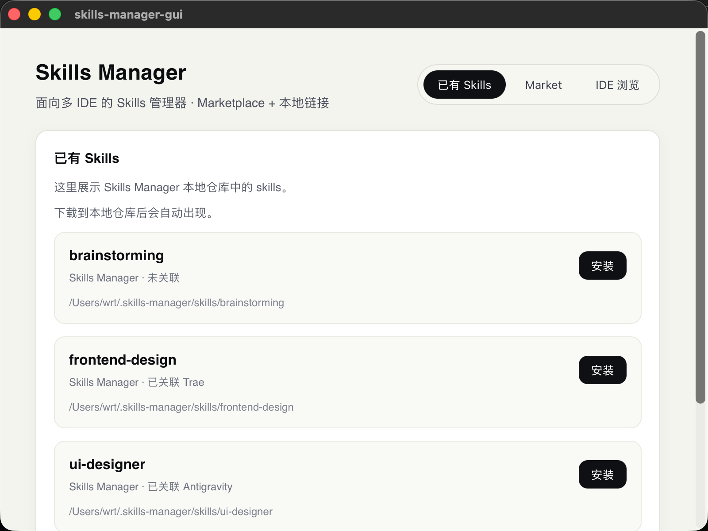
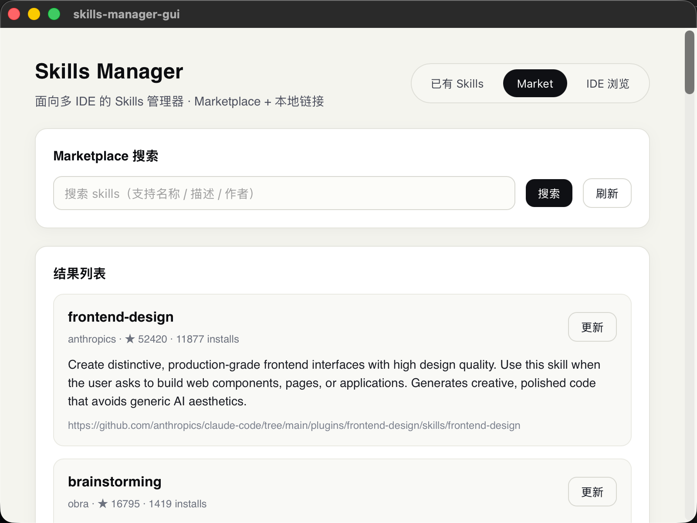
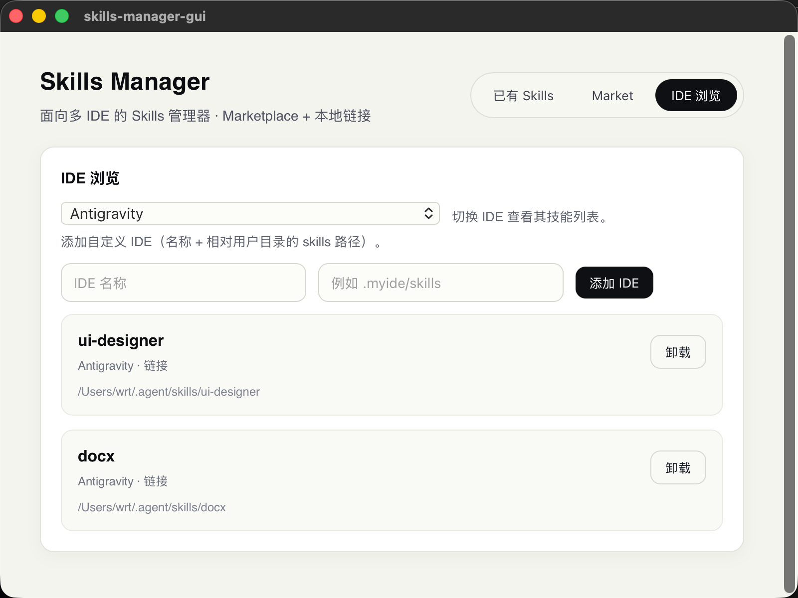

# Skills Manager

[English](README.md) | [中文](README_zh-CN.md)

一个面向多 IDE 的技能管理器（GUI 版），支持从远程市场下载 skills 到本地仓库，并将本地 skills 安装（链接）到各 IDE 目录。界面简洁、流程清晰。





## 核心功能

- 远程 Market 搜索（基于公开 registry）
- 下载到本地仓库（`~/.skills-manager/skills`）
- 本地 skills 一键安装到指定 IDE（软链接）
- IDE 浏览与卸载（移除链接或删除目录）
- 自定义 IDE（名称 + 目录）
- 本地已存在则支持 Market 更新
- 自动检查更新：应用启动时检测 GitHub 最新 Release

## 默认支持的 IDE（字母顺序）

- Antigravity: `.agent/skills`
- Claude: `.claude/skills`
- CodeBuddy: `.codebuddy/skills`
- Codex: `.codex/skills`
- Cursor: `.cursor/skills`
- Kiro: `.kiro/skills`
- Qoder: `.qoder/skills`
- Trae: `.trae/skills`
- VSCode: `.github/skills`
- Windsurf: `.windsurf/skills`

## 使用说明

### 获取方式

- 直接下载 Release 安装包使用（适合普通用户）
- 拉取源码本地运行（适合开发/自定义）

### macOS 安全提示

如果提示“已损坏，无法打开”，可在终端执行（开发阶段临时放行）：

```bash
xattr -dr com.apple.quarantine "/Applications/skills-manager-gui.app"
```

### 1) Market

- 搜索并下载 skills 到本地仓库
- 如果本地已有该 skill，会显示“更新”按钮

### 2) 已有 Skills

- 展示本地仓库的 skills
- 点击“安装”可选择一个或多个 IDE 进行安装

### 3) IDE 浏览

- 选择 IDE 查看其已有 skills
- 支持卸载（链接则移除链接，非链接则删除目录）
- 可添加自定义 IDE（名称 + 相对用户目录的 skills 路径）

## 安装与开发

### 环境依赖

- Node.js (建议 LTS)
- Rust (通过 rustup 安装)
- macOS: Xcode Command Line Tools

### 本地开发

```bash
pnpm install
pnpm tauri dev
```

### 打包发布

```bash
pnpm tauri build
```


## 远程数据来源

- 搜索接口: `https://claude-plugins.dev/api/skills`
- 下载接口: `https://github-zip-api.val.run/zip?source=<repo>`

## 技术栈

- Tauri 2
- Vue 3 + TypeScript + Vite
- Rust (后端命令)


## License

TBD
